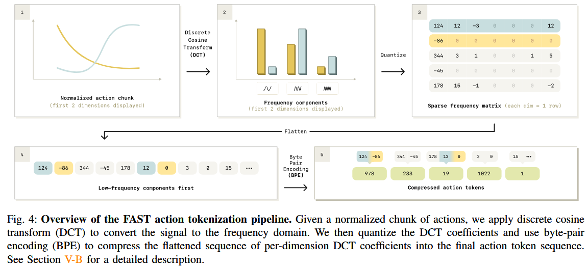

## pi0-fast

主要贡献在于压缩长度为 H 的动作块到长度为 n 的 tokens，且 n 不一定与 H 相等。其思想就像不同长度的单词可以组成一个句子。

好的，这是对论文《FAST: Efficient Action Tokenization for Vision-Language-Action Models》的总结。

### 作者、团队信息、论文标题、论文链接、项目主页

*   **论文标题**: FAST: Efficient Action Tokenization for Vision-Language-Action Models (FAST: 面向视觉-语言-动作模型的高效动作 Tokenization)
*   **作者**: Karl Pertsch\*, Kyle Stachowicz\*, Brian Ichter, Danny Driess, Suraj Nair, Quan Vuong, Oier Mees, Chelsea Finn, Sergey Levine
*   **团队信息**:
    *   Physical Intelligence
    *   UC Berkeley
    *   Stanford
*   **论文链接**: [https://arxiv.org/abs/2501.09747](https://arxiv.org/abs/2501.09747) (注意：这是一个示例性的 arXiv ID，实际发表时可能会变化)
*   **项目主页**: [https://pi.website/research/fast](https://pi.website/research/fast)

### 主要贡献

1.  **提出 FAST 算法**: 提出了一种名为 **频率空间动作序列 Tokenization (Frequency-space Action Sequence Tokenization, FAST)** 的新型动作 Tokenization 方法。该方法基于离散余弦变换 (DCT) 和字节对编码 (BPE)，能高效地压缩连续的机器人动作序列。
2.  **解决高频控制难题**: 证明了现有的基于 "逐维度、逐时间步" 均匀分箱 (binning) 的 Tokenization 方法在处理高频、高维度的灵巧操作任务时性能会严重下降，而 FAST 能够有效解决此问题，使得自回归 VLA 能够成功应用于先前无法处理的复杂任务。
3.  **训练效率显著提升**: 实验表明，将 FAST 与 SOTA 的 VLA 模型 (如 $πο$) 结合，可以在灵巧操作和长时程任务上达到与 Diffusion VLA 相媲美的性能，同时将**训练时间缩短了高达 5 倍**。
4.  **发布通用动作 Tokenizer (FAST+)**: 基于 FAST，作者在一个包含 100 万条真实机器人动作轨迹的大规模、多样化数据集上训练并发布了一个**通用的动作 Tokenizer (FAST+)**。它可以作为一个黑盒工具，无需重新训练即可应用于各种机器人形态、动作空间和控制频率，极大地降低了 VLA 的使用门槛。

### 研究背景

#### 研究问题

大型自回归序列模型，特别是 Vision-Language-Action (VLA) 模型，在机器人领域展现出巨大潜力。但这些模型处理的是离散的 token，而机器人的动作是连续的高维信号。因此，如何将连续的动作信号有效地 "Tokenize" (离散化) 成一个 token 序列，是决定 VLA 性能的关键。

#### 研究难点

1.  **高频数据下的信息冗余**: 对于高频控制（例如 50Hz），相邻时间步的动作变化非常小，具有极高的相关性。传统的逐时间步分箱方法会产生大量高度冗余的 token。这会导致模型的“学习信号”非常弱，因为预测下一个 token 变得过于简单（例如，只需复制前一个 token），模型难以学习到任务的本质，最终陷入局部最优。
2.  **Token 序列过长**: 传统方法为每个动作维度的每个时间步都生成一个或多个 token。在高频长时程的动作块 (action chunk) 中，这会产生一个非常长的 token 序列（例如数百个 token），增加了训练和推理的计算负担，并可能超出模型的上下文长度限制。
3.  **泛化性差**: 不同的机器人、任务和控制频率可能需要不同的 Tokenization 策略，设计一个通用的 Tokenizer 具有挑战性。

#### 相关工作

| 领域/方向                   | 已有方法                                                                                                   | 局限性                                                                                 | 本文改进                                                                                                                           |
| :-------------------------- | :--------------------------------------------------------------------------------------------------------- | :------------------------------------------------------------------------------------- | :--------------------------------------------------------------------------------------------------------------------------------- |
| **机器人动作 Tokenization** | **Naïve Binning (朴素分箱)**: 如 RT-1, RT-2, OpenVLA。将动作序列的每个维度在每个时间步独立地离散化为整数。 | 在高频数据上性能急剧下降，产生大量冗余 token，序列过长，训练效率低。                   | **使用 DCT+BPE 进行压缩**。将动作块视为一个整体信号，转换到频域，保留少量关键系数，极大减少了 token 数量并移除了冗余。             |
| **机器人动作 Tokenization** | **Learned Compression (学习式压缩)**: 如 VQ-VAE, FSQ。训练一个自编码器网络来学习动作序列的离散码本。       | 训练过程复杂，对超参数敏感，重建精度和压缩率的平衡难以控制，在高保真度重建上表现不佳。 | **基于分析的方法**。DCT 是一个固定的数学变换，无需训练，简单高效，超参数少，并且能以高精度重建动作。                               |
| **VLA 模型架构**            | **Diffusion Models (扩散模型)**: 如 Diffusion Policy, $πο$。将动作生成视为一个去噪过程。                   | 训练计算成本非常高昂，有时在遵循语言指令方面不如自回归模型。                           | **基于自回归模型**。通过 FAST Tokenization，使得自回归模型在训练效率上远超扩散模型 (快 5 倍)，同时保持了强大的性能和语言遵循能力。 |

### 方法

作者创建了一个合成的时间序列数据集，其目标是预测一条对四个随机生成的点进行插值的三次样条曲线。揭示了处理高频、平滑的连续信号时，传统的“逐时间步分箱 (per-timestep binning)” Tokenization 方法会彻底失效。

自回归模型在 NTP 时，学习到的信号是 $T_i$ 对于 $T_{1:i-1}$ 的边际信息量。关键点在于，仅使用简单的 per-timestep token 的方式，

Insights: 学习信号与在已知之前所有 $T_{i:i-1}$ 情况下，当前 token T_i 带来的边际信息量（the marginal information）成正比。

如果仅仅使用逐时间步的 tokenization 方案时，由于控制频率增加时，边际信息量会趋于 0，也就是两个时间步内的 token 变化极小，所以分箱后预测的两个点极有可能相同。对应图中 Hz 特别大时，呈现直线，模型只会复制前一个 token，陷入局部最优解。作者称为**边际信息（marginal information）**减少，导致学习停滞。

对于平滑的信号，也就是频率很高，时间步很小，每个时间步之间的变化量也会成比例的减小。这种情况，传统的 tokenization 方案会大幅减少收敛的速度，难以拟合。

FAST 提出，视整个动作块 $a_{1:H}$ 为一个整体，不能孤立对待时间点。基于 DCT 的 FAST 方法在所有采样率下都保持了极低的预测误差。这是因为它将时域信号转换到频域，用少数几个系数就抓住了曲线的整体形状，从而移除了时间上的冗余，为模型提供了有意义、信息密集的学习目标。

FAST 算法的核心思想是**将一个动作块 (action chunk) 视为一个时序信号，然后对其进行压缩**，而不是独立处理每个时间点。把动作视为时序信号是个关键的 insight。

大多数压缩算法都适用，但是考虑复杂程度等，DCT 有简单和计算效率优势，比如 JPEG 用 DCT 压缩。DCT 将连续的信号转换为一系列不同频率的余弦元素之和。感觉就像是 CNN 也使用了快速傅里叶变换来加速，用频域来表示序列有高效的优势。

流程如下：

1.  **归一化 (Normalization)**:
    将输入的动作块 $a_{1:H}$ (维度为 $|\mathcal{A}| \times H$) 的每个动作维度进行归一化。为了对异常值鲁棒，使用训练数据中每个维度的 1% 和 99% 分位数将值缩放到 $[-1, 1]$ 范围内。

2.  **离散余弦变换 (Discrete Cosine Transform, DCT)**:
    对归一化后的动作块的**每一个维度**（每一行）独立应用 DCT。这将时域信号转换到频域，得到一个同样大小的系数矩阵 $C$。DCT 的一个关键特性是，对于平滑的信号（如机器人动作），大部分能量集中在少数低频系数上。

3.  **量化/压缩 (Quantization)**:
    这是压缩的关键步骤。将 DCT 系数矩阵 $C$ 乘以一个缩放因子 $\gamma$，然后进行四舍五入取整。这个操作会使得大多数高频和低能量的系数变为零，只保留少数重要的系数。缩放因子 $\gamma$ 是一个权衡压缩率和重建精度的超参数。
    $C_{\text{quantized}} \leftarrow \text{round}(\gamma \cdot C)$

4.  **展平 (Flatten)**:
    将量化后的稀疏系数矩阵展平为一维整数序列。为了让模型在自回归预测时优先生成决定动作整体形态的低频信息，作者采用**列优先 (column-first)** 的方式展平，即先把所有维度的第一个（最低频）系数拼接起来，然后是所有维度的第二个系数，以此类推。列优先的方式对训练影响明显，把因为低频部分描述了图像的大致轮廓，高频部分都是雕刻细节。
    $[T_k] \leftarrow [C^1_1, C^2_1, \dots, C^{|A|}_1, C^1_2, \dots]$

5.  **字节对编码 (Byte-Pair Encoding, BPE)**:
    将展平后的整数序列输入到一个 BPE Tokenizer 中。BPE 是一种无损压缩算法，它能学习序列中频繁出现的模式（例如，大量的 0 或者特定的系数组合）并将它们合并为新的单个 token。这一步进一步压缩了序列长度，并产生一个适合输入到 VLA 模型的、固定词汇表的最终 token 序列 $[T_1, \dots, T_n]$。

整个过程只有 BPE 是需要学习的，学习过程特别快速。

解码过程是上述步骤的逆过程，所有操作都是可逆的，可以快速地从预测的 token 序列重建回连续的动作。

### 实验与结论

*   **Tokenization 效率**: 在高频任务（如 50Hz 的 T 恤折叠）上，FAST 能将 naïve binning 产生的 700 个 token 压缩到仅 53 个，压缩率超过 13 倍，同时保持了相当的重建精度。
*   **策略性能对比**:
    *   在多个高频、灵巧操作任务（如桌面清洁、T 恤折叠）上，使用 naïve binning 的 VLA 模型完全无法学习，成功率为 0。而使用 FAST 的模型则能有效学习并取得高成功率。
    *   FAST 的性能也优于基于学习的压缩方法 FSQ。
    *   通用的 FAST+ Tokenizer 在各项任务上的表现与为该任务专门训练的 FAST Tokenizer 性能相当，证明了其强大的泛化能力。
*   **与 Diffusion VLA 的对比**:
    *   在大型数据集（如 Table Bussing）上，基于 FAST 的自回归模型 $πο$-FAST 的收敛速度显著快于 Diffusion 版本的 $πο$。
    *   在大规模通用机器人数据集上，$πο$-FAST 最终性能与 SOTA 的 Diffusion VLA 相当，但训练所需的计算资源减少了 5 倍。
*   **零样本泛化**: 在 DROID 数据集上训练的策略，能够零样本泛化到全新的场景（新物体、新视角、新背景），展示了强大的泛化能力，这是之前的方法难以实现的。

**结论**: FAST 是一种简单而高效的机器人动作 Tokenization 方法。它通过将动作序列压缩到频域，解决了现有 VLA 在处理高频、灵巧任务上的核心瓶颈。该方法不仅显著提升了模型性能，还大幅提高了训练效率，并催生了可即插即用的通用动作 Tokenizer FAST+，为构建更强大、更通用的 VLA 机器人策略铺平了道路。

### 不足

1.  **推理速度**: 尽管训练速度快得多，但自回归模型的推理是串行的（逐个 token 生成），其推理速度比并行的扩散模型（通常只需 10-20 个去噪步骤）要慢。在本文的静态操作任务中，这不成问题，但对于需要快速反应的动态任务，可能会是一个瓶颈。
2.  **测试场景有限**: 本文的策略主要在静态的机械臂操作任务上进行了测试。虽然对其他机器人形态（如移动机器人、人形机器人）的离线压缩实验显示了潜力，但实际的策略性能仍有待验证。
3.  **压缩方案的探索**: 本文采用了 DCT+BPE 的组合，但其他时序压缩方案（如小波变换）或无损压缩算法（如 Huffman 编码）也可能有效，其与非自回归解码方式（如扩散模型）的结合是值得探索的未来方向。

## Insights

使用频域信息处理连续的信号，把高频的动作序列看作连续时间序列处理，转换问题到频域来。

## Ref and Tag