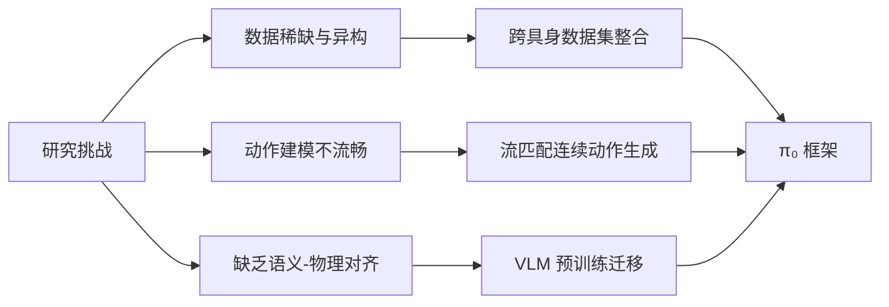
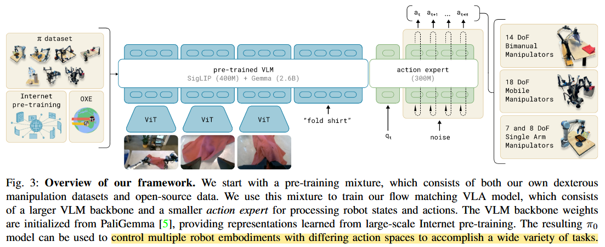
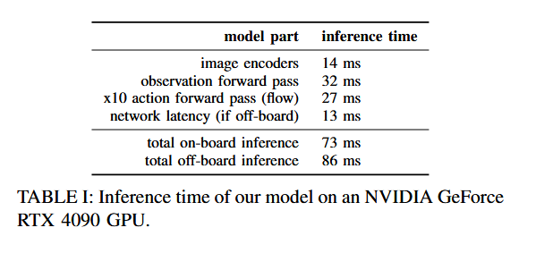
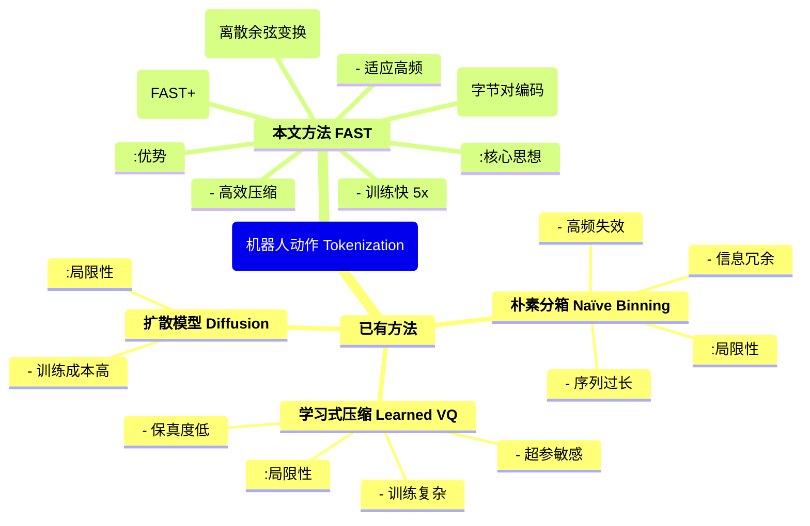
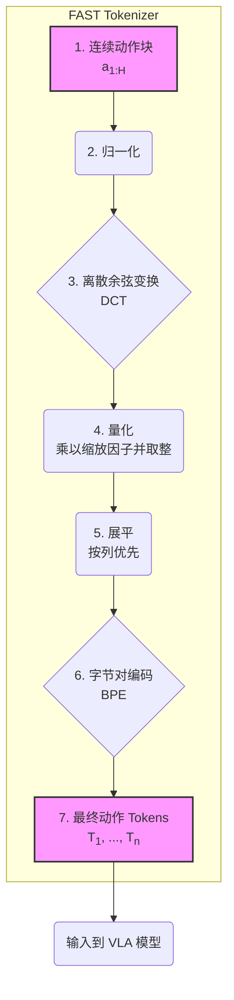

## pi0

通过人给与的或高层次 VLM 策略给与的语言指令，模型要能够执行对应任务。模型能根据微调获取新技能。

总体结构是大小模型结合。pi0 最终能够控制不同动作空间的多个机器人实体（multiple robot embodiments）。

使用高质量数据来后训练，对下游任务至关重要。高质量数据就像教材一样。

### 作者、团队信息、论文标题、论文链接、项目主页
- **作者**：Kevin Black, Noah Brown, Danny Driess 等（Physical Intelligence 团队）  
- **团队**：Physical Intelligence  
- **论文标题**：π₀: A Vision-Language-Action Flow Model for General Robot Control  
- **论文链接**：https://physicalintelligence.company/blog/pi0 


### 主要贡献
1. **新型架构设计**：  
   - 提出基于预训练视觉语言模型（VLM）的 **流匹配（Flow Matching）动作生成架构**，支持 50 Hz 高频连续动作输出。  
   - 引入 **动作专家（Action Expert）** 模块，将 VLM 的语义知识与机器人动作解耦，提升复杂操作的精度。  
2. **大规模训练方案**：  
   - 构建 **跨具身（Cross-Embodiment）数据集**，整合 7 种机器人平台、68 项任务的 10,000+ 小时数据（含开源数据集 OXE/Bridge/DROID）。  
   - 设计 **预训练-精调（Pre-training/Post-training）范式**：预训练学习通用能力，精调专攻复杂任务（如叠衣服、组装盒子）。  
3. **实证突破**：  
   - 实现 **长时程多阶段任务**（如 20 分钟叠衣流程），在 20+ 任务上超越 SOTA（如 OpenVLA、Octo）。  
   - 验证 **VLM 预训练对语言指令遵循的关键作用**，语言理解准确率提升 40%+（vs 无 VLM 基线）。  

### 研究背景
#### 研究问题与难点  
| 领域               | 问题描述                                                 | 难点                                           |
| ------------------ | -------------------------------------------------------- | ---------------------------------------------- |
| **通用机器人控制** | 如何实现单一策略处理多样化物理任务？                     | 数据稀缺、泛化性差、高频动作建模难             |
| **语义-动作对齐**  | 如何融合互联网级语义知识（VLM）与物理交互技能？          | VLM 缺乏物理场景理解，动作离散化导致操控不流畅 |
| **复杂任务扩展**   | 如何解决长时程任务（如叠衣、清桌）的组合优化与错误恢复？ | 传统方法依赖任务特定训练，策略脆弱且无纠错能力 |

#### 相关工作对比  
| 领域           | 已有方法                 | 局限性                              | 本文改进                               |
| -------------- | ------------------------ | ----------------------------------- | -------------------------------------- |
| **VLA 模型**   | RT-2 [7], OpenVLA [24]   | 自回归离散动作，低频控制（≤10 Hz）  | **流匹配连续动作** + 50 Hz 高频输出    |
| **扩散策略**   | Diffusion Policy [9]     | 无预训练 VLM，语义理解弱            | **VLM 主干** + 流匹配动作专家          |
| **大规模训练** | OXE [10], Bridge v2 [52] | 任务简单（抓取/推动），缺乏灵巧操作 | **68 项灵巧任务** + 跨平台异构数据融合 |
| **分层规划**   | SayCan [2]               | 高层-底层策略分离，错误传播         | **端到端 VLA 流** + 高层语言策略协同   |



### 方法

π₀ 模型的核心思想是利用预训练的视觉语言模型 (VLM) 作为主干来理解视觉和语言输入，并结合一个专门的“动作专家”模块通过流匹配 (flow matching) 来生成连续的机器人动作。

Flow matching 更精准。架构受到 Transfusion 启发，训练一个 Transformer，输入不同的对象（objectives）的 tokens。其中，连续输出的 tokens 由 flow matching loss 监督训练，离散输出的 tokens 由交叉熵损失监督训练。额外发现，基于分离的机器人特定权重能提高表现，思想类似 MoE。第一部分处理图像和文本输入，第二部分处理机器人特定的输入输出，即 VLM+动作专家的思想。



1.  **模型架构 (π₀ Model):**
    *   **主干 (Backbone):** 采用预训练的 VLM，如 PaliGemma (论文中使用的是一个 3B 参数版本)。VLM 负责处理输入的图像 (多个视角) 和语言指令，提取高级语义特征。其权重从大规模互联网数据预训练中初始化。
    *   **动作专家 (Action Expert):** 一个相对较小的 Transformer 模型 (约 300M 参数)。它接收机器人的本体感受状态 (如关节角度 \( \bold{q}_t \)) 和经过流匹配过程加噪的动作序列 \( \bold{A}^τ \) 作为输入。动作专家专注于将 VLM 的语义理解转化为具体的、连续的动作输出。
    *   **输入 (Inputs):** $o_t = [I_t^1,\dots I_t^n, \mathcal{l}_t, \bold{q}_t, \bold{A}_t]$
        *   多视角 RGB 图像 (\( I_1, ..., I_r \))
        *   语言指令 (\( l_t \))
        *   机器人本体感知状态 (\( \bold{q}_t \)) 和动作 $\bold{A}_t$
        *   图像和语言指令可以直接输入 VLM，但是本体感知和动作没有参与预训练的语料，所以输入给动作专家更为合适。
    *   **输出 (Outputs):** 未来 H 步的连续动作块 (action chunk) \( A_t = [a_t, ..., a_{t+H-1}] \)。论文中 H=50。
    *   **条件流匹配 (Conditional Flow Matching)**: 受生图和视频领域启发，流匹配效果更好。
        *   用于建模条件概率分布 \( p(A_t | o_t) \)，其中 \( o_t \) 是观测 (图像、语言、状态)。
        *   **训练:**
            1.  对真实的动作块 \( A_t \) 和随机噪声 \( \varepsilon \sim \mathcal{N}(0, I) \)，以及 flow matching 时间步 \( \tau \in [0,1] \)，构造加噪动作 \( A^τ = τA_t + (1-τ)ε \)。
            2.  模型 \( v_θ(A^τ, o_t) \) 被训练来预测去噪向量场 \( u(A^τ | A_t) = ε - A_t \) (或直接预测 \( A_t \) 或 \( \varepsilon \))。
            3.  损失函数为:
                $$ L(\theta) = \mathbb{E}_{p(A_t|o_t), q(A^τ|A_t)}[||v_θ(A^τ, o_t) – u(A^τ|A_t)||^2] $$
            4.  \( \tau \) 从一个移位的 Beta 分布中采样， \( p(\tau) = \text{Beta}(\tau/s; \alpha=1.5, \beta=1.0) \) for \( \tau \in [0,s] \)，其中 \( s=0.999 \)，该分布更侧重于噪声较大的时间步 (即 \( \tau \) 较小)。
        *   **推理:** 从随机高斯噪声 \( A^0 \sim \mathcal{N}(0, I) \) 开始，通过欧拉积分或其他数值方法，沿着学习到的向量场 \( v_θ \) 逐步去噪，迭代若干步 (如 10 步) 以生成最终的动作块 \( A_t \)。
    *   **注意力机制:** 采用分块的注意力机制。图像和语言 Token 构成第一块，本体感受状态 \( q_t \) 是第二块，加噪动作 \( A^τ \) 是第三块。块内是全注意力，块之间是因果注意力 (前面的块可以被后面的块注意到，反之不行，或根据具体设计调整)。
    *   **跨机器人本体 (Cross-Embodiment):** 通过将不同机器人的状态和动作空间填充到数据集中维度最大的机器人，使得单一模型可以处理多种机器人。

2.  **训练流程 (Training Recipe):**
    *   **预训练 (Pre-training) :**
        *   **数据:** 使用大规模、高度多样化的数据集，包含 π₀ 自有数据集 (7 种机器人配置，68 种任务，903M timesteps 的数据) 和 Open X-Embodiment (OXE) 数据集。
        *   **目标:** 使模型学习广泛的物理交互知识、通用技能和泛化能力。
        *   **数据混合策略**：异构的数据集规模呈现差异，对不同任务-机器人组合的数据根据样本量 \( n \) 进行 \( n^{0.43} \) 的加权。
    *   **后训练/微调 (Post-training / Fine-tuning):**
        *   **数据:** 使用针对特定下游任务的、更小规模但更高质量的、经过精心筛选的数据。
        *   **目标:** 使模型在特定复杂任务上 (如叠衣服、擦桌子、组装盒子) 达到更高的熟练度、效率和鲁棒性。

### 数据收集与处理

#### 预训练和后训练

使用了 9.1% 的公开数据集。使用公开数据集面临异构的挑战（TODO，可以在看 UniVLA 提出了什么思路）, 这些机器人通常有一到两个相机, 运行频率在 2~10Hz。包含单臂、双臂数据。

处理异构机器人时，DoF 存在差异。数据中，维度最多的机器人作为参考，配置 pi0 生成的本体感知向量 $\bold{q}_t$ 和动作 $\bold{a}_t$ 为此最大维度。对于 DoF 较小的机器人，使用 0 填充。对于相机少于 3 个的，使用 mask 遮掩缺失的 slots。

此方法感觉有点偷懒和粗犷，想到另一种思路：提供 hint，描述自由度，让 VLA 自己判断生成是否会更好地处理异构？但是提供更多的上下文，能够生成地更好。或者让模型自己预测 mask，更加准确预测了哪些关节角，还可以借鉴数电对数字信号的定义，大于阈值才算 1，不能处于模糊状态，模糊状态代表无效。

后训练时，用特定任务数据集微调。简单任务只需要 5 小时，复杂任务则 100 小时或更多。

#### 语言与高层策略

复杂任务如 bussing（餐桌清理）需要 semantic 推理，拆分复杂任务到子任务。

是否可以借鉴处理异构数据思路，复杂任务与简单任务也用 mask？简单任务直接生成子任务，复杂任务则生成更多子任务。VLM 处理任务拆分。

是否可以把 VLA 考虑得像人一样，面对不同车，可以操作共性的部分？比如油门和刹车等等。

### 实验与结论

- 实验设置:
    - 数据集: π₀ 自有数据集 (7 种机器人, 68 个任务, 超过 10000 小时) 和 OXE 数据集。
    - 对比基线: OpenVLA (7B 参数 VLA), Octo (93M 参数扩散策略), ACT (模仿学习), Diffusion Policy, 以及 π₀-small (不使用 VLM 预训练的 470M 参数版本)。
    - 评估任务类型:
        1. 开箱即用评估 (Out-of-box / Zero-shot): 直接在预训练模型上评估未见过的或预训练中存在的任务 (如叠衬衫、简单擦桌子、装食品袋、烤面包片)。
        2. 语言指令遵循: 评估模型理解和执行详细语言指令的能力 (如擦桌子、摆放餐具、装食品袋)，指令可来自人类专家或高级 VLM 策略。
        3. 学习新灵巧任务 (微调): 在少量新任务数据上微调模型 (如叠碗、叠毛巾、微波炉放特百惠、换纸巾卷、Franka 机器人抽屉放物品)。
        4. 掌握复杂多阶段任务 (微调): 针对非常复杂、长时程的任务进行微调 (如洗衣房叠多种衣物 - 固定/移动机器人、从烘干机卸载衣物、复杂擦桌子 - 含新物体、组装纸盒、打包外卖盒、装鸡蛋)。
- 主要实验结果:
    - 开箱即用性能: π₀ (即使是只训练了部分步数的 "parity" 版本) 显著优于所有基线模型。完整的 π₀ 模型在这些任务上取得了近乎完美的成功率。π₀-small 的表现也优于 OpenVLA 和 Octo，显示了架构的优势。
    - 语言指令遵循: π₀ 比 π₀-small 在遵循语言指令方面表现更好，表明 VLM 预训练带来的语义理解能力提升。在人类专家或高级 VLM 策略的**中间指令（Intermediate language commands）**引导下，π₀ 的任务完成度显著提高，中间指令带来相当信息。
    - 新灵巧任务学习: π₀ 通过微调，在各种新任务上普遍优于其他方法。有趣的是，对于某些任务，从头开始训练的先前 SOTA 模型 (如 ACT) 可能比使用其预训练权重的版本表现更好，这凸显了在这些领域利用预训练的挑战性。而 π₀ 的预训练模型通常比从头训练的 π₀ (scratch) 版本有更大提升，尤其是在数据量较少时。
    - 复杂多阶段任务: π₀ 在这些极具挑战性的任务上取得了超过 50% 的平均最高得分，并显著优于各种消融版本 (如仅预训练、从头训练)。对于更难的任务，预训练带来的提升尤为明显。
- 结论:
    - π₀ 框架 (预训练 VLM + 流匹配动作专家) 结合精心设计的预训练/后训练流程，是构建通用机器人基础模型的一条有效路径。
    - 大规模多样化数据预训练对于模型的泛化能力和零样本/少样本学习能力至关重要。
    - 高质量数据的后训练能够显著提升模型在复杂、特定任务上的性能和鲁棒性。
    - 流匹配能够有效地生成高频连续动作，赋能机器人执行灵巧操作。
    - π₀ 在广泛的机器人操作任务中展现了当前最先进的性能，代表了灵巧机器人操控领域的重要进展。

### 附录

关注部署和推理细节。

#### 部署

每次推理预测 H=50 的动作块，通常高于执行频率，所以推理会更频繁，需要考虑组合动作的策略。作者尝试了 temporal ensembling，但会破坏表现。最后，不聚合动作，而是用 open-loop 地方式执行动作块。例如，20Hz 的 UR5e，每 0.8 秒推理一次，每次执行 16 个动作。其他机器人能有 50Hz，则每 0.5s 推理一次，执行 25 个动作。

在 4090 GPU 上的推理时间如下，耗时。



### 不足

- 预训练数据构成: 如何优化预训练数据集的构成 (哪些数据更有用、如何加权) 仍然是一个开放问题，目前的方法是“有多少用多少”。
- 性能可预测性: 对于特定任务，需要多少以及何种数据才能达到近乎完美的性能，目前尚不清楚如何准确预测。
- 正向迁移的边界: 结合高度多样化的数据 (不同任务、不同机器人) 带来的正向迁移效果有多大，以及这种通用性是否能扩展到更不相关的领域 (如自动驾驶、导航、腿式机器人运动)，仍有待未来工作探索。
- 可靠性: 并非所有评估任务都能可靠地完成，模型的稳定性和对极端情况的处理能力仍有提升空间。

### Insights

VLM 能显著提升语言理解准确率（40%）。

研究动作专家时，关注生成连续输出的领域，如生成图和视频等。

简单任务需要较少数据，复杂任务需要更多数据。与 CoT 如出一辙，输出和上下文信息更多，适合描述和拟合复杂任务的求解。而简单任务使用 CoT 却适得其反，不应该使用简单的较少的 token 来完成。类似地，复杂模型可以处理复杂任务，MLP 参数量拉上来。

## pi0-fast

主要贡献在于压缩长度为 H 的动作块到长度为 n 的 tokens，且 n 不一定与 H 相等。其思想就像不同长度的单词可以组成一个句子。

好的，这是对论文《FAST: Efficient Action Tokenization for Vision-Language-Action Models》的总结。

### 作者、团队信息、论文标题、论文链接、项目主页

*   **论文标题**: FAST: Efficient Action Tokenization for Vision-Language-Action Models (FAST: 面向视觉-语言-动作模型的高效动作 Tokenization)
*   **作者**: Karl Pertsch\*, Kyle Stachowicz\*, Brian Ichter, Danny Driess, Suraj Nair, Quan Vuong, Oier Mees, Chelsea Finn, Sergey Levine
*   **团队信息**:
    *   Physical Intelligence
    *   UC Berkeley
    *   Stanford
*   **论文链接**: [https://arxiv.org/abs/2501.09747](https://arxiv.org/abs/2501.09747) (注意：这是一个示例性的 arXiv ID，实际发表时可能会变化)
*   **项目主页**: [https://pi.website/research/fast](https://pi.website/research/fast)

### 主要贡献

1.  **提出 FAST 算法**: 提出了一种名为 **频率空间动作序列 Tokenization (Frequency-space Action Sequence Tokenization, FAST)** 的新型动作 Tokenization 方法。该方法基于离散余弦变换 (DCT) 和字节对编码 (BPE)，能高效地压缩连续的机器人动作序列。
2.  **解决高频控制难题**: 证明了现有的基于 "逐维度、逐时间步" 均匀分箱 (binning) 的 Tokenization 方法在处理高频、高维度的灵巧操作任务时性能会严重下降，而 FAST 能够有效解决此问题，使得自回归 VLA 能够成功应用于先前无法处理的复杂任务。
3.  **训练效率显著提升**: 实验表明，将 FAST 与 SOTA 的 VLA 模型 (如 $πο$) 结合，可以在灵巧操作和长时程任务上达到与 Diffusion VLA 相媲美的性能，同时将**训练时间缩短了高达 5 倍**。
4.  **发布通用动作 Tokenizer (FAST+)**: 基于 FAST，作者在一个包含 100 万条真实机器人动作轨迹的大规模、多样化数据集上训练并发布了一个**通用的动作 Tokenizer (FAST+)**。它可以作为一个黑盒工具，无需重新训练即可应用于各种机器人形态、动作空间和控制频率，极大地降低了 VLA 的使用门槛。

### 研究背景

#### 研究问题

大型自回归序列模型，特别是 Vision-Language-Action (VLA) 模型，在机器人领域展现出巨大潜力。但这些模型处理的是离散的 token，而机器人的动作是连续的高维信号。因此，如何将连续的动作信号有效地 "Tokenize" (离散化) 成一个 token 序列，是决定 VLA 性能的关键。

#### 研究难点

1.  **高频数据下的信息冗余**: 对于高频控制（例如 50Hz），相邻时间步的动作变化非常小，具有极高的相关性。传统的逐时间步分箱方法会产生大量高度冗余的 token。这会导致模型的“学习信号”非常弱，因为预测下一个 token 变得过于简单（例如，只需复制前一个 token），模型难以学习到任务的本质，最终陷入局部最优。
2.  **Token 序列过长**: 传统方法为每个动作维度的每个时间步都生成一个或多个 token。在高频长时程的动作块 (action chunk) 中，这会产生一个非常长的 token 序列（例如数百个 token），增加了训练和推理的计算负担，并可能超出模型的上下文长度限制。
3.  **泛化性差**: 不同的机器人、任务和控制频率可能需要不同的 Tokenization 策略，设计一个通用的 Tokenizer 具有挑战性。

#### 相关工作

| 领域/方向                   | 已有方法                                                                                                   | 局限性                                                                                 | 本文改进                                                                                                                           |
| :-------------------------- | :--------------------------------------------------------------------------------------------------------- | :------------------------------------------------------------------------------------- | :--------------------------------------------------------------------------------------------------------------------------------- |
| **机器人动作 Tokenization** | **Naïve Binning (朴素分箱)**: 如 RT-1, RT-2, OpenVLA。将动作序列的每个维度在每个时间步独立地离散化为整数。 | 在高频数据上性能急剧下降，产生大量冗余 token，序列过长，训练效率低。                   | **使用 DCT+BPE 进行压缩**。将动作块视为一个整体信号，转换到频域，保留少量关键系数，极大减少了 token 数量并移除了冗余。             |
| **机器人动作 Tokenization** | **Learned Compression (学习式压缩)**: 如 VQ-VAE, FSQ。训练一个自编码器网络来学习动作序列的离散码本。       | 训练过程复杂，对超参数敏感，重建精度和压缩率的平衡难以控制，在高保真度重建上表现不佳。 | **基于分析的方法**。DCT 是一个固定的数学变换，无需训练，简单高效，超参数少，并且能以高精度重建动作。                               |
| **VLA 模型架构**            | **Diffusion Models (扩散模型)**: 如 Diffusion Policy, $πο$。将动作生成视为一个去噪过程。                   | 训练计算成本非常高昂，有时在遵循语言指令方面不如自回归模型。                           | **基于自回归模型**。通过 FAST Tokenization，使得自回归模型在训练效率上远超扩散模型 (快 5 倍)，同时保持了强大的性能和语言遵循能力。 |



### 方法

FAST 算法的核心思想是**将一个动作块 (action chunk) 视为一个时序信号，然后对其进行压缩**，而不是独立处理每个时间点。其流程如下：

1.  **归一化 (Normalization)**:
    将输入的动作块 $a_{1:H}$ (维度为 $|\mathcal{A}| \times H$) 的每个动作维度进行归一化。为了对异常值鲁棒，使用训练数据中每个维度的 1% 和 99% 分位数将值缩放到 $[-1, 1]$ 范围内。

2.  **离散余弦变换 (Discrete Cosine Transform, DCT)**:
    对归一化后的动作块的**每一个维度**（每一行）独立应用 DCT。这将时域信号转换到频域，得到一个同样大小的系数矩阵 $C$。DCT 的一个关键特性是，对于平滑的信号（如机器人动作），大部分能量集中在少数低频系数上。

3.  **量化/压缩 (Quantization)**:
    这是压缩的关键步骤。将 DCT 系数矩阵 $C$ 乘以一个缩放因子 $\gamma$，然后进行四舍五入取整。这个操作会使得大多数高频和低能量的系数变为零，只保留少数重要的系数。缩放因子 $\gamma$ 是一个权衡压缩率和重建精度的超参数。
    $C_{\text{quantized}} \leftarrow \text{round}(\gamma \cdot C)$

4.  **展平 (Flatten)**:
    将量化后的稀疏系数矩阵展平为一维整数序列。为了让模型在自回归预测时优先生成决定动作整体形态的低频信息，作者采用**列优先 (column-first)** 的方式展平，即先把所有维度的第一个（最低频）系数拼接起来，然后是所有维度的第二个系数，以此类推。
    $[T_k] \leftarrow [C^1_1, C^2_1, \dots, C^{|A|}_1, C^1_2, \dots]$

5.  **字节对编码 (Byte-Pair Encoding, BPE)**:
    将展平后的整数序列输入到一个 BPE Tokenizer 中。BPE 是一种无损压缩算法，它能学习序列中频繁出现的模式（例如，大量的 0 或者特定的系数组合）并将它们合并为新的单个 token。这一步进一步压缩了序列长度，并产生一个适合输入到 VLA 模型的、固定词汇表的最终 token 序列 $[T_1, \dots, T_n]$。

解码过程是上述步骤的逆过程，所有操作都是可逆的，可以快速地从预测的 token 序列重建回连续的动作。



### 实验与结论

*   **Tokenization 效率**: 在高频任务（如 50Hz 的 T 恤折叠）上，FAST 能将 naïve binning 产生的 700 个 token 压缩到仅 53 个，压缩率超过 13 倍，同时保持了相当的重建精度。
*   **策略性能对比**:
    *   在多个高频、灵巧操作任务（如桌面清洁、T 恤折叠）上，使用 naïve binning 的 VLA 模型完全无法学习，成功率为 0。而使用 FAST 的模型则能有效学习并取得高成功率。
    *   FAST 的性能也优于基于学习的压缩方法 FSQ。
    *   通用的 FAST+ Tokenizer 在各项任务上的表现与为该任务专门训练的 FAST Tokenizer 性能相当，证明了其强大的泛化能力。
*   **与 Diffusion VLA 的对比**:
    *   在大型数据集（如 Table Bussing）上，基于 FAST 的自回归模型 $πο$-FAST 的收敛速度显著快于 Diffusion 版本的 $πο$。
    *   在大规模通用机器人数据集上，$πο$-FAST 最终性能与 SOTA 的 Diffusion VLA 相当，但训练所需的计算资源减少了 5 倍。
*   **零样本泛化**: 在 DROID 数据集上训练的策略，能够零样本泛化到全新的场景（新物体、新视角、新背景），展示了强大的泛化能力，这是之前的方法难以实现的。

**结论**: FAST 是一种简单而高效的机器人动作 Tokenization 方法。它通过将动作序列压缩到频域，解决了现有 VLA 在处理高频、灵巧任务上的核心瓶颈。该方法不仅显著提升了模型性能，还大幅提高了训练效率，并催生了可即插即用的通用动作 Tokenizer FAST+，为构建更强大、更通用的 VLA 机器人策略铺平了道路。

### 不足

1.  **推理速度**: 尽管训练速度快得多，但自回归模型的推理是串行的（逐个 token 生成），其推理速度比并行的扩散模型（通常只需 10-20 个去噪步骤）要慢。在本文的静态操作任务中，这不成问题，但对于需要快速反应的动态任务，可能会是一个瓶颈。
2.  **测试场景有限**: 本文的策略主要在静态的机械臂操作任务上进行了测试。虽然对其他机器人形态（如移动机器人、人形机器人）的离线压缩实验显示了潜力，但实际的策略性能仍有待验证。
3.  **压缩方案的探索**: 本文采用了 DCT+BPE 的组合，但其他时序压缩方案（如小波变换）或无损压缩算法（如 Huffman 编码）也可能有效，其与非自回归解码方式（如扩散模型）的结合是值得探索的未来方向。


### Insights

是否可以利用相对时间，直接压缩为相对的动作块？

要用好分层的思想。

**快慢掩码：**

Motivation 在于区分距离物体较远和较近是有意义的，因为不同关节移动需求不同。定义 mask，分别对应距离操作物体距离。较远则比如 `[1,1,1,0,0,...,0,0]`；距离较近则 `[0,0,0,...,1,1]`。让模型预测快慢动作。

时间是一个强相关的量，起初往往距离较远，推移后往往距离较近。

## 代码仓库

具身智能：基于pi0和pi0 fast的vla代码讲解（纯眼无实操版） - lumosity的文章 - 知乎
https://zhuanlan.zhihu.com/p/1895856498615240391

## Presentation or 技术分享

### LAN 传输文件

关键 IP 设置，ssh 服务和 sftp 命令，

### 使用二进制 API

C 兼容的 API 是最通用的方式。

C++ 需要指定声明选项，避免。编译时，C++ 会使用修饰（mangling）的方式修改函数签名，比如: 

```cpp
// mangle.cpp
extern "C" {
  void foo(int i) {}
}

void bar(int i) {}

void bar(double d) {}
```

```bash
g++ -c mangle.cpp -o mangle.o
```

使用 nm 工具查看编译后对象文件的符号表：

```bash
❯ nm mangle.o
0000000000000000 T foo
000000000000001c T _Z3bard
000000000000000e T _Z3bari
```

这些符号就是运行时，调用函数的入口点。C++ 比 C 多了**重载**的功能，所以会修饰为不同符号，比如修饰 bar 函数为 _Z3bard 和 _Z3bari。而 extern "C" 告诉编译器，不进行修饰。运行时能够正确找到 C 兼容的 API。

本项目使用到的接口如下：

```bash
❯ nm -D --defined-only librelaxed_ik_lib.so | grep -e '\(relaxed_ik_new\|solve_position\|relaxed_ik_free\|solve_velocity\)'
000000000003c8e0 T relaxed_ik_free
000000000003c5b0 T relaxed_ik_nw
000000000003cb40 T solve_position
000000000003d0f0 T solve_velocity
```

```bash
# 1. 首先检查是否包含调试符号
file librelaxed_ik.so  # 查看是否有 "with debug_info"
# 2. 提取完整调试信息
objdump --dwarf=info librelaxed_ik.so > debug_info.txt
# 3. 搜索函数签名
grep -A 20 'relaxed_ik_new' debug_info.txt
```

手臂姿态控制部分：

https://docs.galaxea-ai.com/zh/Guide/R1Pro/R1Pro_Software_Introduction_ROS2/#_18

## Ref and Tag