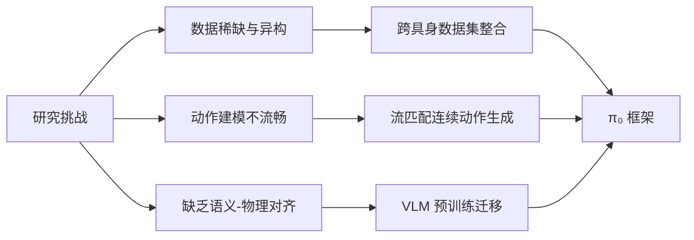

## pi0

通过人给与的或高层次 VLM 策略给与的语言指令，模型要能够执行对应任务。模型能根据微调获取新技能。

总体结构是大小模型结合。pi0 最终能够控制不同动作空间的多个机器人实体（multiple robot embodiments）。

使用高质量数据来后训练，对下游任务至关重要。高质量数据就像教材一样。

### 作者、团队信息、论文标题、论文链接、项目主页
- **作者**：Kevin Black, Noah Brown, Danny Driess 等（Physical Intelligence 团队）  
- **团队**：Physical Intelligence  
- **论文标题**：π₀: A Vision-Language-Action Flow Model for General Robot Control  
- **论文链接**：https://physicalintelligence.company/blog/pi0 


### 主要贡献
1. **新型架构设计**：  
   - 提出基于预训练视觉语言模型（VLM）的 **流匹配（Flow Matching）动作生成架构**，支持 50 Hz 高频连续动作输出。  
   - 引入 **动作专家（Action Expert）** 模块，将 VLM 的语义知识与机器人动作解耦，提升复杂操作的精度。  
2. **大规模训练方案**：  
   - 构建 **跨具身（Cross-Embodiment）数据集**，整合 7 种机器人平台、68 项任务的 10,000+ 小时数据（含开源数据集 OXE/Bridge/DROID）。  
   - 设计 **预训练-精调（Pre-training/Post-training）范式**：预训练学习通用能力，精调专攻复杂任务（如叠衣服、组装盒子）。  
3. **实证突破**：  
   - 实现 **长时程多阶段任务**（如 20 分钟叠衣流程），在 20+ 任务上超越 SOTA（如 OpenVLA、Octo）。  
   - 验证 **VLM 预训练对语言指令遵循的关键作用**，语言理解准确率提升 40%+（vs 无 VLM 基线）。  

### 研究背景
#### 研究问题与难点  
| 领域               | 问题描述                                                 | 难点                                           |
| ------------------ | -------------------------------------------------------- | ---------------------------------------------- |
| **通用机器人控制** | 如何实现单一策略处理多样化物理任务？                     | 数据稀缺、泛化性差、高频动作建模难             |
| **语义-动作对齐**  | 如何融合互联网级语义知识（VLM）与物理交互技能？          | VLM 缺乏物理场景理解，动作离散化导致操控不流畅 |
| **复杂任务扩展**   | 如何解决长时程任务（如叠衣、清桌）的组合优化与错误恢复？ | 传统方法依赖任务特定训练，策略脆弱且无纠错能力 |

#### 相关工作对比  
| 领域           | 已有方法                 | 局限性                              | 本文改进                               |
| -------------- | ------------------------ | ----------------------------------- | -------------------------------------- |
| **VLA 模型**   | RT-2 [7], OpenVLA [24]   | 自回归离散动作，低频控制（≤10 Hz）  | **流匹配连续动作** + 50 Hz 高频输出    |
| **扩散策略**   | Diffusion Policy [9]     | 无预训练 VLM，语义理解弱            | **VLM 主干** + 流匹配动作专家          |
| **大规模训练** | OXE [10], Bridge v2 [52] | 任务简单（抓取/推动），缺乏灵巧操作 | **68 项灵巧任务** + 跨平台异构数据融合 |
| **分层规划**   | SayCan [2]               | 高层-底层策略分离，错误传播         | **端到端 VLA 流** + 高层语言策略协同   |



### 方法

π₀ 模型的核心思想是利用预训练的视觉语言模型 (VLM) 作为主干来理解视觉和语言输入，并结合一个专门的“动作专家”模块通过流匹配 (flow matching) 来生成连续的机器人动作。

Flow matching 更精准。架构受到 Transfusion 启发，训练一个 Transformer，输入不同的对象（objectives）的 tokens。其中，连续输出的 tokens 由 flow matching loss 监督训练，离散输出的 tokens 由交叉熵损失监督训练。额外发现，基于分离的机器人特定权重能提高表现，思想类似 MoE。第一部分处理图像和文本输入，第二部分处理机器人特定的输入输出，即 VLM+动作专家的思想。

1.  **模型架构 (π₀ Model):**
    *   **主干 (Backbone):** 采用预训练的 VLM，如 PaliGemma (论文中使用的是一个 3B 参数版本)。VLM 负责处理输入的图像 (多个视角) 和语言指令，提取高级语义特征。其权重从大规模互联网数据预训练中初始化。
    *   **动作专家 (Action Expert):** 一个相对较小的 Transformer 模型 (约 300M 参数)。它接收机器人的本体感受状态 (如关节角度 \( q_t \)) 和经过流匹配过程加噪的动作序列 \( A^τ \) 作为输入。动作专家专注于将 VLM 的语义理解转化为具体的、连续的动作输出。
    *   **输入 (Inputs):** $o_t = [I_t^1,\dots I_t^n, \mathcal{l}_t, q_t]$
        *   多视角 RGB 图像 (\( I_1, ..., I_r \))
        *   语言指令 (\( l_t \))
        *   机器人本体感受状态 (\( q_t \))
    *   **输出 (Outputs):** 未来 H 步的连续动作块 (action chunk) \( A_t = [a_t, ..., a_{t+H-1}] \)。论文中 H=50。
    *   **条件流匹配 (Conditional Flow Matching)**: 受生图和视频领域启发，流匹配效果更好。
        *   用于建模条件概率分布 \( p(A_t | o_t) \)，其中 \( o_t \) 是观测 (图像、语言、状态)。
        *   **训练:**
            1.  对真实的动作块 \( A_t \) 和随机噪声 \( \varepsilon \sim \mathcal{N}(0, I) \)，以及 flow matching 时间步 \( \tau \in [0,1] \)，构造加噪动作 \( A^τ = τA_t + (1-τ)ε \)。
            2.  模型 \( v_θ(A^τ, o_t) \) 被训练来预测去噪向量场 \( u(A^τ | A_t) = ε - A_t \) (或直接预测 \( A_t \) 或 \( \varepsilon \))。
            3.  损失函数为:
                $$ L(\theta) = \mathbb{E}_{p(A_t|o_t), q(A^τ|A_t)}[||v_θ(A^τ, o_t) – u(A^τ|A_t)||^2] $$
            4.  \( \tau \) 从一个移位的 Beta 分布中采样， \( p(\tau) = \text{Beta}(\tau/s; \alpha=1.5, \beta=1.0) \) for \( \tau \in [0,s] \)，其中 \( s=0.999 \)，该分布更侧重于噪声较大的时间步 (即 \( \tau \) 较小)。
        *   **推理:** 从随机高斯噪声 \( A^0 \sim \mathcal{N}(0, I) \) 开始，通过欧拉积分或其他数值方法，沿着学习到的向量场 \( v_θ \) 逐步去噪，迭代若干步 (如 10 步) 以生成最终的动作块 \( A_t \)。
    *   **注意力机制:** 采用分块的注意力机制。图像和语言 Token 构成第一块，本体感受状态 \( q_t \) 是第二块，加噪动作 \( A^τ \) 是第三块。块内是全注意力，块之间是因果注意力 (前面的块可以被后面的块注意到，反之不行，或根据具体设计调整)。
    *   **跨机器人本体 (Cross-Embodiment):** 通过将不同机器人的状态和动作空间填充到数据集中维度最大的机器人，使得单一模型可以处理多种机器人。

2.  **训练流程 (Training Recipe):**
    *   **预训练 (Pre-training) :**
        *   **数据:** 使用大规模、高度多样化的数据集，包含 π₀ 自有数据集 (7 种机器人配置，68 种任务，超 1000 万个时间步) 和 Open X-Embodiment (OXE) 数据集。
        *   **目标:** 使模型学习广泛的物理交互知识、通用技能和泛化能力。
        *   数据混合策略：对不同任务-机器人组合的数据根据样本量 \( n \) 进行 \( n^{0.43} \) 的加权。
    *   **后训练/微调 (Post-training / Fine-tuning):**
        *   **数据:** 使用针对特定下游任务的、更小规模但更高质量的、经过精心筛选的数据。
        *   **目标:** 使模型在特定复杂任务上 (如叠衣服、擦桌子、组装盒子) 达到更高的熟练度、效率和鲁棒性。

### 数据收集与处理

使用了 9.1% 的公开数据集。使用公开数据集面临异构的挑战（TODO，可以在看 UniVLA 提出了什么思路）, 这些机器人通常有一到两个相机, 运行频率在 2~10Hz。包含单臂、双臂数据。

### 实验与结论
- 实验设置:
    - 数据集: π₀ 自有数据集 (7 种机器人, 68 个任务, 超过 10000 小时) 和 OXE 数据集。
    - 对比基线: OpenVLA (7B 参数 VLA), Octo (93M 参数扩散策略), ACT (模仿学习), Diffusion Policy, 以及 π₀-small (不使用 VLM 预训练的 470M 参数版本)。
    - 评估任务类型:
        1. 开箱即用评估 (Out-of-box / Zero-shot): 直接在预训练模型上评估未见过的或预训练中存在的任务 (如叠衬衫、简单擦桌子、装食品袋、烤面包片)。
        2. 语言指令遵循: 评估模型理解和执行详细语言指令的能力 (如擦桌子、摆放餐具、装食品袋)，指令可来自人类专家或高级 VLM 策略。
        3. 学习新灵巧任务 (微调): 在少量新任务数据上微调模型 (如叠碗、叠毛巾、微波炉放特百惠、换纸巾卷、Franka 机器人抽屉放物品)。
        4. 掌握复杂多阶段任务 (微调): 针对非常复杂、长时程的任务进行微调 (如洗衣房叠多种衣物 - 固定/移动机器人、从烘干机卸载衣物、复杂擦桌子 - 含新物体、组装纸盒、打包外卖盒、装鸡蛋)。
- 主要实验结果:
    - 开箱即用性能: π₀ (即使是只训练了部分步数的 "parity" 版本) 显著优于所有基线模型。完整的 π₀ 模型在这些任务上取得了近乎完美的成功率。π₀-small 的表现也优于 OpenVLA 和 Octo，显示了架构的优势。
    - 语言指令遵循: π₀ 比 π₀-small 在遵循语言指令方面表现更好，表明 VLM 预训练带来的语义理解能力提升。在人类专家或高级 VLM 策略的中间指令引导下，π₀ 的任务完成度显著提高。
    - 新灵巧任务学习: π₀ 通过微调，在各种新任务上普遍优于其他方法。有趣的是，对于某些任务，从头开始训练的先前 SOTA 模型 (如 ACT) 可能比使用其预训练权重的版本表现更好，这凸显了在这些领域利用预训练的挑战性。而 π₀ 的预训练模型通常比从头训练的 π₀ (scratch) 版本有更大提升，尤其是在数据量较少时。
    - 复杂多阶段任务: π₀ 在这些极具挑战性的任务上取得了超过 50% 的平均最高得分，并显著优于各种消融版本 (如仅预训练、从头训练)。对于更难的任务，预训练带来的提升尤为明显。
- 结论:
    - π₀ 框架 (预训练 VLM + 流匹配动作专家) 结合精心设计的预训练/后训练流程，是构建通用机器人基础模型的一条有效路径。
    - 大规模多样化数据预训练对于模型的泛化能力和零样本/少样本学习能力至关重要。
    -高质量数据的后训练能够显著提升模型在复杂、特定任务上的性能和鲁棒性。
    -流匹配能够有效地生成高频连续动作，赋能机器人执行灵巧操作。
    -π₀ 在广泛的机器人操作任务中展现了当前最先进的性能，代表了灵巧机器人操控领域的重要进展。
### 不足
- 预训练数据构成: 如何优化预训练数据集的构成 (哪些数据更有用、如何加权) 仍然是一个开放问题，目前的方法是“有多少用多少”。
- 性能可预测性: 对于特定任务，需要多少以及何种数据才能达到近乎完美的性能，目前尚不清楚如何准确预测。
- 正向迁移的边界: 结合高度多样化的数据 (不同任务、不同机器人) 带来的正向迁移效果有多大，以及这种通用性是否能扩展到更不相关的领域 (如自动驾驶、导航、腿式机器人运动)，仍有待未来工作探索。
- 可靠性: 并非所有评估任务都能可靠地完成，模型的稳定性和对极端情况的处理能力仍有提升空间。

### Insights

VLM 能显著提升语言理解准确率（40%）。

研究动作专家时，关注生成连续输出的领域，如生成图和视频等。

## Presentation or 技术分享

### LAN 传输文件

关键 IP 设置，ssh 服务和 sftp 命令，

### 使用二进制 API

C 兼容的 API 是最通用的方式。

C++ 需要指定声明选项，避免。编译时，C++ 会使用修饰（mangling）的方式修改函数签名，比如: 

```cpp
// mangle.cpp
extern "C" {
  void foo(int i) {}
}

void bar(int i) {}

void bar(double d) {}
```

```bash
g++ -c mangle.cpp -o mangle.o
```

使用 nm 工具查看编译后对象文件的符号表：

```bash
❯ nm mangle.o
0000000000000000 T foo
000000000000001c T _Z3bard
000000000000000e T _Z3bari
```

这些符号就是运行时，调用函数的入口点。C++ 比 C 多了**重载**的功能，所以会修饰为不同符号，比如修饰 bar 函数为 _Z3bard 和 _Z3bari。而 extern "C" 告诉编译器，不进行修饰。运行时能够正确找到 C 兼容的 API。

本项目使用到的接口如下：

```bash
❯ nm -D --defined-only librelaxed_ik_lib.so | grep -e '\(relaxed_ik_new\|solve_position\|relaxed_ik_free\|solve_velocity\)'
000000000003c8e0 T relaxed_ik_free
000000000003c5b0 T relaxed_ik_nw
000000000003cb40 T solve_position
000000000003d0f0 T solve_velocity
```

```bash
# 1. 首先检查是否包含调试符号
file librelaxed_ik.so  # 查看是否有 "with debug_info"
# 2. 提取完整调试信息
objdump --dwarf=info librelaxed_ik.so > debug_info.txt
# 3. 搜索函数签名
grep -A 20 'relaxed_ik_new' debug_info.txt
```

手臂姿态控制部分：

https://docs.galaxea-ai.com/zh/Guide/R1Pro/R1Pro_Software_Introduction_ROS2/#_18

## Ref and Tag