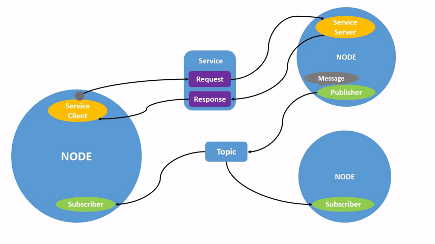

## 安装

使用 docker 环境安装，docker pull osrf/ros2:nightly

```bash
docker run -dit \
    --name myros2 \
    --env DISPLAY=$DISPLAY \
    --env QT_X11_NO_MITSHM=1 \
    --volume /tmp/.X11-unix:/tmp/.X11-unix \
    --volume $HOME/.Xauthority:/root/.Xauthority \
    --net host \
    osrf/ros2:nightly \
    bash
docker exec -it myros2 bash
```

进入终端后，安装一些常用工具：

```bash
apt install -y vim
```

后面默认使用了 docker 的 root 环境，不再加上 sudo。版本使用 rolling，文档注意使用 rolling 的版本。

## 常用命令

### 安装

```bash
# rolling 版本的海龟，docker 版本对应 rolling
# colcon 是构建包的工具
# rqt 可视化组件和依赖
apt -y install ros-rolling-turtlesim python3-colcon-common-extensions '~nros-rolling-rqt*' \
    iproute2
```

### 查看组件

```bash
ros2 pkg executables turtlesim # 查看 package 下的可执行文件
ros2 node list
ros2 topic list
ros2 service list
ros2 action list
```

## 运行可执行文件

```bash
ros2 run {{package}} {{executable}} 
```

### 节点

```bash
ros2 node list # list current running nodes
# 查看节点细节。比如 /my_turtle
# 查看订阅者，发布者，服务和 actions
ros2 node info {{node}}
```

### 话题

```bash
ros2 topic list # show topic
ros2 topic list -t # show topic with type，更详细
# 监听话题，如果发布数据到此话题则打印，用于调试
ros2 topic echo {{topic}} 
ros2 topic echo {{topic}} --no-arr # 不显示 arr 字段
ros2 topic info {{topic}} # 查看话题细节
# 推送信息到话题
# '{{args}}' 单引号中的 {{args}} 时 YAML 格式的，特别注意冒号后要紧跟空格
ros2 topic pub {{topic}} {{msg_type}} '{{args}}'
# 例子，--once 代表仅发布一次；或者指定 --rate hz，以 hz 频率一直发送
# 随后可以 ros2 topic echo /turtle1/pose 可以看到有内容
ros2 topic pub --once /turtle1/cmd_vel \
    geometry_msgs/msg/Twist \
    "{linear: {x: 2.0, y: 0.0, z: 0.0}, angular: {x: 0.0, y: 0.0, z: 1.8}}"

ros2 topic hz {{topic}} # 查看数据发布速率
```

### interface: 查看类型定义的工具，与 type 打交道

```bash
# 查看类型的定义，展示数据组成细节
ros2 interface show {{service_type | message_type | action_type}}
# 例子
ros2 interface show geometry_msgs/msg/Twist
```

### service

```bash
ros2 service list
ros2 service type {{service}}
# arguments 参数可选
ros2 service call {{service}} {{service_type}} {{arguments}}
ros2 service echo {{service_type | service_type}} {{arguments}}
# 根据服务类型查找服务
ros2 service find {{service type name}}
```

### Parameters

```bash
ros2 param list
ros2 param get {{node}} {{parameter}}
ros2 param set {{node}} {{parameter}} {{value}}
# 查看所有节点参数值，以 yaml 格式展示
# 可以重定向到 yaml 文件
ros2 param dump {{node}}
ros2 param load {{node}} {{parameter_file}}
```

### Actions

```bash
ros2 action list
ros2 action list -t
ros2 action type {{action}}
ros2 action info {{action}}
```

### 创建 package

```bash
ros2 pkg create
```

## 配置环境

## 使用 ROS2

运行 setup.bash 脚本，初始化环境。如果是 zsh，则用 setup.zsh。

```bash
# Replace ".bash" with your shell if you're not using bash
# Possible values are: setup.bash, setup.sh, setup.zsh
source /opt/ros/rolling/setup.bash
[rti_connext_dds_cmake_module][warning] No RTI Connext DDS installation specified.. RTI Connext DDS will not be available at runtime,unless you already configured LD_LIBRARY_PATH manually.
```

可以这一过程放入 /root/.bashrc，每次进入 bash 即激活。

```bash
# echo "source /opt/ros/rolling/setup.zsh" >> ~/.zshrc
echo "source /opt/ros/rolling/setup.bash" >> ~/.bashrc
```

验证。

```bash
printenv | grep -i ROS
```

应当看到。

```
ROS_VERSION=2
ROS_PYTHON_VERSION=3
ROS_DISTRO=rolling
```

### 使用 turtlesim, ros2 和 rqt

在 bash 界面：

```bash
apt update
apt install ros-rolling-turtlesim
```

执行

```bash
ros2 run turtlesim turtle_teleop_key
# 重复第一只海龟命令
ros2 run turtlesim turtle_teleop_key --ros-args --remap turtle1/cmd_vel:=turtle2/cmd_vel
```

### 对比：话题，服务，动作

#### Topic（话题）
• 概念：话题是ROS2中最基本的异步、单向通信方式，类似于发布/订阅模式。一个节点可以作为发布者（Publisher）发布信息到一个特定的话题上，而零个、一个或多个节点作为订阅者（Subscriber）接收这些信息。发布者不知道也不关心有多少订阅者，而订阅者只接收它们感兴趣的话题。
• 特点：支持一对多或多对多的通信，适用于频繁或连续的数据流传输，如传感器数据、控制指令等。
• 使用场景：适合于持续更新的数据流，例如摄像头图像、激光雷达数据传输，或是机器人状态的广播。

#### Service（服务）
• 概念：服务提供了同步的请求/响应通信模式。一个节点作为服务端（Server）等待客户端（Client）的请求，并返回响应。客户端发起请求后会阻塞等待服务端的响应。
• 特点：服务是双向通信，基于请求和响应的模式，适用于需要立即反馈或确认的交互场景。
• 使用场景：适用于需要得到明确响应的操作，如查询机器人当前位置、请求执行某个一次性任务或确认操作是否成功。

#### Action（动作）
• 概念：动作是ROS2中用于处理长时间运行任务的高级通信机制，它结合了异步特性和反馈机制。动作分为目标（goal）、结果（result）、反馈（feedback）三个阶段，允许客户端发送一个目标给服务端，服务端执行过程中可以周期性地提供进度反馈，最终报告结果。
• 特点：支持多对一的通信，具有目标取消、任务反馈和结果确认的能力，适用于需要持续监控和可能需要中途干预的复杂任务。

使用场景：适用于复杂的、可能需要较长时间完成的任务，如导航到远处的目标点、执行复杂的机械臂动作序列，其中任务的进展和结果需要被监控和可能的中止。

### 话题和服务的区别

是两种核心通信机制，它们的核心区别体现在通信模型、数据流向、适用场景等多个方面。以下是具体对比：

| ​特性     | ​话题                      | ​服务                    |
| --------- | -------------------------- | ------------------------ |
| ​数据流   | 持续、高频（如传感器数据） | 短暂、低频（如控制指令） |
| ​反馈需求 | 无需反馈                   | 需要明确响应结果         |
| ​典型应用 | 图像传输、机器人状态更新   | 参数查询、任务触发       |
| ​通信效率 | 高（无阻塞）               | 中（需等待响应）         |

总结
- ​选择话题：当需要**持续数据流**或**​一对多/多对多通信**时（如传感器数据分发）。
- ​选择服务：当需要**​即时反馈**或**​精确控制**时（如执行计算任务或设备控制）。

## 客户端库

### colcon: 构建 packages

安装，apt -y install python3-colcon-common-extensions。colcon 使用 out of source builds。首先，需要构建一个目录，作为项目目录。随后，目录下放置 src 子目录，对应 ROS 的 package 的源代码。随后，colcon 创建 src 的同级目录 build, install, log。
- build用于存放生成的中间文件,CMake也会在此目录下,对应源码结构生成中间文件;
- install会存放各个安装的package,也按照源码结构的目录来生成和存放;

比如

```bash
mkdir -p ~/ros2_ws/src
cd ~/ros2_ws
git clone https://github.com/ros2/examples src/examples -b rolling
```

在 ros2_ws 目录下，执行：

```bash
colcon build --symlink-install
```

可以看到目录变化：

```
.
├── build
├── install
├── log
└── src
```

如有需要，可以运行测试命令 colcon test。building 成功后，输出内容放置在 install 目录，如需使用，还要添加它们到对应的环境变量。colcon 会同时生成 bash, zsh, bat 脚本，运行它们来安装即可：

```bash
source install/setup.bash
```

#### 例子

订阅者和发布者的例子：

```bash
ros2 run examples_rclcpp_minimal_subscriber subscriber_member_function
```

另一个终端运行:

```bash
ros2 run examples_rclcpp_minimal_publisher publisher_member_function
```

#### 创建工具

colcon 使用 package.xml 配置文件。支持不同构建类型，推荐的有 ament_cmake 和 ament_python，还有 cmake 包。

#### 配置 colcon tab 补全

```bash
# 对于 zsh
# echo "source /usr/share/colcon_argcomplete/hook/colcon-argcomplete.zsh" >> ~/.zshrc
echo "source /usr/share/colcon_argcomplete/hook/colcon-argcomplete.bash" >> ~/.bashrc
```

#### 使用 rosdep 检验依赖

在 workspace，比如 ~/ros2_ws 目录下，执行 colcon build 之前，可以解析依赖。

```bash
rosdep install -i --from-path src --rosdistro rolling -y
```

#### Overlay 和 Underlay

我们每次进入新的 shell 时,调用 source /opt/ros/rolling/local_setup.zsh 或是 /opt/ros/rolling/setup.zsh 来初始化开发环境, 此 setup 脚本是 source installation 或者 binary installation 提供的, 会为当前 workspace 提供必要的 build dependencies, 比如 example packages; 我们称此 workspace 的环境为 **underlay**。

我们创建新的目录后,在 underlay 的基础上,做出修改并使其成为 overlay。后续开发中,使用 overlay 来迭代 package 是推荐的做法。

比如，在 source /opt/ros/rolling/setup.bash 后，在当前 Workspace 下，source 此 overlay：

```bash
source install/local_setup.bash
```

即可在 underlay 上构建 overlay。于是，在 local_setup.bash 后，可以运行此 overlay 的内容。

#### package 构成

一个 package 至少包含如下文件：
- `package.xml` 包含元信息
- `resource/{{package}}` 包的标志文件
- `setup.cfg` is required when a package has executables, so ros2 run can find them
- `setup.py` containing instructions for how to install the package
- `{{package}}` 与包同名的目录名，下面通常包含具体的源代码。used by ROS 2 tools to find your package, contains `__init__.py`

#### workspace 下的包如何组织的

在 workspace 的 src 目录下，组织了各种包。

```
workspace_folder/
    src/
      cpp_package_1/
          CMakeLists.txt
          include/cpp_package_1/
          package.xml
          src/

      py_package_1/
          package.xml
          resource/py_package_1
          setup.cfg
          setup.py
          py_package_1/
      ...
      cpp_package_n/
          CMakeLists.txt
          include/cpp_package_n/
          package.xml
          src/
```

#### 创建包

```bash
cd ~/ros2_ws/src
ros2 pkg create --build-type ament_python --license Apache-2.0 {{package_name}}
```

还可指定 --node-name 来创建简单类型的可执行文件。比如：

```bash
ros2 pkg create --build-type ament_python --license Apache-2.0 \
    --node-name my_node my_package
```

构建并使用

```bash
cd ~/ros2_ws
# 如果不指定 --packages-select，编译所有包会很耗时
colcon build --packages-select my_package
source install/local_setup.bash
ros2 run my_package my_node
```

可以查看 ros2_ws/src/my_package 下的文件，包含 my_package, package.xml, resource, setup.cfg, setup.py, test。

package.xml，我们可以看到 description 和 liscence 有 TODO 内容，可以修改。在 `<license>` 标签下方，有很多以 `_depend` 结尾的标签，比如 `<test_depend>`，代表依赖别的包，colcon 会搜索。

setup.py 包含了与 package.xml 相同的描述、维护者和证书字段。还有 version 和 name 字段。

## 例子

### 发布者和订阅者

```bash
cd ~/ros2_ws/src
ros2 pkg create --build-type ament_python --license Apache-2.0 py_pubsub
```

在 `__init__.py` 同级目录，即 ~/ros2_ws/src/py_pubsub/py_pubsub/publisher_member_function.py：

```py
# publisher_member_function.py
import rclpy
from rclpy.executors import ExternalShutdownException
from rclpy.node import Node
# 内置的字符串消息类型，发布到话题需要对应 std_msgs 下的类型
from std_msgs.msg import String

class MinimalPublisher(Node):

    def __init__(self):
        super().__init__('minimal_publisher')
        self.publisher_ = self.create_publisher(String, 'topic', 10)
        timer_period = 0.5  # seconds
        self.timer = self.create_timer(timer_period, self.timer_callback)
        self.i = 0

    def timer_callback(self):
        msg = String()
        msg.data = 'Hello World: %d' % self.i
        self.publisher_.publish(msg)
        self.get_logger().info('Publishing: "%s"' % msg.data)
        self.i += 1

def main(args=None):
    try:
        with rclpy.init(args=args):
            minimal_publisher = MinimalPublisher()
            rclpy.spin(minimal_publisher)
    except (KeyboardInterrupt, ExternalShutdownException):
        pass

if __name__ == '__main__':
    main()
```

```py
# subscriber_member_function.py
import rclpy
from rclpy.executors import ExternalShutdownException
from rclpy.node import Node
from std_msgs.msg import String

class MinimalSubscriber(Node):

    def __init__(self):
        super().__init__('minimal_subscriber')
        self.subscription = self.create_subscription(
            String,
            'topic',
            self.listener_callback,
            10)
        self.subscription  # prevent unused variable warning

    def listener_callback(self, msg):
        self.get_logger().info('I heard: "%s"' % msg.data)

def main(args=None):
    try:
        with rclpy.init(args=args):
            minimal_subscriber = MinimalSubscriber()
            rclpy.spin(minimal_subscriber)
    except (KeyboardInterrupt, ExternalShutdownException):
        pass

if __name__ == '__main__':
    main()
```

使用了 rclpy 和 std_msgs 包后，需要在 package.xml 文件添加配置如下：

```xml
<exec_depend>rclpy</exec_depend>
<exec_depend>std_msgs</exec_depend>
```

添加 entry point，打开 setup.py 文件，把 maintainer, maintainer_email, description 和 license 字段修改以匹配 package.xml。随后，在下面加入：

```py
entry_points={
        'console_scripts': [
                'talker = py_pubsub.publisher_member_function:main',
                'listener = py_pubsub.subscriber_member_function:main',
        ],
},
```

随后，setup.cfg 文件会自动生成，比如：

```
[develop]
script_dir=$base/lib/py_pubsub
[install]
install_scripts=$base/lib/py_pubsub
```

构建和运行：

```bash
rosdep install -i --from-path src --rosdistro rolling -y
colcon build --package-select py_pubsub
source install/local_setup.bash
ros2 run py_pubsub talker
```

另一个窗口

```bash
ros2 run py_pubsub talker
```

## Ref and Tag