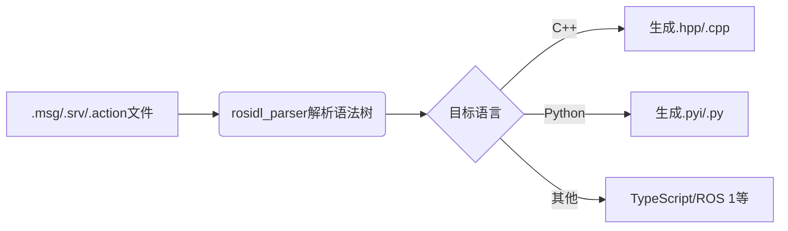

## 安装和创建镜像

使用 docker 环境安装，docker pull osrf/ros2:nightly

```bash
docker run -dit \
    --name myros2 \
    --env DISPLAY=$DISPLAY \
    --env QT_X11_NO_MITSHM=1 \
    --volume /tmp/.X11-unix:/tmp/.X11-unix \
    --volume $HOME/.Xauthority:/root/.Xauthority \
    --net host \
    osrf/ros2:nightly \
    bash
docker exec -it myros2 bash
```

进入终端后，需要安装一些常用工具。

后面默认使用了 docker 的 root 环境，不再加上 sudo。版本使用 rolling，文档注意使用 rolling 的版本。

## 初始化

### 初始化环境

运行 setup.bash 脚本，初始化环境。如果是 zsh，则用 setup.zsh。

```bash
# Replace ".bash" with your shell if you're not using bash
# Possible values are: setup.bash, setup.sh, setup.zsh
source /opt/ros/rolling/setup.bash
```

可以这一过程放入 /root/.bashrc，每次进入 bash 即激活。

```bash
# echo "source /opt/ros/rolling/setup.zsh" >> ~/.zshrc
echo "source /opt/ros/rolling/setup.bash" >> ~/.bashrc
```

验证。

```bash
printenv | grep -i ROS
```

应当看到。

```
ROS_VERSION=2
ROS_PYTHON_VERSION=3
ROS_DISTRO=rolling
```

### 使用 turtlesim, ros2 和 rqt

在 bash 界面：

```bash
apt update
apt install ros-rolling-turtlesim
```

执行

```bash
ros2 run turtlesim turtle_teleop_key
# 重复第一只海龟命令
ros2 run turtlesim turtle_teleop_key --ros-args --remap turtle1/cmd_vel:=turtle2/cmd_vel
```

### 汇总 bash 设置

```bash
. /opt/ros/rolling/setup.bash
# colcon_cd
. /usr/share/colcon_cd/function/colcon_cd.sh
. /usr/share/colcon_cd/function/colcon_cd-argcomplete.bash

export _colcon_cd_root=/opt/ros/rolling/
```

```zsh
. /opt/ros/rolling/setup.zsh
# colcon_cd
. /usr/share/colcon_cd/function/colcon_cd.sh
. /usr/share/colcon_cd/function/colcon_cd-argcomplete.zsh

export _colcon_cd_root=/opt/ros/rolling/
```

### 汇总安装对应的包

```bash
# rolling 版本的海龟，docker 版本对应 rolling
# colcon 是构建包的工具
# rqt 可视化组件和依赖
# docker 版本的 ros2 自带了 ros-rolling-turtlesim
apt -y install \
    ros-rolling-turtlesim python3-colcon-common-extensions '~nros-rolling-rqt*' \
    iproute2 vim x11-apps tree
```

### 查看组件

```bash
ros2 pkg executables turtlesim # 查看 package 下的可执行文件
ros2 node list
ros2 topic list
ros2 service list
ros2 action list
```

可以看到，ROS2 使用象牙符号 := 赋值。

## 常用命令

### 运行

```bash
ros2 run {{package}} {{executable}}
```

可以指定参数 `--ros-args --remap {{node_property}}:={{new_value}}`，重新分配节点属性。`-r` 是对应短选项。

### Node

```bash
ros2 node list # list current running nodes
# 查看节点细节。比如 /my_turtle
# 可以看到订阅者，发布者，服务和 actions
ros2 node info {{node}}
```

### Topic 

节点运行时，会发布和订阅话题。查看命令如下：

```bash
ros2 topic list
ros2 topic list -t # show topic with type，更详细
```

可以监听话题并打印：

```bash
# 监听话题，如果发布数据到此话题则打印，用于调试
ros2 topic echo {{topic}} 
ros2 topic echo {{topic}} --no-arr # 不显示 arr 字段
```

查看话题的类型，发布、订阅者数量：

```bash
ros2 topic info {{topic}}
```
查看到类型后，可以用 `ros2 interface show {{type}}` 查看 schema。

知道类型后，可以直接发布数据到话题，其中数据要表现为 YAML 格式，要注意冒号后紧跟空格。

```bash
ros2 topic pub {{topic}} {{msg_type}} '{{args}}'
# 例子，--once 代表仅发布一次；或者指定 --rate hz，以 hz 频率一直发送
# 随后可以 ros2 topic echo /turtle1/pose 可以看到有内容
ros2 topic pub --once /turtle1/cmd_vel \
    geometry_msgs/msg/Twist \
    "{linear: {x: 2.0, y: 0.0, z: 0.0}, angular: {x: 0.0, y: 0.0, z: 1.8}}"
ros2 topic pub /turtle1/cmd_vel geometry_msgs/msg/Twist 'linear:
  x: 0.0
  y: 0.0
  z: 0.0
angular:
  x: 0.0
  y: 0.0
  z: 0.0
'
```

ros2 topic pub 的参数还有：
- `--once` 仅仅发布一次，否则持续发送，默认 1 Hz
- `-w {{num_subscriptions}}` 等待订阅数量

统计话题频率、带宽、查找类型等：

```bash
ros2 topic hz {{topic}} # 查看数据发布速率
ros2 topic bw {{topic_name}}
ros2 topic find {{topic_type}}
```

可以使用工具 `rqt_graph` 查看节点和话题的联系。

### Interface: 查看类型定义，与 type 打交道

```bash
# 查看类型的定义，展示数据组成细节
ros2 interface show {{service_type | message_type | action_type}}
# 例子
ros2 interface show geometry_msgs/msg/Twist
```

### Service

```bash
ros2 service list
ros2 service list -t # 带有类型的查看
ros2 service type {{service}}
# arguments 参数可选
ros2 service call {{service}} {{service_type}} {{arguments}}
ros2 service echo {{service_type | service_type}} {{arguments}}
# 根据服务类型查找服务
ros2 service find {{service type name}}
```

### Parameters

Parameter 是节点的配置值，每个节点保存它为 int, float, string, bool, list, dict 等。这是一种动态配置机制，可以在运行时修改，不需要重新编译，给与节点信息。

```bash
ros2 param list
ros2 param get {{node}} {{parameter}}
ros2 param set {{node}} {{parameter}} {{value}}
# 查看所有节点参数值，以 yaml 格式展示
# 可以重定向到 yaml 文件
ros2 param dump {{node}}
ros2 param load {{node}} {{parameter_file}}
```

在节点启动时加载 parameter file:

```bash
ros2 run {{package_name}} {{executable_name}} --ros-args --param-file {{file_name}}
```

### Actions

ROS2 的一种通信类型，用于长任务。包含 goal, feedback, and a result。Actions 构建于 topics 和 services 之上，功能类似服务，除了不能被取消。

```bash
ros2 action list
ros2 action list -t
ros2 action type {{action}}
ros2 action info {{action}}
```

### Packages

```bash
ros2 pkg executables {{package_name}} # 查看有哪些可执行文件
ros2 pkg create
```

ros2 pkg create 可以接受各种名来，简化配置：
- `--build-type` 可选 ament_cmake 或 ament_python
- `--license` 通常是 Apache-2.0
- `--dependencies` 添加依赖，自动配置 package.xml，CMakeLists.txt 等。比如指定 rclcpp

```bash
ros2 pkg create --build-type ament_cmake --license Apache-2.0 cpp_srvcli --dependencies rclcpp example_interfaces
```

### Launching nodes

复杂系统中，通常需要同时运行多个节点。配置 launch 文件，使用 `ros2 launch` 一次启动系统的所有节点。

```bash
ros2 launch turtlesim multisim.launch.py
```

multisim.launch.py 内容如下：

```py
from launch import LaunchDescription
import launch_ros.actions


def generate_launch_description():
    return LaunchDescription([
        launch_ros.actions.Node(
            namespace='turtlesim1', package='turtlesim',
            executable='turtlesim_node', output='screen'),
        launch_ros.actions.Node(
            namespace='turtlesim2', package='turtlesim',
            executable='turtlesim_node', output='screen'),
    ])
```

可以看到，同时加载两个 Node。

### colcon: 构建

```bash
colcon build # 构建当下所有 package
colcon build --packages-select my_package
```

### rosdep: 判断依赖

```bash
rosdep install -i --from-path src --rosdistro rolling -y
```

##
## 概念

### 话题，服务，动作

#### Topic（话题）
• 概念：话题是ROS2中最基本的异步、单向通信方式，类似于发布/订阅模式。一个节点可以作为发布者（Publisher）发布信息到一个特定的话题上，而零个、一个或多个节点作为订阅者（Subscriber）接收这些信息。发布者不知道也不关心有多少订阅者，而订阅者只接收它们感兴趣的话题。
• 特点：支持一对多或多对多的通信，适用于频繁或连续的数据流传输，如传感器数据、控制指令等。
• 使用场景：适合于持续更新的数据流，例如摄像头图像、激光雷达数据传输，或是机器人状态的广播。

#### Service（服务）

类似 C/S 架构场景。

• 概念：服务提供了同步的请求/响应通信模式。一个节点作为服务端（Server）等待客户端（Client）的请求，并返回响应。客户端发起请求后会阻塞等待服务端的响应。
• 特点：服务是双向通信，基于请求和响应的模式，适用于需要立即反馈或确认的交互场景。
• 使用场景：适用于需要得到明确响应的操作，如查询机器人当前位置、请求执行某个一次性任务或确认操作是否成功。

#### Action（动作）

• 概念：动作是 ROS2 中用于处理长时间运行任务的高级通信机制，它结合了异步特性和反馈机制。动作分为目标（goal）、结果（result）、反馈（feedback）三个阶段，允许客户端发送一个目标给服务端，服务端执行过程中可以周期性地提供进度反馈，最终报告结果。
• 特点：支持多对一的通信，具有目标取消、任务反馈和结果确认的能力，适用于需要持续监控和可能需要中途干预的复杂任务。

使用场景：适用于复杂的、可能需要较长时间完成的任务，如导航到远处的目标点、执行复杂的机械臂动作序列，其中任务的进展和结果需要被监控和可能的中止。

### 话题和服务的区别

是两种核心通信机制，它们的核心区别体现在通信模型、数据流向、适用场景等多个方面。以下是具体对比：

| ​特性     | ​话题                      | ​服务                    |
| --------- | -------------------------- | ------------------------ |
| ​数据流   | 持续、高频（如传感器数据） | 短暂、低频（如控制指令） |
| ​反馈需求 | 无需反馈                   | 需要明确响应结果         |
| ​典型应用 | 图像传输、机器人状态更新   | 参数查询、任务触发       |
| ​通信效率 | 高（无阻塞）               | 中（需等待响应）         |

总结
- ​选择话题：当需要**持续数据流**或**​一对多/多对多通信**时（如传感器数据分发）。
- ​选择服务：当需要**​即时反馈**或**​精确控制**时（如执行计算任务或设备控制，需要像 C/S 一样请求回答）。

## 客户端库

### 构建 packages 的流程

安装，apt -y install python3-colcon-common-extensions。colcon 使用 out of source builds。首先，需要构建一个目录，作为项目目录。随后，目录下放置 src 子目录，对应 ROS 的 package 的源代码。随后，colcon 创建 src 的同级目录 build, install, log。
- build用于存放生成的中间文件,CMake也会在此目录下,对应源码结构生成中间文件;
- install会存放各个安装的package,也按照源码结构的目录来生成和存放;

比如

```bash
mkdir -p ~/ros2_ws/src
cd ~/ros2_ws
git clone https://github.com/ros2/examples src/examples -b rolling
```

在 ~/ros2_ws 目录下，执行：

```bash
colcon build --symlink-install
```

--symlink-install 在 install 目录创建软链接，指向 build 和 src 中对应的原始文件。比如，使用 Python 时不会编译文件，可以避免复制。不指定，则会拷贝编译文件和需要的文件到 install 目录。此选项方便开发迭代，生产部署时，应当去掉此选项。

可以看到目录变化：

```
.
├── build
├── install
├── log
└── src
```

build 之前，可以运行测试命令 colcon test。building 成功后，输出内容放置在 install 目录。如需使用，要添加它们到对应的环境变量。colcon 会同时生成 bash, zsh, bat 脚本，运行它们来安装即可：

```bash
source install/setup.bash
```

#### 例子

订阅者和发布者的例子：

```bash
ros2 run examples_rclcpp_minimal_subscriber subscriber_member_function
```

另一个终端运行:

```bash
ros2 run examples_rclcpp_minimal_publisher publisher_member_function
```

#### colcon_cd：快速移动 cwd 到 package

首先配置：

```bash
echo "source /usr/share/colcon_cd/function/colcon_cd.sh" >> ~/.bashrc
echo "export _colcon_cd_root=/opt/ros/rolling/" >> ~/.bashrc
```

随后可以用：

```bash
colcon_cd {{pkg_name}}
```

#### 创建自己的 package

colcon 使用 package.xml 配置文件。支持不同构建类型，推荐的有 ament_cmake 和 ament_python，还有 cmake 包。

#### 使用 rosdep 检验依赖

在 workspace，比如 ~/ros2_ws 目录下，执行 colcon build 之前，可以解析依赖。解析 src 目录下的项目，指定 ros 版本为 rolling：

```bash
rosdep install -i --from-path src --rosdistro rolling -y
```

#### Overlay 和 Underlay

每次进入新的 shell 时,调用 source /opt/ros/rolling/local_setup.zsh 或是 /opt/ros/rolling/setup.zsh 来初始化开发环境, 此 setup 脚本是 ROS2 的 source installation 或者 binary installation 提供的, 为当前 workspace 提供必要的 build dependencies, 比如 example packages; 称此 workspace 的环境为 underlay。

我们创建新的目录后,在 underlay 的基础上,做出修改并使其成为 overlay。后续开发中,使用 overlay 迭代 package 是推荐的做法。

比如，在 source /opt/ros/rolling/setup.bash 后，在当前 Workspace 下，source 此 overlay：

```bash
source install/local_setup.bash
```

即可在 underlay 上构建 overlay。于是，在 local_setup.bash 后，可以运行此 overlay 的内容。

#### Package 构成

一个 package 至少包含如下文件：
- `package.xml` 包含元信息
- `resource/{{package}}` 包的标志文件
- `setup.cfg` is required when a package has executables, so ros2 run can find them
- `setup.py` containing instructions for how to install the package
- `{{package}}` 与包同名的目录名，下面通常包含具体的源代码。used by ROS 2 tools to find your package, contains `__init__.py`

#### Workspace 下的包如何组织的

在 workspace 的 src 目录下，组织了各种包。

```
workspace_folder/
    src/
      cpp_package_1/
          CMakeLists.txt
          include/cpp_package_1/
          package.xml
          src/

      py_package_1/
          package.xml
          resource/py_package_1
          setup.cfg
          setup.py
          py_package_1/
      ...
      cpp_package_n/
          CMakeLists.txt
          include/cpp_package_n/
          package.xml
          src/
```

#### 创建包

```bash
cd ~/ros2_ws/src
```

CMake 和 Python 版本分别如下：

```bash
ros2 pkg create --build-type ament_cmake --license Apache-2.0 <package_name>
ros2 pkg create --build-type ament_python --license Apache-2.0 {{package_name}}
```

还可指定 --node-name 来创建简单类型的可执行文件，类似 Hello World 的模板。指定后，会在 ~/ros2_ws/src 下，生成 my_package/src/my_node.cpp 或 ./my_package/my_package/my_node.py 文件。

```bash
ros2 pkg create --build-type ament_python --license Apache-2.0 \
    --node-name my_node my_package
```

构建并运行：

```bash
cd ~/ros2_ws
# 如果不指定 --packages-select，编译所有包会很耗时
colcon build --packages-select my_package
source install/local_setup.bash
ros2 run my_package my_node
```

可以查看 ros2_ws/src/my_package 下的文件，包含 my_package, package.xml, resource, setup.cfg, setup.py, test。

package.xml，我们可以看到 description 和 liscence 有 TODO 内容，可以修改。在 `<license>` 标签下方，有很多以 `_depend` 结尾的标签，比如 `<test_depend>`，代表依赖别的包，colcon 会搜索。

setup.py 包含了与 package.xml 相同的描述、维护者和证书字段。还有 version 和 name 字段。

#### 自定义 package.xml

填写 maintainer, description, buildtool_depend 等内容。

### 各种例子

1. [publisher and subscriber (C++)](https://docs.ros.org/en/rolling/Tutorials/Beginner-Client-Libraries/Writing-A-Simple-Cpp-Publisher-And-Subscriber.html)
2. [publisher and subscriber (Pyhthon)](https://docs.ros.org/en/rolling/Tutorials/Beginner-Client-Libraries/Writing-A-Simple-Cpp-Publisher-And-Subscriber.html)

主要使用回调函数的范式完成定时的任务。

### C++ 版本

头文件：
- `rclcpp/rclcpp.hpp` 包含了 Node 等定义
- `std_msgs/msgs/string.hpp` 定义了发布的数据类型，比如 `std_msgs::msg::String`

rclcpp::Node 有创建发布者的成员函数：
- `rclcpp::Publisher<std_msgs::msg::String>::SharedPtr create_publisher(String, QoS)`
- `rclcpp::Subscription<std_msgs::msg::String>::SharedPtr create_subscription(String, QoS, callback)`
- `rclcpp::TimerBase::SharedPtr create_wall_timer(hz, callback)`

Publisher 有方法发布信息：
- `publish(std_msgs::msg::String msg)`

修改 package.xml，因为需要 rclcpp/rclcpp.hpp, std_msgs/msgs/string.hpp，所以需要指出依赖：

```xml
<depend>rclcpp</depend>
<depend>std_msgs</depend>
```

CMakeLists.txt 不分，需要查找对应的 pacakge：

```CmakeLists
find_package(ament_cmake REQUIRED)
find_package(rclcpp REQUIRED)
find_package(std_msgs REQUIRED)
```

总结思路：在 Ctor 创建 publisher，定义一个让 publisher 不断发布 msg 的回调函数，创建 timer 并注册此回调函数。最后修改配置文件，引入依赖的包。

Service and Client：需要定义 .srv 文件，以 `---` 分割请求和响应内容类型。

#### 处理 Action

创建 action server，由如下 API 创建：

```cpp
rclcpp_action::create_server(NodeT, const std::string&, typename Server<ActionT>::GoalCallback, typename Server<ActionT>::CancelCallback, typename Server<ActionT>::AcceptedCallback, const rcl_action_server_options_t&, rclcpp::CallbackGroup::SharedPtr)
```

所有 Callback 需要理解返回，避免阻塞。

GoalCallback 接受两个参数，在接收到客户端请求目标（goal）时调用，随后开始执行实现 goals 的逻辑。

CancelCallback 接受一个参数，客户端发来取消后，告诉服务端处理取消逻辑。

AcceptedCallback 接受一个参数，处理 GoalCallback 返回 rclcpp_action::GoalResponse::ACCEPT_AND_EXECUTE 的目标。由于需要立即返回，通常分发任务到工作线程来完成。

### Python 版本

思路类似，与配置 CMakeLists.txt 不同的是，配置 setup.py 文件找到入口。

## 多机通信

ROS 2 使用分布式通信框架，基于 DDS，满足网络配置条件即可在不同主机上的节点进行数据交互。

两台主机位于同一局域网，且 ping 通。并且要求 ROS 2 环境一致，确保所有节点使用消息类型完全一致，比如 (如 std_msgs/String)。

Domain ID 标识的逻辑分组，分组内的节点可以通信。可在 .bashrc 中设置相同的 Domain ID：

```bash
export ROS_DOMAIN_ID=42 # 保持一致即可，默认 0，范围从 0-101
```

### 发布者主机设置

设置主机 IP 如下：

```bash
export ROS_IP=192.168.1.100
```

启动发布者节点：

```bash
ros2 run demo_nodes_cpp taker
```

### 订阅者从机设置

设置从机 IP 和启动订阅者节点：

```bash
export ROS_IP=192.168.1.101
ros2 run demo_nodes_cpp listener
```

### 通信验证

在从机上查看接受的消息：

```bash
ros2 topic echo /chatter
```

### 常见问题与解决方案

| ​问题            | ​原因                        | ​解决方案                                               |
| ---------------- | ---------------------------- | ------------------------------------------------------- |
| 节点无法发现彼此 | Domain ID 不一致             | 检查两台主机的 .bashrc 中 ROS_DOMAIN_ID 是否相同。      |
| 话题数据无法接收 | 防火墙阻拦                   | 开放 UDP 端口（默认 7400-7500）或临时禁用防火墙。       |
| 消息类型不匹配   | 不同主机编译的消息接口不一致 | 在两台主机上重新编译相同功能包，确保消息定义同步。      |
| IP 地址配置错误  | 网络桥接或静态 IP 设置错误   | 使用 ifconfig 确认 IP，并在 .bashrc 中正确导出 ROS_IP。 |

TODO...

## 例子

### 发布者和订阅者

```bash
cd ~/ros2_ws/src
ros2 pkg create --build-type ament_python --license Apache-2.0 py_pubsub
```

在 `__init__.py` 同级目录，即 ~/ros2_ws/src/py_pubsub/py_pubsub/publisher_member_function.py：

```py
# publisher_member_function.py
import rclpy
from rclpy.executors import ExternalShutdownException
from rclpy.node import Node
# 内置的字符串消息类型，发布到话题需要对应 std_msgs 下的类型
from std_msgs.msg import String

class MinimalPublisher(Node):

    def __init__(self):
        super().__init__('minimal_publisher')
        self.publisher_ = self.create_publisher(String, 'topic', 10)
        timer_period = 0.5  # seconds
        self.timer = self.create_timer(timer_period, self.timer_callback)
        self.i = 0

    def timer_callback(self):
        msg = String()
        msg.data = 'Hello World: %d' % self.i
        self.publisher_.publish(msg)
        self.get_logger().info('Publishing: "%s"' % msg.data)
        self.i += 1

def main(args=None):
    try:
        with rclpy.init(args=args):
            minimal_publisher = MinimalPublisher()
            rclpy.spin(minimal_publisher)
    except (KeyboardInterrupt, ExternalShutdownException):
        pass

if __name__ == '__main__':
    main()
```

```py
# subscriber_member_function.py
import rclpy
from rclpy.executors import ExternalShutdownException
from rclpy.node import Node
from std_msgs.msg import String

class MinimalSubscriber(Node):

    def __init__(self):
        super().__init__('minimal_subscriber')
        self.subscription = self.create_subscription(
            String,
            'topic',
            self.listener_callback,
            10)
        self.subscription  # prevent unused variable warning

    def listener_callback(self, msg):
        self.get_logger().info('I heard: "%s"' % msg.data)

def main(args=None):
    try:
        with rclpy.init(args=args):
            minimal_subscriber = MinimalSubscriber()
            rclpy.spin(minimal_subscriber)
    except (KeyboardInterrupt, ExternalShutdownException):
        pass

if __name__ == '__main__':
    main()
```

使用了 rclpy 和 std_msgs 包后，需要在 package.xml 文件添加配置如下：

```xml
<exec_depend>rclpy</exec_depend>
<exec_depend>std_msgs</exec_depend>
```

添加 entry point，打开 setup.py 文件，把 maintainer, maintainer_email, description 和 license 字段修改以匹配 package.xml。随后，在下面加入：

```py
entry_points={
        'console_scripts': [
                'talker = py_pubsub.publisher_member_function:main',
                'listener = py_pubsub.subscriber_member_function:main',
        ],
},
```

随后，setup.cfg 文件会自动生成，比如：

```
[develop]
script_dir=$base/lib/py_pubsub
[install]
install_scripts=$base/lib/py_pubsub
```

构建和运行：

```bash
rosdep install -i --from-path src --rosdistro rolling -y
colcon build --package-select py_pubsub
source install/local_setup.bash
ros2 run py_pubsub talker
```

另一个窗口

```bash
ros2 run py_pubsub talker
```

## Launch

Launch 系统用于加载程序，能够指定参数等，方便监视状态。加载文件可以是 XML，YAML 和 Python。

## 标准的消息

消息的定义文件通常保存为 `.msg` 后缀。服务和动作的后缀为 `.srv` 和 `.action`。

### std_srvs/srv/SetBool

### std_msgs

#### Header

https://docs.ros2.org/latest/api/

https://docs.ros2.org/latest/api/std_msgs/msg/Header.html

std_msgs/Header 定义如下：

```
builtin_interfaces/msg/Time stamp
string frame_id
```

stamp 可以通过 Node 对象的 now() 方法获取。

### geometry_msgs

#### Point

geometry_msgs/Point 定义：

```
float64 x
float64 y
float64 z
```

#### Quaternion

geometry_msgs/Quaternion 定义（带有默认值）：

```
float64 x 0
float64 y 0
float64 z 0
float64 w 1
```

#### Pose

geometry_msgs/Pose 定义：

```
Point position
Quaternion orientation
```

#### Vector3

geometry_msgs/Vector3 定义：

```
float64 x
float64 y
float64 z
```

#### Transform

geometry_msgs/Transform 定义：

```
geometry_msgs/msg/Vector3 translation
geomtry_msgs/msg/Quaternion rotation
```

#### TransformStamped

geometry_msgs/TransformStamped 定义：

```
std_msgs/Header header
string child_frame_id
geometry_msgs/msg/Transform transform
```

#### PoseStamped

带有时间戳的 Pose。geometry_msgs/PoseStamped 定义：

```
std_msgs/msg/Header header
geometry_msgs/msg/Pose pose
```

### sensor_msgs

#### CompressedImage

CompressedImage 用于压缩图片和传输。通常使用 cv_bridge 包转换，自动处理压缩和解压缩。用法如下：

```py
import rclpy
from rclpy.node import Node
from sensor_msgs.msg import Image
from cv_bridge import CvBridge
import cv2

class ImagePublisher(Node):
    def __init__(self):
        super().__init__('image_publisher')
        self.bridge = CvBridge()
        self.publisher = self.create_publisher(Image, 'image_raw', 10)
        
        # 使用image_transport会自动创建压缩话题
        # 原始图像
        img = cv2.imread('image.jpg')
        msg = self.bridge.cv2_to_imgmsg(img, "bgr8")
        self.publisher.publish(msg)
```

订阅端：

```py
from rclpy.node import Node
from sensor_msgs.msg import CompressedImage
from cv_bridge import CvBridge
import cv2

class CompressedImageSubscriber(Node):
    def __init__(self):
        super().__init__('compressed_image_subscriber')
        self.subscription = self.create_subscription(
            CompressedImage,
            'image/compressed',
            self.listener_callback,
            10)
        self.bridge = CvBridge()
    
    def listener_callback(self, msg):
        try:
            # 将压缩图像转换为OpenCV格式
            cv_image = self.bridge.compressed_imgmsg_to_cv2(msg)
            cv2.imshow("Compressed Image", cv_image)
            cv2.waitKey(1)
        except Exception as e:
            self.get_logger().error(f"Error processing image: {e}")
```

- jpeg: 有损压缩，适合自然场景
- png: 无损压缩，适合需要保留细节的图像
- webp: 较新的格式，提供有损和无损选项

#### JointState

主要字段：

```
std_msgs/Header header   # 时间戳和坐标系信息
string[] name           # 关节名称数组
float64[] position      # 关节位置(弧度或米)
float64[] velocity      # 关节速度(弧度/秒或米/秒)
float64[] effort        # 关节力矩/力(牛顿米或牛顿)
```

### geometry_msgs.msg

#### TransformStamped

## rosidl: ROS Interface Definition Language (接口定义语言)

标准化消息、服务和动作的接口描述规范，实现跨语言一致性。代码生成流程：



### 流程

创建接口文件：

```bash
# 在ROS 2包的msg目录下创建
my_package/
└── msg/
    └── MyMessage.msg  # 内容示例: string name, float32[] data
```

配置依赖，在 package.xml 中：

```xml
<build_depend>rosidl_default_generators</build_depend>
<exec_depend>rosidl_default_runtime</exec_depend>
<member_of_group>rosidl_interface_packages</member_of_group>
```

配置 CMakeLists.txt：

```cmake
find_package(rosidl_default_generators REQUIRED)
rosidl_generate_interfaces(${PROJECT_NAME}
  "msg/MyMessage.msg"
)
```

编译与生成结果，在位置：
- C++: install/my_package/include/my_package/msg/my_message.hpp
- Python: install/my_package/lib/python3.10/site-packages/my_package/msg/__init__.py

## 行为树

https://docs.nav2.org/behavior_trees/index.html

用好行为树优势，发挥可扩展性。

调研 Nav2 用行为树的方便，在


## URDF

安装 Tutorial：

```bash
sudo apt install -y ros-$ROS_DISTRO-urdf-tutorial
```

## 并发与话题订阅的 callback

比如，订阅一个话题，代表控制机器人的关节角到指定位置。还需要监测关节角，移动到与指定角度相差极小后发布成功的话题。

问题：使用 callback 处理订阅的话题，而监测关节角也依赖于处理订阅话题的 callback。内部实现时，一个 callback 阻塞会导致其他订阅的话题阻塞，自然监测不了最新的关节角。

### 方案一：asyncio

当前 callback 发完命令后，使用 asyncio.sleep() 让出控制权，给下一个 callback 机会读取最新关节角。

```py
import rclpy
from rclpy.node import Node
from std_msgs.msg import String
import asyncio
import threading
import concurrent.futures

class AsyncSubscriber(Node):
    def __init__(self):
        super().__init__('async_subscriber')
        
        # 创建专用的事件循环
        self.loop = asyncio.new_event_loop()
        self.thread = threading.Thread(target=self.run_event_loop, daemon=True)
        self.thread.start()
        
        # 创建订阅器
        self.subscription = self.create_subscription(
            String,
            'topic',
            self.callback_wrapper,  # 同步包装器
            10
        )
        self.get_logger().info("Async Subscriber Ready")

    def run_event_loop(self):
        """在新线程中运行事件循环"""
        asyncio.set_event_loop(self.loop)
        self.loop.run_forever()

    def callback_wrapper(self, msg):
        """同步回调函数，将任务提交到事件循环线程"""
        # 使用线程安全的方式提交协程
        future = asyncio.run_coroutine_threadsafe(
            self.async_callback(msg), 
            self.loop
        )
        
        # 如果不处理，协程不会执行到最后，不会得到调度的机会
        future.add_done_callback(self.handle_task_result)

    def handle_task_result(self, future):
        """处理异步任务的结果或异常"""
        try:
            # 获取结果（如果有）或捕获异常
            future.result()
        except Exception as e:
            self.get_logger().error(f"Async task failed: {str(e)}")

    async def async_callback(self, msg):
        """真正的异步回调函数"""
        self.get_logger().info(f"Received: {msg.data}")
        
        # 模拟异步等待资源
        await asyncio.sleep(2)  # 替换为实际的异步等待操作
        
        # 资源就绪后的处理
        self.get_logger().info(f"Processed after async wait: {msg.data}")

    def destroy_node(self):
        """清理资源"""
        self.loop.call_soon_threadsafe(self.loop.stop)
        super().destroy_node()

def main(args=None):
    rclpy.init(args=args)
    node = AsyncSubscriber()
    
    # 使用多线程执行器
    executor = rclpy.executors.MultiThreadedExecutor()
    executor.add_node(node)
    
    try:
        executor.spin()
    except KeyboardInterrupt:
        pass
    finally:
        node.destroy_node()
        rclpy.shutdown()

if __name__ == '__main__':
    main()
```

### 方案二：任务队列，轮询

## Ref and Tag

https://docs.ros.org/en/rolling/index.html