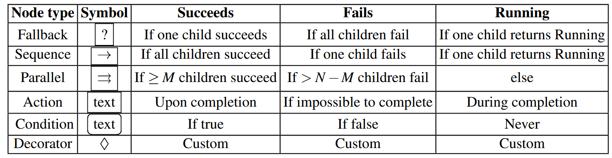
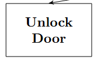
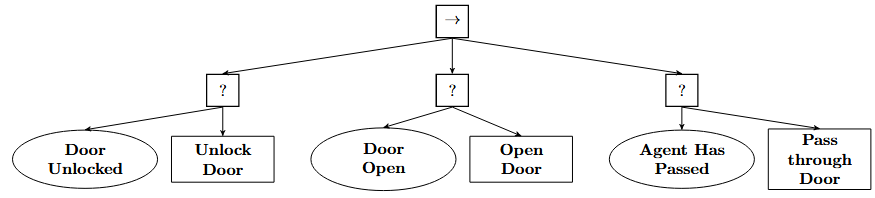
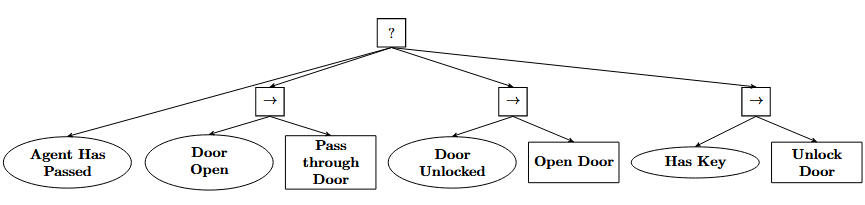
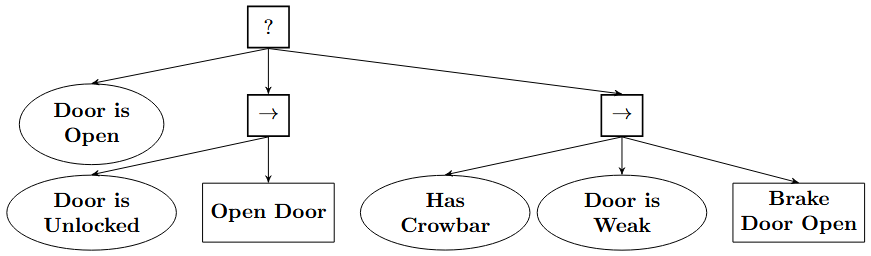
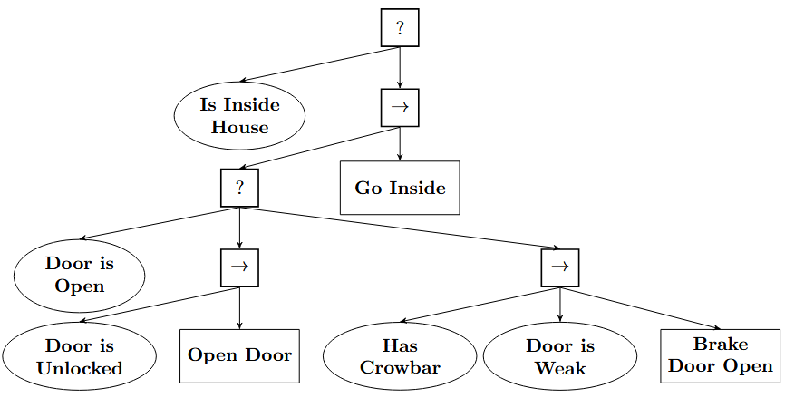
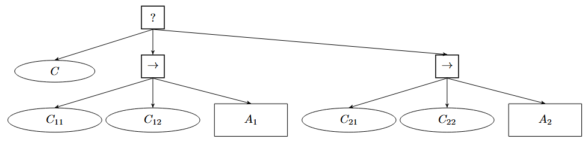
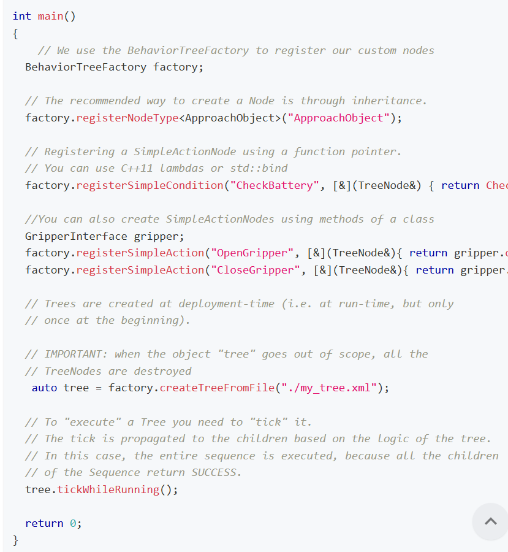
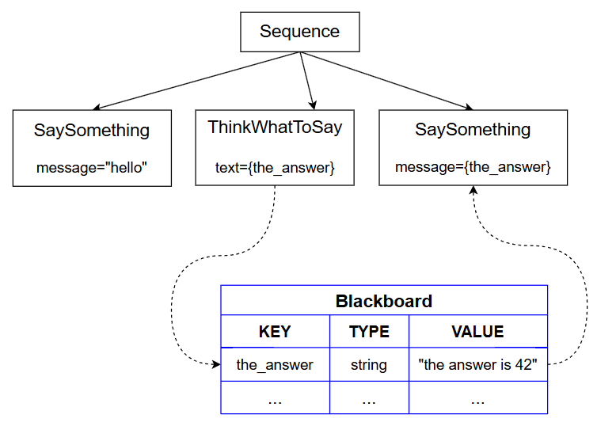

## 1. 什么是行为树

BT 管理机器人或AI系统行为的模块化、层次化控制架构。用于 Agent 领域，可以描述机器人或游戏中的虚拟实体。显著提升系统的可维护性和反应能力。

BT 优势：
- 模块化和可重用性。子树可以独立设计、测试和重用。而 FSM 的状态转移需调整全局，添加和删除状态需调整大量转移条件。感觉有 C++ 中类型擦除，或是 Linux 内核的 rbtree 等设计思路，易扩展。
- 层次化结构。适合任务分解，用于描述复杂任务。FSM 的层次化需手动设计嵌套，复杂度高，难维护。
- 反应性（Reactivity）。通过 Tick 机制周期性检查条件，实时响应环境。FSM 需显示定义所有可能转移。
- 可读性与调试便利。
- 安全性。通过序列节点（Sequence）和回退节点（Fallback）组合，实现安全约束。FSM 需手动编码所有异常处理路径。
- 扩展性。支持动态扩展（运行时修改子树）。

劣势:
1.  **实现复杂度**
    -   行为树引擎需要支持并行执行、条件检查和状态返回（Success/Failure/Running），单线程实现较复杂。
    -   FSM的实现更简单，适合快速原型开发。
2.  **性能开销**
    -   高频的Tick和条件检查可能带来计算开销（尤其在深层树中）。
    -   FSM的事件驱动机制通常更轻量。
3.  **学习曲线**
    -   行为树的设计需要掌握节点类型（Sequence、Fallback、Decorator等）的语义，新手可能需要适应。
    -   FSM的概念更直观（状态+转移）。
4.  **工具链成熟度**
    -   FSM有更多成熟的工具（如ROS的`smach`），而行为树库（如`BehaviorTree.CPP`）相对较新。


为什么行为树比 FSM 更适合机器人？
1.  **应对不确定性**
    -   机器人在动态环境中需频繁处理意外（如物体掉落、传感器噪声）。行为树的反应性允许任务中断和恢复，而FSM需要为所有异常设计状态。
2.  **模块化开发**
    -   机器人任务常需多人协作。行为树的子树可独立开发，而FSM的全局状态转移会引发冲突。
3.  **长期维护**
    -   复杂FSM的修改容易引入错误，行为树的层次化结构更易于迭代和扩展。
4.  **与ROS2的兼容性**
    -   ROS2的异步通信与行为树的Tick机制天然契合，适合处理多任务并行（如导航+抓取+避障）。

### 历史

模块化是让代码可重用的核心。行为树提供了不同于 FSM 的角度来设计模块化的系统。在 CMU，BT 广泛用于机器人操作[2,20]。[2] 指出了 BT 有优越的可复用的优势：一个行为可以复用为另一个更高层的行为，不需要指出此行为直接相关的后续行为。

[27]指出，因为模块化和可适配的方式 (adaptable representation) 表示机器人任务，BTs 可让非专家可以涉足机器人操作。BTs 就像一个轻便、可重用且简单的语法。
> Insights: 此思想进一步发展，是否存在让非机器人专家，即普通用户自行定义机器人的功能的能力，从而实现泛化，根据原子技能，让用户定义和探索真正的泛化。

### 为什么 FSM 不够使用：响应式和模块化的迫切需求

大多数 Agent 都是响应式和模块化的（reactive and modular）。
- 响应式的方式要求快速处理以应对变化。
- 模块化的方式描述系统组件可以拆分为小模块，且能再组合。优势为易开发、测试，可重用。

FSM 的思想就像编程语言的 GoTo 语句，这是一种 one-way control transfers，跳跃并执行后续内容。但是，太过灵活的转移严重影响代码的可读性，让模块直接的耦合变为复杂。比如，GoTo 的地方发生修改，涉及的模块都有影响。在软件设计上，混乱的依赖急剧增加系统的复杂程度，没有规律可以参考，难以厘清脉络。每个模块耦合严重的场景下，难以阅读和理解其功能。

当下编程语言使用 two-way control transfers 的方式，即函数。调用之后等待回来，避免随机地跳转。BTs 也类似，沿着一个方向，从上到下。

一个行为通常由一系列任务无关的子行为（sub-behaviors）组成，这意味着设计者在创建某个子行为时，无需知道后续将执行哪个子行为。这些子行为可以通过递归方式设计。执行失败后，甚至可以退回根节点，再次重新执行此子节点。

### BTs 的形式

BT 是一个有向有根的树（directed rooted tree），内部节点称为控制节点（control flow nodes），叶节点称为执行节点（execution nodes）。

从根节点开始执行，发出信号给一个孩子节点执行，此执行称为 ticks。周期性地调用 Tick 函数，孩子节点会立即返回 Running, Success, 或 Failure。
- Running: 节点正在运行。
- Success: 节点执行成功，继续执行后续节点。
- Failure: 节点执行失败，可能会有回退到父节点的操作。

控制节点以四种类型出现：
1. Sequence: 期待所有执行完成，代表一个流程；否则定位第一个失败或运行的
  - 从左到右地路由 ticks，直到遇到返回 Failure 或 Running，同时返回给它的 parent，此时不再遍历右侧孩子
  - 仅当全部孩子返回 Success，才会返回 Success 传递给 parent。
  - 通常以带框的 $\rightarrow$ 表示
2. Fallback: 期待第一个成功或执行的节点，无则代表所有孩子都 Failure
  - 从左到右路由 ticks，直到遇到返回 Success 或 Running，同时返回给它的 parent，此时不再遍历右侧孩子
  - 仅当全部孩子返回 Failure，才会返回 Failure 传递给 parent。
  - 通常以带框的 $?$ 表示
4. Parallel: 统计 N 个孩子节点的情况，查看 M <= N 个孩子状态
  - 并行路由 ticks 到所有子节点，如果有 M 个孩子返回 Success，返回 Success
  - 若 N-M+1 个孩子返回 Failure，则返回 Failure
  - 其他情况返回 Running
  - 通常以带框的 $\rightrightarrows$ 表示
5. Decorator: 灵活的内部节点，但只有一个孩子
  - 根据用户定义规则，处理孩子节点的返回状态
  - 根据用户定义规则，有选择性地 ticks 孩子
  - 就像 SQL 的 SELECT 语句可以使用 max，unique 等。

执行节点有两种类型：
1. Action: 接收 ticks 后执行一个命令（command）
  - 正确完成返回 Success
  - 错误返回 Failure
  - 运行中返回 Running
  - 通常以带文本方框表示
2. Condition: 接收 ticks 后检查命题（proposition）
  - 返回命题真与否，对应 Success 或 Failure
  - 通常以带文字圆框表示，常作为叶子第一个节点



部分 BT 实现不会有 RUNNING 状态，让一个节点直接执行到返回 Failure/Success，称此为 non-reactive 的方式。此方式牺牲了响应的能力。

## 3. 设计原则

### 提升可读性：使用显示的 Success 条件执行节点

BTs 优势之一是切换结构清晰。尽可能使用明确的返回和动作指令。比如执行节点为开锁：



但是，考虑门是已经打开的情况，此时不需要开锁，应该返回 Success。这样的结构会更清晰，把判断（Condition）和动作（Action）分开，让原子技能尽可能简单。



### 提升响应能力：使用隐式 Sequence

场景：Agent 进门后且门已经关上（比如自动关的门）。不再使用 Fallback 逐个检查条件并执行，而是默认使用 Sequence，直接先执行，由第一个 Condition 节点决定是否返回。



可以看到，隐式 Sequence 的方式，以任务目标为开始，倒推需要做的动作。比如判断是否进门，在判断门是否关着的，等等。这种方式能够方便地执行 Undo 操作，比如开门后关门。

### 使用 Backchaining：Postcondition-Precondition-Action (PPA)

以终为始，反向地开始描述工作内容。比如，preconditino 版本，把 precondition 放到前面部分：



可以进一步修改为 PPA，添加 precondition 后，在下一层子树再添加一个 condition，扩展任务细节：



比如，Is Inside House 和 Door is Open 的关系，甚至是后面的 Door is Unlocked 等关系。

我们可以迭代构建专有的 BT，

Backchaining 算法要求，至少最后有一个动作。使用 PPA，先检查一个条件，不满足则查看兄弟节点，一个 Sequence 包含一个 Condition 和一个 Action，此时构成了 PPA。



上面描述了一个典型的 PPA 架构，动作 Ai 可以到达状态或条件 postcondition C，但是动作 Ai 前有 precondition Cij，这两部分紧密组合，需要直接判断 precondition 才有动作的执行。比如，Open Door 可以到达 Door is Open，Brake Door Open 也可以到达 Door is Open，但它们都有自己的 precondition。而这些动作都是为了达到 postcondition C 判断的条件。

这种设计有**高效**的优势，把最有可能且最需要优先执行的动作到第一位置，再检查最有可能失败的 precondition，从而快速关注下一个 fallback 选项。**这是规划高效和复杂任务的 Insights**。

### 使用 Memory Nodes

在 control flow nodes 中使用 memory，避免重复执行任务。

### 选择合适的粒度（granularity）

要思考叶子节点表达什么，BT 表达什么，通常设计如下：
- 设计为单个叶子：特别具体的场合下，仅使用如此的组合时，不需要考虑复用性
- 设计为组合的 sub-BT：分解为条件，动作和 flow control nodes，方便其他 BT 使用其中部分，提高复用性

## 7. BT 与 Automated Planning

FSM 认为世界时静态且已知的，因此关注 static plan，一系列的 action 对应状态转移。实际上，许多 Agents 在不确定的世界里工作，更加关注目标和对象。动作的影响难以预测，重新规划会浪费开销，因此提出了挑战：
- 分层组织的审慎决策（Hierarchically organized deliberation）：actor 在运行时在线决策；
- 持续规划与审慎决策（Continual planning and deliberation）。执行者在整个行动过程中监测、优化、扩展、更新、调整和修复其计划，同时利用动作的描述性模型和操作性模型。

Deliberation（审慎决策）：强调在执行前进行深度推理和规划，而非仅依赖即时反应。
Online：动态调整

侵入式？

## Behaviortree.CPP

https://www.behaviortree.dev/docs/learn-the-basics/main_concepts

可以使用函数指针的方式注册 TreeNodes，但是最佳实践是继承 TreeNode 并自定义行为。通常定义下面三个类的其中之一：
- `ActionNodeBase`
- `ConditionNode`
- `DecorateNode`

### Ports

IO ports 是行为树的输入和输出端口，用于在节点之间传递数据。可以在节点之间传递数据，也可以在节点和外部环境之间传递数据。

### 访问 ROS package 内容

对于 ROS 用户，如果需要访问 ROS package 的内容，在 xml 配置中，使用如下语法：

```xml
<include ros_pkg="name_package" path="path_relative_to_pkg/path_to_file.xml" />
```

### 第一个 BT

BT 的机制最终会调用 callbacks，也就是 tick。

#### 动态地创建树

除了使用代码静态地定义节点，可以使用 XML 文件来动态创建。通常在 CPP 文件定义各类节点，注册到 Factory 后，XML 来组织这些节点为树。



问题：存在大量重复的 register 代码，节点增多，代码注册会变得冗长，是否可以设计可扩展性更强的方式？

设计自动化实现一个类时，自动注册到 Factory。注册逻辑在 Base 类中，可以使用静态变量，反射或 CRTP 语法来实现。

```cpp
class Base {
  public:
    static void Register() {
      Factory::Register<Base>("Base");
    }
};
```

或者在 class 前面使用一个宏来处理，就像内核开发使用宏来注册驱动的接口。实现一个：

```c
MODULE_DEVICE_TABLE()
```

#### Blackboard and ports

TreeNodes 提供了与高层次抽象沟通的机制，与函数的思想完全不同。我们通常想要：
- 传递 arguments/parameters 给一个 Node 作为输入
- 获取节点的输出信息
- 分享输出信息给其他节点

简单的可以用函数，复杂的要用节点。尽可能用节点的方式。

btcpp 通过 ports 提供了 dataflow 的机制，易用且类型安全。



在 XML 中，可以使用 `{the_answer}` 的形式引用 Blackboard 中的值，提供给节点。节点可以写和读这些 Entry 的内容。

```xml
<ThinkWhatToSay   text="{the_answer}"/>
<SaySomething     message="{the_answer}" />
```

"Blackboard" 是 KV 存储，树的所有节点可见。有 IO ports。
- I: 节点以静态成员函数注册 `InputPort<T>`，可以调用 `getInput<T>` 获取输入;
- O: 节点以静态成员函数注册 `OutputPort<T>`，调用 `setOutput()` 成员函数输出。

输入可以是静态字符串，也可以是 KEY 的标识符。

注意，不要用 bb 传递参数，它们仅作为不同节点之间的连接。应当在构造函数中指定参数，在 registerNodeType 的时候传入参数并注册到 factory。

#### XML 语法

[详细 XML 用法](https://www.behaviortree.dev/docs/learn-the-basics/xml_format/)

第一个 tag 必须是 root，属性 BTCPP_format 是必要的，通常是 4; 包含 1 or 多个 BehaviorTree tag，且每个都要有 ID 属性。通常要实例化的树的 ID 设为 "MainTree"。

name 属性可选，仅表示实例的名称，可选。自己写节点时，也要以

在 2.4 之后，使用 include 标签可以像 C++ 一样包含其他文件。对于 ROS 项目，可以用语法：

```bash
<include ros_pkg="name_package"  path="path_relative_to_pkg/grasp.xml"/>
```

可在脚本 XML 中，使用 `<Script>` tag 输出到 Port。参考 [Introduction to Scripting](https://www.behaviortree.dev/docs/guides/scripting/)。比如：

```xml
<Sequence>
    <Script code=" A:=THE_ANSWER; B:=3.14; color:=RED " />
    <Precondition if="A>B && color!=BLUE" else="FAILURE">
        <Sequence>
          <SaySomething message="{A}"/>
          <SaySomething message="{B}"/>
          <SaySomething message="{color}"/>
        </Sequence>
    </Precondion>
</Sequence>
```

这些变量都会保存在 Blackboard，可以访问。

#### Ports 与泛型

支持自动转换类型，如 int, long, double 和 NodeStatus。用户定义类型也可以。需要自定义模板特例化函数，来解析：

```cpp
namespace BT
{
    template <> inline Position2D convertFromString(StringView str)
    {
        ......
    }
} // end namespace BT
```

```xml
  <Script        code=" OtherGoal:='-1;3' " />
  <PrintTarget   target="{OtherGoal}" />
```

#### 编译和安装

使用 conan 编译。在项目父目录创建 build 目录，即 build 与 Behaviortree.CPP 同级。初次可能会报错。需要安装编译工具 conan 和 catkin_pkg

```bash
uv pip install conan catkin_pkg
```

catkin_pkg 会在 cmake 时调用，没有此包会导致 CMake Error。

首次使用 conan，需要创建 conan 的 profile，在编译时指出 `--profile:build=<myprofile>` 位置，或者直接默认创建：

```bash
conan profile detect --force
```

随后，conan 可以安装项目所需的依赖等。

指定安装目录，可以在 cmake 时指定 `-DCMAKE_INSTALL_PREFIX=/usr/local`，编译完成后 `sudo make install`。

构建 rapid-yaml 使用：

```bash
git submodule update --init --recursive
cmake -S . -B build -DCMAKE_INSTALL_PREFIX=/usr/local
```

### Reactive and Asynchronous behaviors

Async Action 在完成之前返回 Running 状态。不会在 tick() 阻塞太多时间，尽快返回。出现异常情况时，调用 halt() 方法，能尽快 abort。更多参考 [Asynchronous Actions](https://www.behaviortree.dev/docs/guides/asynchronous_nodes/)。

StatefulActionNode 是常见的方式，通常是 request-reply 模式。请求后，周期性地检查反馈是否完成。如果计算耗时，应当放到线程中。使用 Reactive 风格的 API，需要覆盖 onStart()、onRunning()、onHalted() 等方法。

在 XML 中，与响应式相关设计时，使用 ReactiveSequence，当子树 Sequence 的子节点返回 Running 时，会重复地执行 ReactiveSequence 下的各个节点，从头开始。其中，若发生 FAILURE，则节点会尽快调用 onHalted()。为了更好地控制，尽可能使用 Tree::sleep()，它能由 TreeNode::emitStateChanged() 唤醒。

异步参考 [AsyncThreadedAction](https://www.behaviortree.dev/docs/guides/asynchronous_nodes)，指出尽量避免直接生成新线程的方案。特别是线程 sleep 时，却需要 aborted 的场景，唤醒不及时会导致难以即使退出和释放资源。也许可以考虑 C++20 的 jthread 和 stop_tokens。现在 std::condition_variable_any 也能够传入和收到 stop_tokens 的信号，避免等待过久。

官方指出，需要默认避免复杂度情况，尽可能避免多线程。

### 使用子树组成行为

可以在 XML 中，定义多个树，组织子树到更大的树，得到层次化地树。

```xml
<root BTCPP_format="4">

    <BehaviorTree ID="MainTree">
        <Sequence>
            <Script code=" move_goal='1;2;3' " />
            <SubTree ID="MoveRobot" target="{move_goal}" 
                                    result="{move_result}" />
            <SaySomething message="{move_result}"/>
        </Sequence>
    </BehaviorTree>

    <BehaviorTree ID="MoveRobot">
        <Fallback>
            <Sequence>
                <MoveBase  goal="{target}"/>
                <Script code=" result:='goal reached' " />
            </Sequence>
            <ForceFailure>
                <Script code=" result:='error' " />
            </ForceFailure>
        </Fallback>
    </BehaviorTree>

</root>
```

最终，由 factory 创建树，使用树的 ID 来创建。

引用子树时，可以 remap Blackboard 中的变量，避免名称冲突。比如 MainTree 中的需要使用 move_goal，可能来自子树中的 target Port。所以 `target="{move_goal}"` 代表 MoveRobot 中的 target 相当重新映射到 MainTree 中的 move_goal，随后 SaySomething 节点可以使用。

一个行为对应一个类。factory 不应该放到负责的行为中，应当在行为创建时，用 DI 方式注入。

### 官方提供的节点

- root
- BehaviorTree，指定一颗树，由 ID 属性指定唯一标识
- 子树管理：Subtree，使用 ID 引用其他行为树; include 引入其他 XML 文件
- 控制节点：
  - [Sequence, ReactiveSequence, SequenceWithMemory](https://www.behaviortree.dev/docs/nodes-library/SequenceNode), 
  - [Fallback, ReactiveFallback](https://www.behaviortree.dev/docs/nodes-library/FallbackNode), Parallel
- [装饰器](https://www.behaviortree.dev/docs/nodes-library/DecoratorNode)：Inverter, RetryUntilSucessful
- 条件节点和动作节点需自行实现
- 黑板操作：Script

### Pre and Post conditions

简单的，不需要编写 C++ 代码的简短 Script。

### 区分 Ports 与传入参数（arguments）的场景

关于构造函数，如果需要使用更多的参数，官网不推荐使用 blackboards 和 Input Ports 的方式，t通常有几个错误：参数是编译时可知的，而 Input Ports 是运行时j决定的；且 arguments 在运行时不变，所以没必要在 XML 设置。

首选方案是构造函数传参，在注册到 factory 时指定节点的构造函数的参数，适合参数在树初始化时确定且运行时不变。

其次，同一节点类型的不同实例需不同参数时，使用初始化函数 initialize()，创建树后遍历节点，通过 dynamic_cast 识别目标节点并调用其 initialize() 方法。参数值可在代码中动态指定。

```cpp
auto tree = factory.createTreeFromText(xml);
tree.applyVisitor([](TreeNode* node) {
  if (auto action_b = dynamic_cast<Action_B*>(node)) {
    action_b->initialize(69, "interesting_value");
  }
});
```

Ports 的合理使用场景是运行时动态修改的内容，（如根据传感器数据更新），可以通过黑板传递。某些结果保存到黑板，方便调试和后续处理。将状态和结果（如 ROS2 service 的返回结果）通过黑板（Blackboard）共享是绝对正确的设计，也是官方推荐的核心模式。Ports 作为访问黑板的接口，是实现这一目标的关键机制。

优点：
1. 解耦节点通信。节点间无需直接引用彼此，通过黑板键值（如 {result}）间接交互，符合行为树数据驱动的设计哲学。
2. 动态数据支持。ROS2 服务返回的结果通常在运行时确定（如导航路径、传感器数据），黑板天然支持动态更新。
3. 跨子树共享。黑板数据可被任意节点访问，实现跨子树的状态传递（如全局错误码 error_code）。

### 集成到 ROS2

[BehaviorTree.ROS2](https://github.com/BehaviorTree/BehaviorTree.ROS2)

应当由中心化的 ROS 节点，负责行为树的执行，即 Task Planner。其他元素应当是 service-oriented 组件，代理业务逻辑和决策部署。

rclcpp_action 完美适配，因为都有异步特性，且不需要开新的线程。且都有 halt() 或类似的 abort。

## 架构设计

行为树是高级的抽象，负责最终的执行。机器人的关系不是包含关系，而是使用关系。行为树用到了机器人，组织它的行为。机器人的动作不应该依赖于行为树，而是设计好了且足够细节，由行为树组织它们。因此，适合使用一个 Controller，或者是上下文管理器管理它们。

把机器人的控制器的类放到行为树里，是否妥当？让行为树依赖机器人。

### 控制关节的节点

```cpp
class MoveRobot;
class MoveJoints;
class FireJoints;
```

### 动作节点管理

维护一个 factory，包含各种动作。就像 MODULE_DEVICE_TABLE 宏，在实现的 cpp 中，在最后一行调用它即可注册。

factory 为什么不能放到全局作用域？

## Ref and Tag

[Arxiv](http://arxiv.org/abs/1709.00084)
