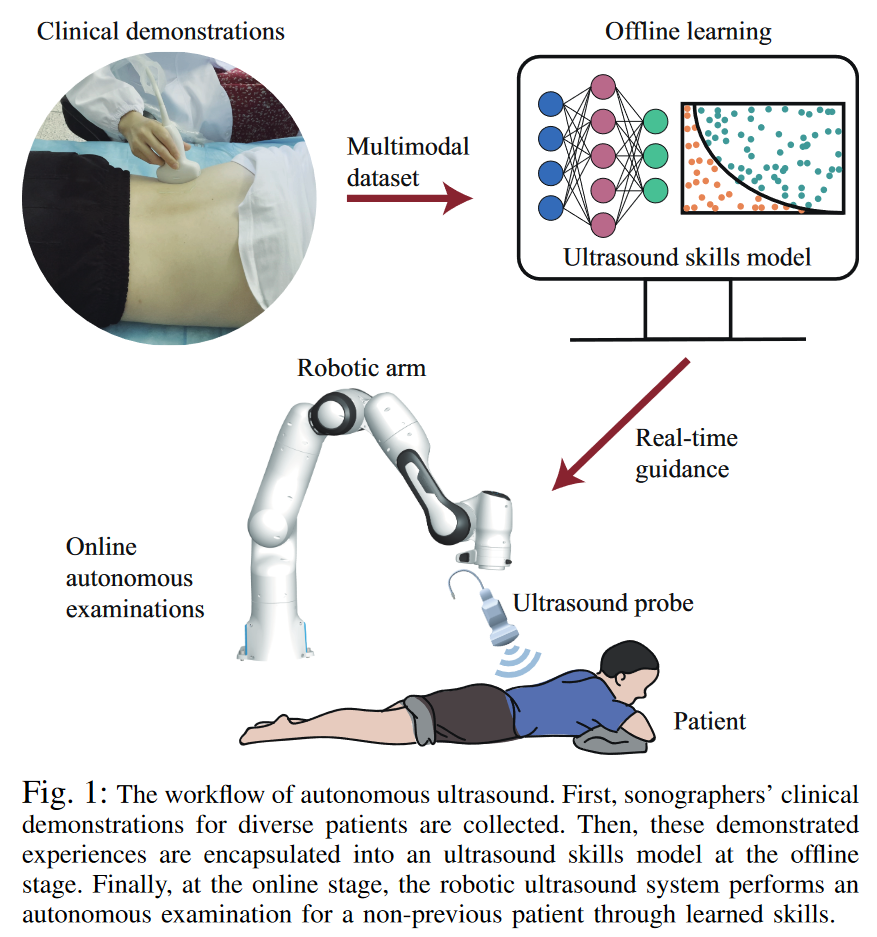
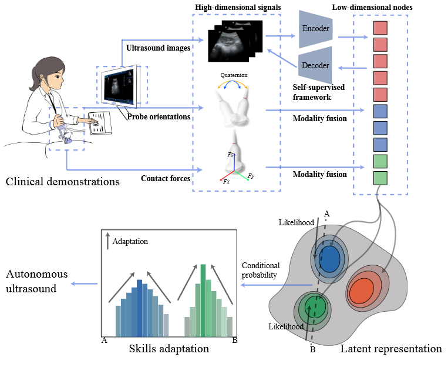
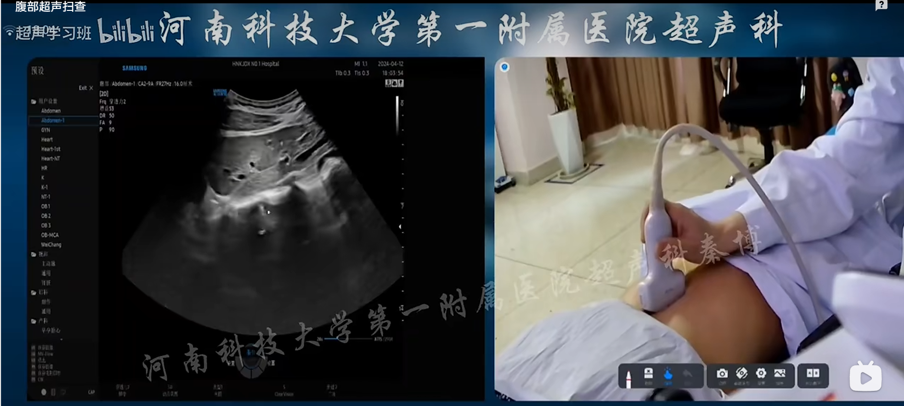
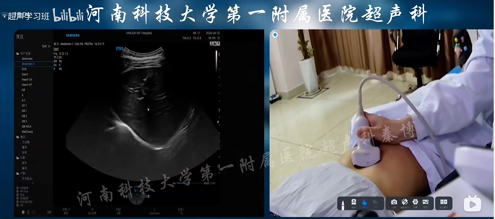
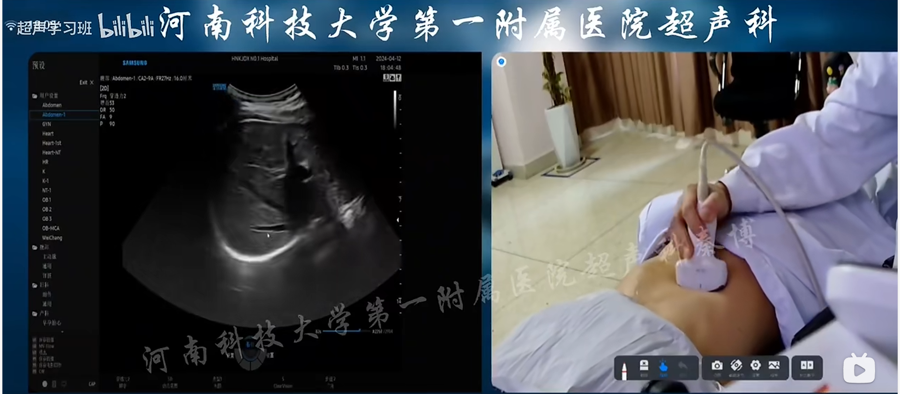
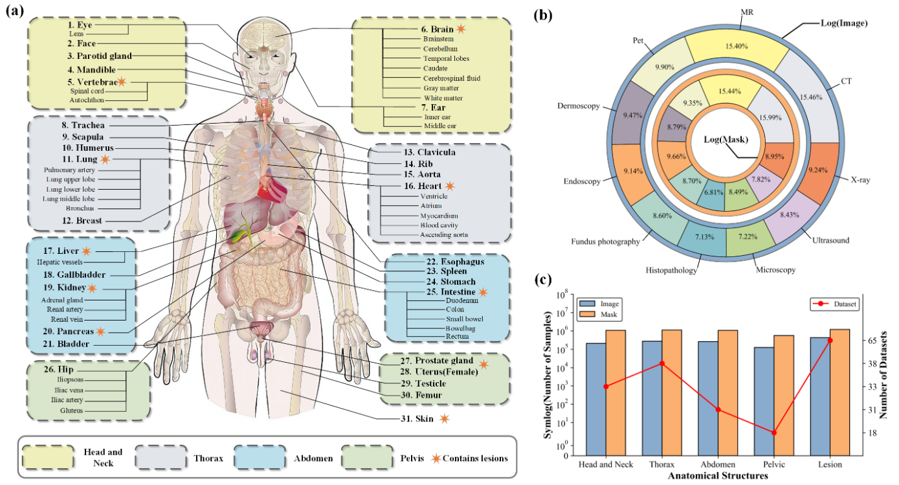

高质量数据十分重要。

## 学习表征和扫描技能
Learning Autonomous Ultrasound via Latent Task Representation and Robotic Skills Adaptation

作者提出 the latent task representation 和关于自动超声扫描的机器人技能适应。能够泛化到不同病人上来使用。


如图，Offline 学习阶段，把演示数据编码到 vec，在 online stage，机器人超声系统执行自主检查。

提出了一个全自主的 latent representation 方法，把演示的超声图像、探头角度和接触力作为网络输入。为了提升适应能力，提出基于概率方法，不断微调探头角度和接触力，以此提升健壮性和泛化能力。

insight：使用概率来泛化


如图，演示信息编码嵌入到 node 中，全局分布信息由概率模型表示。Low-likelihood nodes 会被适应地调整到附近最高的地方。

问题描述：$D=\{d_1, d_2, ..., d_N\}=\{(x_i,p_i,f_i)\}_{i=1...N}, x_i\in\R^{224\times224\times1}$, $x$ 是超声图像，p 是探头角度（四元数），f 是接触力。

为了潜在表达自主超声任务，采用自监督

## 医疗保健领域具身智能的综述：技术、应用和机遇
[A Survey of Embodied AI in Healthcare: Techniques, Applications, and Opportunities](https://arxiv.org/abs/2501.07468)

远程超声。填补乡镇的医疗资源缺口 [105], 远程超声诊断的方式是基于图像的视觉伺服算法 [406-408]，动态调整探头角度和位置，还有改善移动和力 [109, 409, 410]。类似医疗图像注册 [411] 可以辅助超声扫描，提升定位准确性 [106, 412]，执行动作补偿 [413, 414] 和实时监察 [102, 415]。

## SAM-Med2D


## 构建系统

#### Workflow
LLM 根据病历，得到需要检查的器官。随后，另一个 LLM 规划，检查对应器官。根据当前超声影响，指导在哪个器官附近，随后做出指令，向目标器官方向移动。移动方向，为了简化问题，建模为前后移动，左右移动，旋转探头（原子动作尽可能简单）。insights 在于不同器官之间的相对位置有联系，用好联系来导航。

#### 难点1：不同器官位置的联系，器官间导航
当前难点：Agent 如何确定器官之间位置的联系。能否从自动驾驶工作了解联系？到达目标点？下个路口左右转？


能否借鉴 [GeoText-1652](https://arxiv.org/pdf/2311.12751) 构建数据集的思路？通过超声图像能够辨别目标器官的方位位置。比如 DeepSeek-R1 有强大的推理能力，能够处理。

使用 USFM 构造数据集？

术中导航?

一系列超声影响采样，判断是远离还是逼近。

使用 RAG？我向 DeepSeek 询问：各个器官在人体内是否存在相对位置的关系。使用深度思考，给出了结果。能否用超声图像分割总结后，得到当前在哪个位置，然后再向大模型询问需要向哪里移动。

US 图像增强后，首先，要一个 VL 模型总结图像质量，是否在中央，是否清晰。随后，向推理强大的大模型比如 DeepSeek R1, 询问，以文本方式决策下一步超声探头的操作。

pormpts: 你是一名超声检查工作者，你可以操作超声探头，操作包含移动和旋转，移动有四个选择：向左、向右、向前、向后移动，旋转则是旋转超声探头的角度。
在检查时候，超声图像中肾脏在图像偏左位置，如果需要获得清晰图像，下一步应该把超声探头向如何操作？回答以 json 格式输出，比如 {"Anatomical association": "右肾与肝脏关系：右肾位于肝脏后下方，左移探头可能需避开肝右叶边缘，寻找最佳声窗。左肾与脾脏关系：左肾靠近脾脏，若脾脏遮挡，可让患者右侧卧位，利用重力使脾脏移位。", "operation":  {"移动": "向左移动探头 2 厘米", "旋转": "逆时针旋转 5°-10°（向患者头侧倾斜）"}}
```json
{
  "Anatomical_association": {
    "右肾与肝脏": "右肾位于肝脏后下方，左移探头时需注意避开肝右叶边缘以获取最佳声窗。",
    "左肾与脾脏": "左肾靠近脾脏，若脾脏遮挡视野，可调整患者为右侧卧位，利用重力使脾脏移位。"
  },
  "operation": {
    "移动": "向左移动探头 1-2 厘米（沿患者体表向左）",
    "旋转": "逆时针旋转 5°-10°（向患者头侧倾斜探头，减少肋骨声影干扰）"
  },
  "补充说明": {
    "验证调整": "移动后观察肾脏是否移至图像中央，必要时小幅调整探头压力或角度。",
    "呼吸配合": "可嘱患者深吸气后屏气，扩大肋间隙以改善声窗条件。"
  }
}
```

你是一名超声检查工作者，你可以操作超声探头，操作包含移动和旋转，移动有四个选择：向左、向右、向前、向后移动，旋转则是旋转超声探头的角度。
在检查时候，病人仰卧，超声图像中肾脏在图像偏左位置，如果需要检查肝脏，下一步应该如何操作超声探头？回答以 json 格式输出，比如 {"Anatomical association": "右肾与肝脏关系：右肾位于肝脏后下方，左移探头可能需避开肝右叶边缘，寻找最佳声窗。左肾与脾脏关系：左肾靠近脾脏，若脾脏遮挡，可让患者右侧卧位，利用重力使脾脏移位。", "operation":  {"移动": "向左移动探头 2 厘米", "旋转": "逆时针旋转 5°-10°（向患者头侧倾斜）"}}
```json
{
  "Anatomical_association": {
    "右肾与肝脏": "右肾位于肝脏后下方，肝脏覆盖于右肾前上方。仰卧位时，肝脏占据右上腹腔，右肾位于其后方深处。",
    "探头初始位置": "当前肾脏显像提示探头可能位于右肾区，需向头侧及腹侧调整以覆盖肝右叶。"
  },
  "operation": {
    "移动": "向右上方移动探头 3-4 厘米（沿右肋缘向患者头侧方向滑动）",
    "旋转": "逆时针旋转 10°-15°（向患者头侧倾斜，使声束垂直穿过肝实质）"
  },
  "补充说明": {
    "呼吸配合": "嘱患者深吸气后屏气，利用膈肌下移扩大肝右叶显像范围",
    "解剖验证": "寻找肝内门静脉"Y"形分支及肝静脉汇入下腔静脉的特征性结构",
    "压力调节": "适度加压推开结肠肝曲气体，但避免压迫导致肝形态失真"
  }
}
```

是否需要挂解剖学知识库的 RAG？比如如《格氏解剖学》《影像解剖学》等。DeepSeek 能够回答器官之间相对位置。能够回答胸腔内器官的相对位置、腹腔内器官的相对位置，还有解剖变异与异常的情况。。

解剖学知识库的结构需要包含器官的名称、位置、毗邻结构、功能以及常见变异等信息。

可以从解剖学的教材的图像中，做一个数据集来微调。强化视觉方面的多模态能力。

与 HuatuoGPT-Vision 对话：
```
Q: 你是一名超声工作者，现在需要检查病人的胆囊，请判断当前的超声检查是否清晰，足矣分析患者情况。注意，回答以 json 格式输出。以下是一些回答的例子：比如 {"是否清晰": "是", "超声检查": "这张图像显示的是一个肾脏的超声波扫描。我们可以看到肾实质和肾盂之间有一个明显的分界线,这表明存在一定程度的水肿或积液情况。此外,在肾门区域还可以观察到一些扩张的小血管结构,这些可能是由于静脉回流受阻而形成的旁路循环。总的来说,这个影像提示患者可能存在轻度至中度的双侧输尿管梗阻性病变。", "诊断": "可能存在轻度至中度的双侧输尿管梗阻性病变。"}, {"是否清晰": "否", "超声检查": "影像不清晰，不足以诊断。", "诊断": ""}, {"是否清晰": "是", "超声检查": "当前影像没有检测到指定的器官，不足以给出诊断意见。", "诊断": ""}

Question: 'You are an ultrasound technician who needs to examine a patient's liver. Please determine whether the obtained images are clear and properly positioned at the targeted organ. Requirement: The response must be provided in JSON format, with the keys containing the following four keywords: clarity, anatomical_location_match, ultrasound_findings, and diagnostic_notes.' Example Output: { "clarity": true, "anatomical_location_match": true, "ultrasound_findings": "The liver parenchyma demonstrates homogeneous echotexture with well-visualized vascular structures.", "diagnostic_notes": "No focal lesions detected; findings consistent with normal hepatic anatomy."}
```


##### 初始位置比较重要。
引入一个模糊位置的概念，让模型推理。在开始阶段，超声探头放到腹部大致中间位置，这是一个模糊的位置概念，是大致的方位。注意，开始阶段位置初始化是重要的。随后可以根据解剖关系向不同位置移动。比如需要检查肝脏，

Q:你是一名超声工作者，你需要检查患者的肝脏。现在超声探头位置大致在病人腹部中间位置，请根据解剖关系，给出如何操作探头才能得到目标器官影像的意见。操作包含移动和旋转，移动有四个选择：向左、向右、向前、向后移动，旋转则是旋转超声探头的角度。回答以 json 格式输出。

A:
```json
{
  "Anatomical_association": {
    "肝脏位置": "肝脏主要位于右上腹腔，右叶占据右季肋区及部分上腹，左叶延伸至中线左侧，下缘一般不超出右肋弓。",
    "毗邻结构": {
      "上方": "膈肌（呼吸运动影响肝脏位置）",
      "下方": "胆囊、右肾、结肠肝曲",
      "左侧": "胃、胰腺体尾部"
    }
  },
  "operation": {
    "移动": {
      "主方向": "向右上方移动探头 3-4 厘米（沿右肋缘方向）",
      "微调建议": [
        "若显示肝左叶，需向右移动探头至锁骨中线",
        "若遇肠道气体干扰，可稍向后（向患者背侧）加压移动"
      ]
    },
    "旋转": {
      "角度调整": "逆时针旋转 10°-15°（向患者头侧倾斜，使声束对准膈肌方向）",
      "解剖适配": "通过肋间隙倾斜探头避开肋骨声影"
    }
  },
  "补充说明": {
    "呼吸配合": "嘱患者深吸气后屏气，利用膈肌下移扩大肝显像范围",
    "验证标志": [
      "寻找门静脉'工'字形分支特征",
      "追踪肝静脉汇入下腔静脉的'海鸥征'"
    ],
    "压力控制": "适度加压推开结肠气体，但避免过度压迫导致肝形态失真"
  }
}
```

基于 LLM 的启发式探索：DeepSeek R1 能够推理到大致位置，是模糊的位置。但是准确位置，那么使用一个模糊位置，是否可行？不停地探索，直到发现到了指定位置。模糊位置第一次执行幅度较大。对第一次移动训练和对齐，尽量要一次完成。但是人的身体有大小区别，可能分为两步更为合适，第一步稍大一点，但是在全年龄段几乎合适。第二步再开始细化。随后执行需要执行幅度越来越小，就像退火。

需要一个强大的 MLLM 总结当前超声图像。

余弦相似度？

##### 腹部超声扫查
[腹部超声扫查](https://www.bilibili.com/video/BV1X6421Z7CB/?share_source=copy_web&vd_source=fe1db0b3f565b5940b244b9c7f7b4fa1)
[教学视频 | 腹部超声基本操作手法演示教程](https://www.bilibili.com/video/BV1EK411m7zC/?share_source=copy_web&vd_source=fe1db0b3f565b5940b244b9c7f7b4fa1)

需要纵切，先扫描出完整的肝组织叶面。


斜切扫查右肋檐下，沿着膈肌扫查：


探头逆时针翻转，调整位置检查三条肝静脉，呈现工字形：


矢状切
1. 肝肾切面 锁骨中线与腋前线
2. 胆囊长轴切面 锁骨中线与腹直肌外缘
3. 经下腔静脉
4. 经腹主动脉
5. 经胸骨旁

横切面 剑突下 （向下移）
1. 第二肝门（必要时斜切）
2. 门脉主干（工字）

斜切面（向右下移动）
1. 经第一肝门（肋缘）
2. 经第二肝门（肋缘）
3. 经门静脉长轴（肋间）

需要引入什么来确定探头和人的相对位置？摄像头？

询问 DeepSeeek 肝脏超声检查，它能够梳理出来流程。Q 为"你是一名超声检查工作者，现在患者需要检查肝脏，请问检查操作需要分为几步？"。回答具体如下：
```json
{
  "肝脏超声检查步骤": {
    "第一步：检查前准备": {
      "患者准备": [
        "空腹8小时（减少肠道气体干扰）",
        "仰卧位为主，双手上举扩大肋间隙",
        "训练患者深呼吸配合（深吸气后屏气）"
      ],
      "设备设置": [
        "选择凸阵探头（3.5-5MHz）",
        "预设腹部超声模式，调整深度至12-18cm",
        "开启彩色多普勒及频谱测量功能"
      ]
    },
    "第二步：系统性扫查": {
      "右肋间纵切扫查": {
        "操作": "沿6-9肋间纵向滑动探头",
        "重点": [
          "显示门静脉右支及肝右静脉长轴",
          "观察肝右叶回声均匀性"
        ]
      },
      "剑突下斜切扫查": {
        "操作": "探头倾斜30°-45°向头侧扫描",
        "重点": [
          "测量肝左叶厚度（正常≤6cm）",
          "识别肝圆韧带（高回声标志线）"
        ]
      },
      "右肾旁冠状切面": {
        "操作": "探头置于右腋后线冠状位",
        "重点": [
          "对比肝/肾实质回声（脂肪肝时肝＞肾）",
          "排查右肝后段占位病变"
        ]
      }
    },
    "第三步：血管系统评估": {
      "门静脉检查": [
        "横切面测量门静脉主干直径（正常≤13mm）",
        "频谱多普勒检测向肝血流（流速15-25cm/s）"
      ],
      "肝静脉评估": [
        "显示肝右静脉汇入下腔静脉",
        "观察波形变化（淤血肝时波形平坦化）"
      ]
    },
    "第四步：病变记录": {
      "占位性病变": [
        "记录位置（Couinaud肝段划分法）",
        "测量大小/边界/血流（CEUS必要时）"
      ],
      "弥漫性病变": [
        "描述回声强度（与肾皮质对比）",
        "提示肝硬化特征（边缘锯齿状、尾状叶增大）"
      ]
    },
    "第五步：补充扫查": {
      "体位调整": [
        "左侧卧位观察右肝后段",
        "半坐位评估肝下垂程度"
      ],
      "特殊技术": [
        "弹性成像检测肝硬度（FibroScan原理）",
        "对比增强超声（CEUS）鉴别病灶性质"
      ]
    }
  },
  "注意事项": {
    "图像优化技巧": [
      "遇肠道气体干扰时加压探头",
      "调整焦点位置至肝门部水平",
      "使用谐波成像减少噪声"
    ],
    "危急征象预警": [
      "门静脉离肝血流（门脉高压危象）",
      "肝破裂出血（包膜中断+腹腔积液）",
      "布加综合征（肝静脉血流反向）"
    ]
  }
}
```

#### 难点2：训练机械臂 end-effector 来前后移动，旋转
关于 NAVILA 和 DeepSeek R1 工作思考，应当在简洁高效的思路上探索，能够评估是否有效。这是 action primitives，应当简单高效。

contact force 保证探头不会偏离人体表面。

但是，有两个决定探头移动方向的思路：1）纯 RL；2）MLLM 根据超声图像，决定需要前进后退。使用 2）的解释性会更强。

添加一个方向，确定患者头部方向，是否能够简化问题。这可以形成一个先理解，再做出动作的工作思路。

以固定的位移、角度确定方向，还有 0 代表停止。随时注意力控。

#### 难点3：增强检查，不仅仅是定位器官
诊断需要一系列图像，辅助医生判断是否存在异样。1）需要完整器官的各个切面；2）需要一系列图像即可。

效果：不仅仅为了能够实现 US 图像的清晰，还要扫描多个地方。2）看起来更合理，但是需要一些语料。比如，当前探头接触人体的切面，其他位置。

可以找到处理辅助诊断的内容。

## USFM
[paper](https://www.sciencedirect.com/science/article/abs/pii/S1361841524001270)

USFM 工作提供了超声影像数据库。1）能否理解不清晰的超声图像？2）能否理解不同器官之间位置？3）能否通过某些方式指导探头根据当前影像和影像记录导航到目标器官？用好不同器官之间联系。

USFM 能够从低质量 US 图像提取空间和频率信息，学习到更多的 US 表征，有强大的标签效率，用于疾病分类，组织分割，图像增强任务。

希望使用 USFM 减少对超声图像中器官的标注工作。

## SAM-Med2D


是否有 LLM 知道器官位置？

## 自主超声扫查
Enhancing Surgical Robots with Embodied Intelligence for Autonomous Ultrasound Scanning

首先，设计了超声操作知识数据库，用于给 LLM 添加超声扫查领域的专家信息，使得 LLM 能够精准规划动作。其次，基于 think-observe-execute prompt engineering，设计动态超声扫查 strategy，LLMs 能够自动调整动作规划策略。

受到 ReACT 启发，动态执行机制允许 verbal command interpretation，减少了手动调整的需求。


## 做好 LLM Agent，ReACT
S. Yao, J. Zhao, D. Yu et al., “React: Synergizing reasoning and acting in language models,” arXiv preprint arXiv:2210.03629, 2022. Agent 都会参考的 ReACT 工作。ICLR 2023 已收录。[link](https://openreview.net/pdf?id=WE_vluYUL-X)

Multi-Agent实践第4期：智能体的“想”与“做”-ReAct Agent - ModelScope小助理的文章 - 知乎, https://zhuanlan.zhihu.com/p/689675968

#### 超声多模态大模型工作
* HuatuoGPT-Vision, https://arxiv.org/abs/2406.19280, 
* LLaVA-Med 微软，https://github.com/microsoft/LLaVA-Med
* Med-MoE：轻量级医学视觉-语言模型的域特定专家混合, https://arxiv.org/pdf/2404.10237.pdf, https://github.com/jiangsongtao/Med-MoE
* LLaVA-Ultra, https://arxiv.org/pdf/2410.15074, 代码未公开
* Ultrasound-QBench, https://arxiv.org/pdf/2501.02751, 代码未公开
* OmniMedVQA 数据集，CVPR 2024, https://arxiv.org/pdf/2402.09181, 
* MedImageInsight, 微软，https://arxiv.org/pdf/2410.06542
* BiomedParse, 微软，https://github.com/microsoft/BiomedParse
* AIGC每周精选-医学影像大模型 - gaojing的文章 - 知乎
https://zhuanlan.zhihu.com/p/699266280
* https://learn.microsoft.com/zh-cn/azure/ai-studio/how-to/model-catalog-overview

* [awesome-multimodal-in-medical-imaging](https://github.com/richard-peng-xia/awesome-multimodal-in-medical-imaging)
* [PromptMRG: Diagnosis-Driven Prompts for Medical Report Generation](https://arxiv.org/pdf/2308.12604)
* MMMU-Benchmark Evaluation Challenge，https://eval.ai/web/challenges/challenge-page/2179/leaderboard/5377/Health%2520%2526%2520Medicine

## papers
* 强化学习：A. Pore, D. Corsi, E. Marchesini, D. Dall’Alba, A. Casals, A. Farinelli, and P. Fiorini, “Safe reinforcement learning using formal verification for tissue retraction in autonomous robotic-assisted surgery,” in 2021 IEEE/RSJ International Conference on Intelligent Robots and Systems (IROS).   IEEE, 2021, pp. 4025–4031.
* Ultrasound-Guided Robotic Navigation with Deep Reinforcement Learning
* Yuxin Song, Zhaoming Zhong, Baoliang Zhao, Peng Zhang, Qiong
 Wang, Ziwen Wang, Liang Yao, Faqin Lv, and Ying Hu, “Medical
 ultrasound image quality assessment for autonomous robotic screening,”
 IEEE R

## US
* [72例超声临床病例解析......](https://mp.weixin.qq.com/s?__biz=MzIyMjE1ODA3MQ==&mid=2247692926&idx=2&sn=87a1aad709a15187e03c038721309f45&chksm=e93284a6da814fd8fa1ebccc1c3106579e1d695182c0b2670956f1fb9af5d616047e8a9bf8fd&scene=27)

## 启发式探索
insights：根据图片，如果当前图片并不适合，或者角度不满足，在没有视觉的引导，那就选择启发式的方案，随机朝着一个方向尝试。然后回来，选择最有可能的方向来进一步探索。蕴含着强化学习的思想。

## 模仿学习和 RL
机械臂在人体表面上移动的前进、后退、向左和向右，可以尝试强化学习或者模仿学习。最后 LLM 推理模型来调用。

## Tag
#Robotics
#Ultrasound