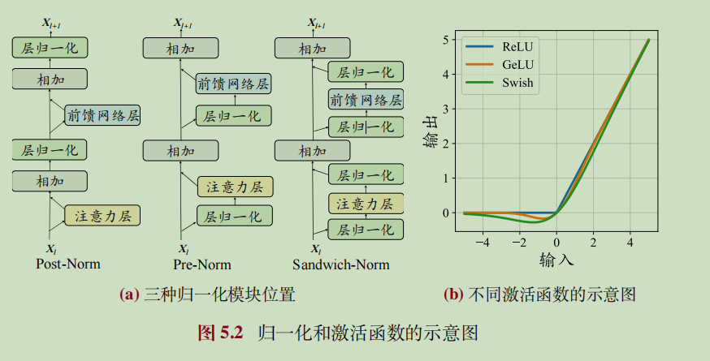

## 为什么需要 norm first？Post-Norm vs Prej-Norm

经典 Transformer 论文中，在 Attention 之后再引入层归一化。原始结构在残差计算之后 Norm。

$$
\text{Post-Norm}(x)=\text{Norm}(x+\text{Sublayer}(x))
$$

- 优势：加快训练速度，更有效传播梯度，减少训练时间。降低对超参数敏感性（学习率，初始化参数等），更容易调优。
- 缺点：输出层附近梯度较大，出现训练不稳定的情况。大模型中少用此方法。

### Pre-Norm

$$
\text{PreNorm}=x + \text{SubLayer}(\text{Norm}(x))
$$

Tips：在最后一个 Block 层，还需要额外添加一个 LayerNorm，保证前后都有归一化，就像三明治夹住。

- 优点：有效防止梯度爆炸和梯度消失。训练稳定，大模型优先选择。
- 缺点：性能逊色Post-Norm。

## LayerNorm

$$
μ=\frac{1}{H} Σ_{i=1}^H x_i,\\ σ=\sqrt{\frac{1}{H} Σ_{i=1}^H (x_i−\mathbb{μ})^2 }
$$

## RMSNorm

原始的 Transformer 使用 LayerNorm，现在常用均方根归一化 (Root Mean Square Layer Normalization, RMSNorm) 和 DeepNorm。Qwen2，LLaMA 也用了 RMSNorm。

## Ref and Tag

#Transformer
#归一化