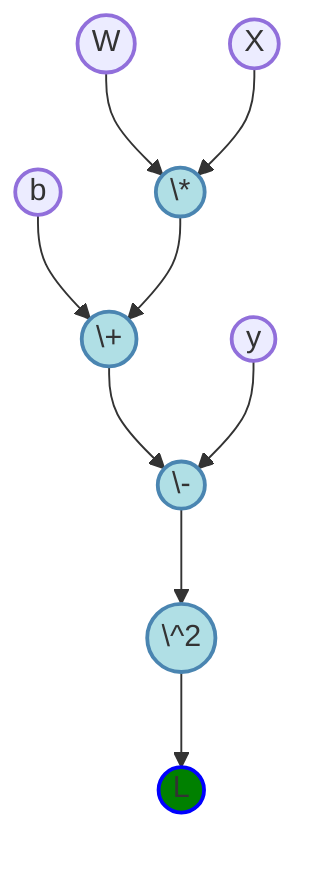
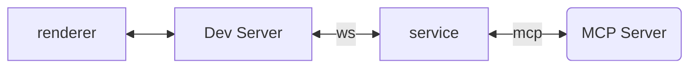
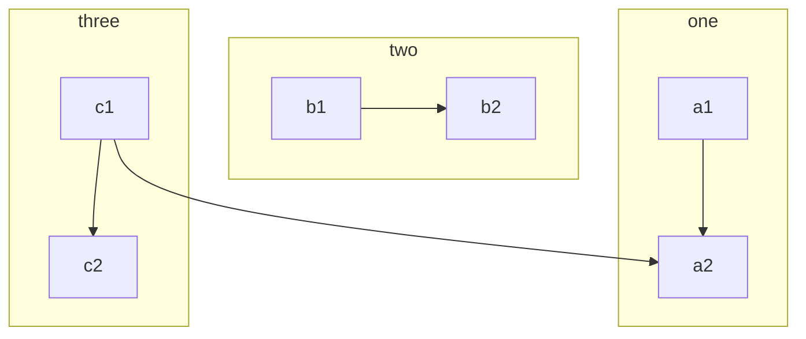
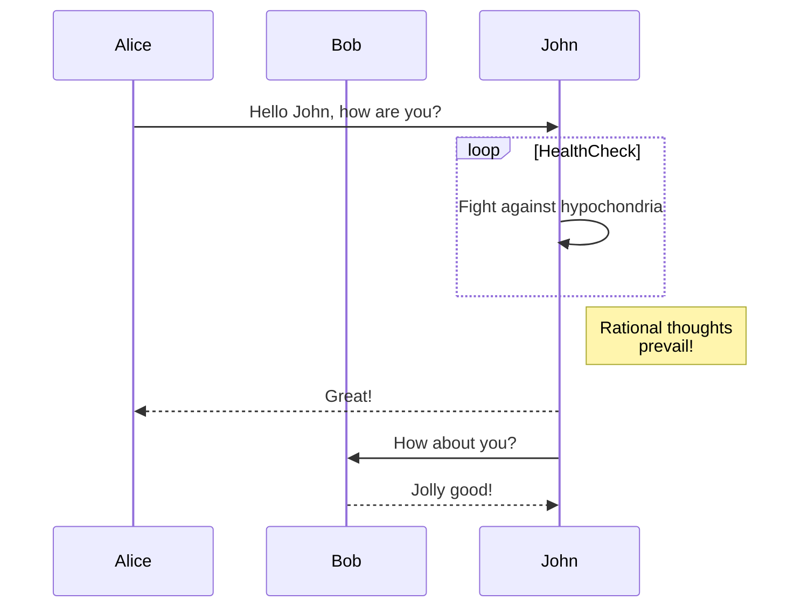
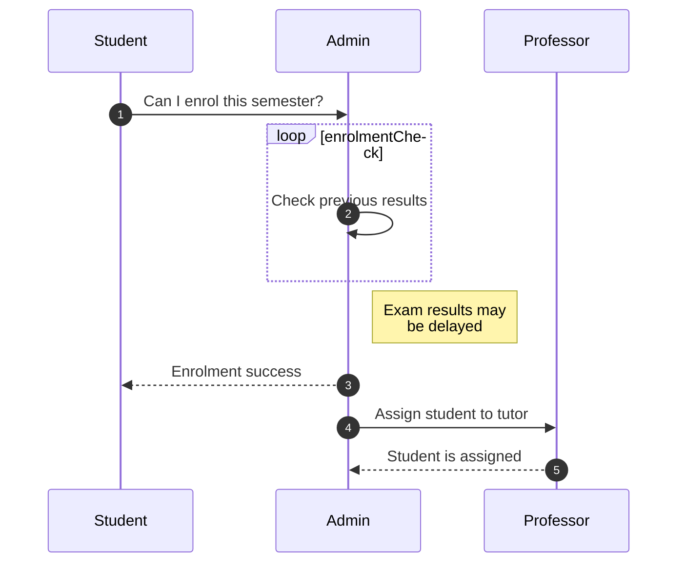
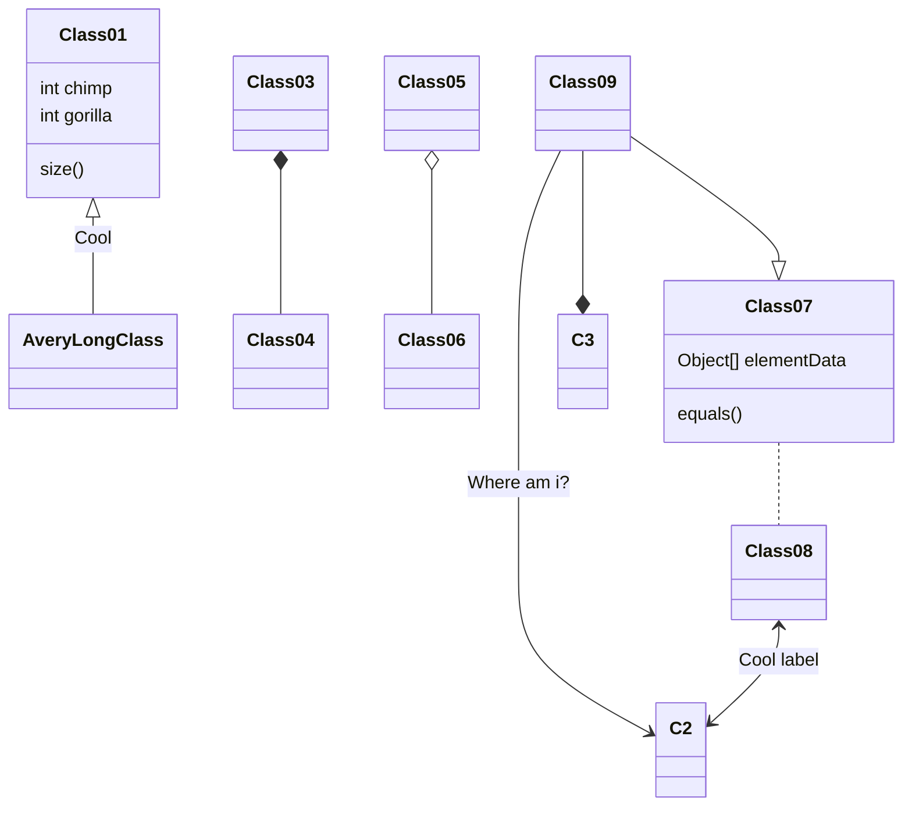
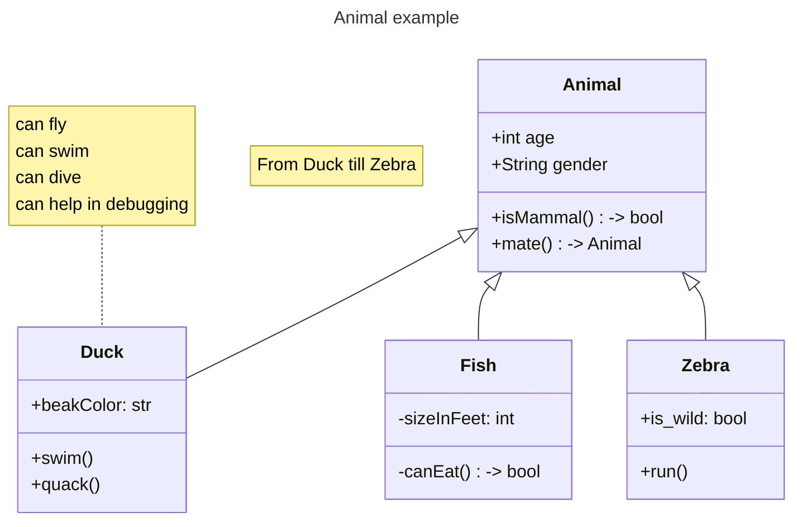

## Graph, Flowchat

设置颜色：fill 填充颜色，stroke 和 stroke-width 指定边界颜色和宽度。有两种方式应用到节点上：
- 使用 style 指出，仅对单个节点起作用。
- 定义为 class 后，使用 ::: 符号指定类型，可以复用颜色配置。

## 时序图：Sequence diagram

## 类表（Class Diagram），UML 图

Tips: ` ` 可以换行。

## Ref and Tag

官网教程有很多示例
https://mermaid.js.org/intro/