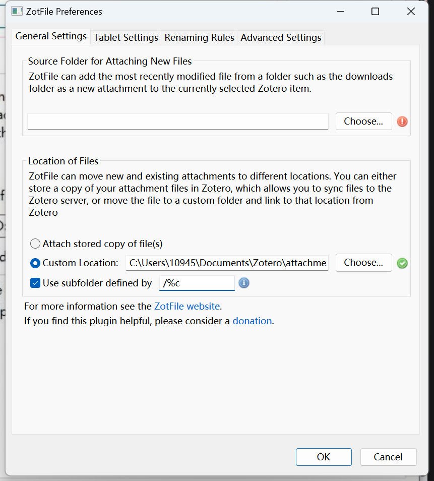
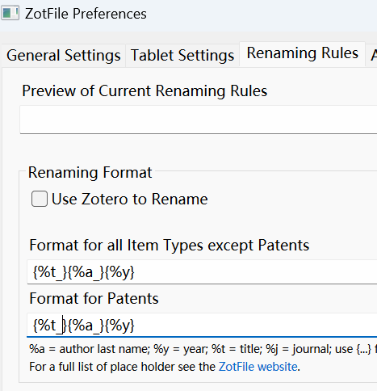

## 使用 WPS 网盘联动

在本地创建 Zotero 目录，比如 D:\\WPSSync\\zotero，保存各种文件。

在 Zotero 菜单栏设置，Edit->Preferences->Advanced->Files and Folders 菜单中修改 Base directory 和 Data Directory Location 的位置。

如需同步云盘，在 WPS 的云盘->我的云文档->Zotero 中，将已经保存论文内容的文件，导出内容到此目录，并且选择同步更新（普通会员账号，每个 PC 只能同步一个目录），重新打开 Zotero 可以发现已经同步了。并且，在我的云文档的 Zotero 目录，右击选择同步目录，设置它以同步即可。

## ZotFile 插件：自动调整文件名

[ZotFile](http://zotfile.com/) 插件可以按照规则命名文件，并且保存在指定目录，方便管理文献。下载之后，依次点击菜单栏工具（tools）->插件（Add-ons），拖拽下载的 zotfile-5.1.0-fx.xpi 到插件管理窗口，安装即可。ZotFile 通过相对路径管理附件。在 zotero 目录下，创建了 attachments 目录，保存文献附件。依次点击工具->ZotFile Preferences，在 Custom Location 和 Use subfolder 处修改如下：

对于命名格式，修改如下：

## Ref and Tag

#utils