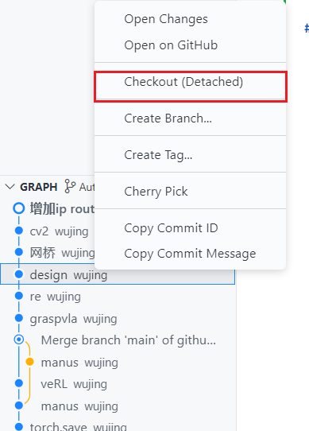

在 Vs Code 侧边栏的 source control 中，看到 Changes 下，文件会有标记。
- M 代表修改了的文件
- D 代表删除的文件
- U 代表新加入的文件

## 游离式查看版本

在 Graph 一栏，右击选择 Checkout (Detached) 使用分离头指针查看版本：

等价于 git checkout --detach {{commit id}}，进入分离头指针 (Detached HEAD) 状态。此命令将 HEAD 指针进入指定的提交版本，使工作区脱离分支约束，进入独立状态，提供临时沙盒。在沙盒环境下，即 git checkout --detach {{commit id}} 后的环境，修改代码，需要手动创建分支，否则改动会**丢失**。

使用场景：
- 快速回退特定提交，复现 Bug 或测试旧版本功能，且不污染当前版本。
- 紧急热修复。回退和修改后，通过 git branch {{new-hotfix}} 保存。

新版本 Git 推荐使用 git switch --detach {{commit id}}，命令语义更清晰。使用 git restore --source {{commit id}} {{file}} 查看版本文件，避免进入游离状态。

随后，如需保存修改，需要创建新的分支，再改动。否则，可以 git switch 回到分支。

## Ref and Tag