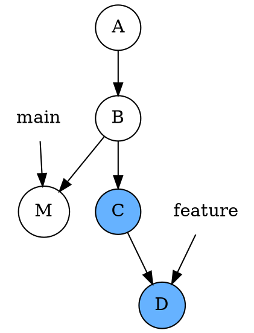
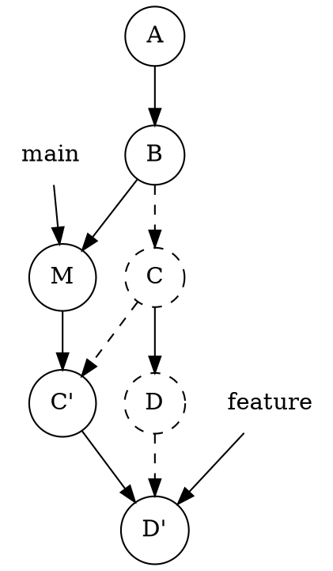

## git rebase 的功能

当 merge 保留了很多的分支，main 历史像是发毛了一样，此时需要 rebase 使得 commit 历史变得简洁。rebase 保证提交的只有一条线。例子如下，rebase 前：



git switch feature 分支，并执行 git rebase main 后，发生和处理如下内容：
- 从公共祖先开始，也就是 B 之后，逐步提取 feature 分支在公共祖先节点 B 之后的节点，将其**移植**到当前 main 分支最新提交 M 之后。
- 在这过程中，我们需要**依次**比较 main 分支最新 HEAD 与所有移植节点。即 M 与 C，还有 D 比较。
- Git 提示我们需要一步步处理冲突，随后得到 C' 和 D'。而最后 feature 指针指向最后节点，D'，得到一条水平的 commit 历史。



可以看到，git switch feature，在 feature 分支下执行 rebase，把 feature 的分支的 base 放到了 main 上，正如 rebase 单词本意。

处理过程提示冲突时，合并当前所有冲突后，需要 git stage FILE_NAMES，并进一步处理下一个分支。

```bash
git stage a.dat
git status 
# 当前提交处理完后，会提示
#    You are currently rebasing branch 'dev' on '3f010c7'.
#      (all conflicts fixed: run "git rebase --continue")
git rebase --continue # 继续处理冲突，会提示修改commit信息。
```

## git pull 的场景

当 git pull origin main 时，实际执行了 git fetch origin/main 到本地，再 git merge origin/main。但是，当分支过多时，可能遇到如下报错：

```console
From github.com:Psi-Robot/DexGraspVLA
 * branch            main       -> FETCH_HEAD
hint: You have divergent branches and need to specify how to reconcile them.
hint: You can do so by running one of the following commands sometime before
hint: your next pull:
hint: 
hint:   git config pull.rebase false  # merge (the default strategy)
hint:   git config pull.rebase true   # rebase
hint:   git config pull.ff only       # fast-forward only
hint: 
hint: You can replace "git config" with "git config --global" to set a default
hint: preference for all repositories. You can also pass --rebase, --no-rebase,
hint: or --ff-only on the command line to override the configured default per
hint: invocation.
fatal: Need to specify how to reconcile divergent branches.
```

根据 hint，当前有多个分支，需要调解（reconcile）。给出了一些配置，比如 git config pull.rebase false，使用默认的策略，merge 即可。另一个使用 rebase，还有 fast-forward。

解决方案和策略：

### merge 的方式

```bash
git pull origin main --no-rebase
# 或
git config pull.rebase false  # 设置默认合并策略为 merge，这是最佳实践
git pull origin main
```

- 效果：Git 会生成一个新的“合并提交”，保留本地和远程的提交历史。
- 适用场景：如果你需要保留完整的开发历史（包括分叉和合并的痕迹）。

### rebase

```bash
git pull origin main --rebase
# 或
git config pull.rebase true  # 设置默认合并策略为 rebase
git pull origin main
```

- 效果：将你本地的提交“变基”到远程分支的最新提交之后，形成一条直线历史。
- 适用场景：如果你希望提交历史保持简洁线性（适合个人开发或小型项目）。

### 仅允许快速合并

```bash
git pull origin main --ff-only
```

- 效果：如果存在分叉，直接报错终止。只有本地分支可以快进（即远程分支包含本地所有提交）时才会成功。
- 适用场景：如果你严格禁止分叉提交，需要先处理本地提交再拉取。

## Ref and Tag