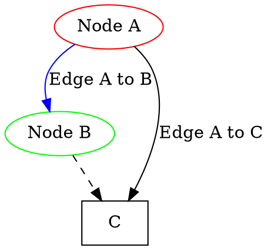
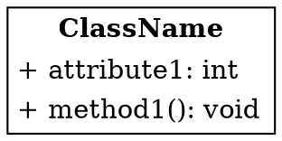
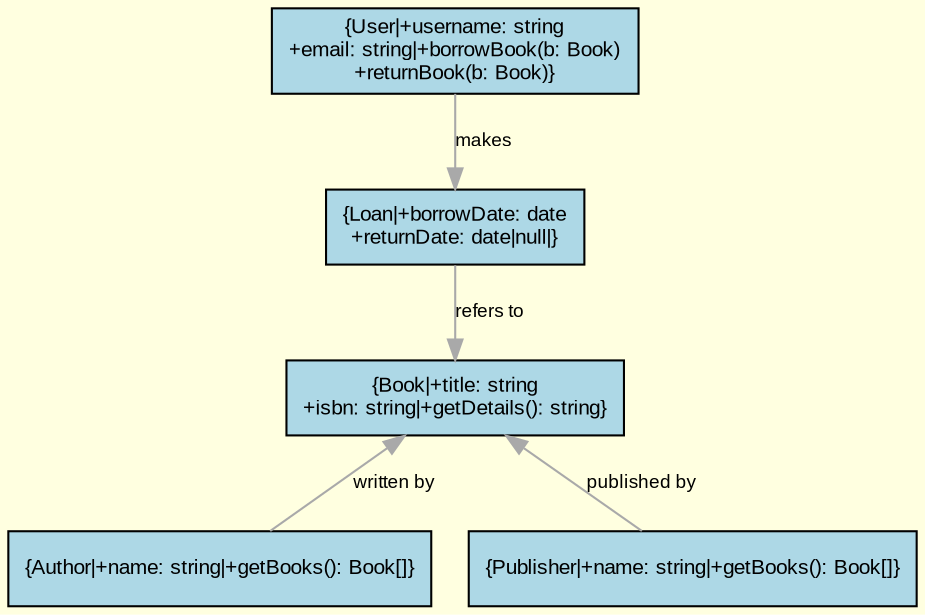
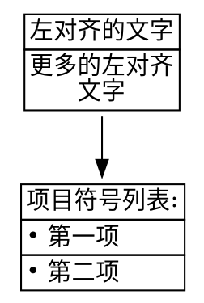
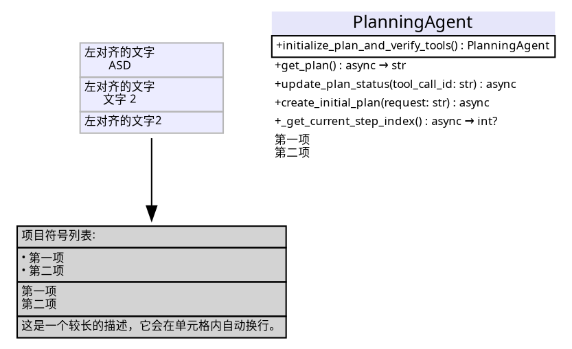

## Dot 语言

### 图

- 有向图 (Digraph)：它的边有一个明确的起点和终点。
- 无向图 (Graph)：它的边没有明确的起点和终点。

```
digraph G { ... }  // 有向图
graph G { ... }    // 无向图
```

### Node

节点代表图中的实体，有唯一标识，可以添加额外属性，比如形状、颜色、标签。

```
nodeA [label="This is node A", color=red];
```

### Edge

连接两个节点。边可以有属性，比如线型、颜色和标签。

- 有向图中，边有箭头，比如 nodeA -> nodeB [label="Edge from A to B", color=blue]
- 无向图则是线段，比如 nodeA -- nodeB

### Attributes

图、节点和边都可以有属性，决定元素的外观和行为。比如颜色、宽度、形状和样式。常见的有：
- color
- label，附到元素的文本标签
- fontsize，节点标签文字大小
- fontname 比如 Arial, Futura, Helvetica-Light
- shape，节点形状
    - ellipse 默认的，椭圆形状的节点
    - circle 
    - box
    - diamond
    - record 类似 UML 图
- style，比如 dashed, bold, filled, dotted
- fillcolor，当 style 设置 filled 时，指定填充的颜色，比如 fillcolor="yellow"

边的属性还有：
- weight，在布局中，权重越大则越短。比如 A -> B [weight=2]
- arrowhead 和 arrowtail，箭头样式，比如 normal, inv, dot, odot, none 等。

全局属性：
- graph [bgcolor="gray"] 设置全局背景灰色
- node [color="red", shape="ellipse"] 设置全局的节点默认红色，椭圆形状
- edge [color="blue"]

比如：



### subgraph

在全局 graph 下，可以创建子图。

### 使用 HTML-like 的标签



## 例子

图书管理系统的类图：
- Book: 代表一个书籍。
- Author: 代表书籍的作者。
- Publisher: 代表书籍的出版社。
- User: 代表使用此系统的用户。
- Loan: 代表用户从图书馆借书的记录。



### 绘制 UML

```graphviz
digraph ClassDiagram {
    rankdir=TB;
    node [shape=record, fontname="Futura", fontsize=8, color="#ececff"];

    Manus [
        label = "{Manus|#核心业务代理实现}"
    ];

    PlanningAgent [
        label = "{PlanningAgent||+initialize_plan_and_verify_tools() : PlanningAgent\n+get_plan() : async → str\nupdate_plan_status(tool_call_id: str) : async\ncreate_initial_plan(request: str) : async\n_get_current_step_index() : async → int?}"
    ];

    SWEAgent [
        label = "{SWEAgent|+think(): async → bool}"
    ];

    ToolCallAgent [
        label = "{ToolCallAgent|+execute_tool(command: ToolCall) : async → str|+handle_special_tool(name: str, result: Any)|+_should_finish_execution() : → bool|+_is_special_tool(name: str) : → bool}"
    ];

    ReActAgent [
        label = "{<<Abstract>> ReActAgent|+think() : async → bool|+act() : async → str}"
    ];

    BaseAgent [
        label = "{<<Abstract>> BaseAgent|+Config: ClassVar|+messages: List[Message]|+initialize_agent() : BaseAgent|+state_context(new_state: AgentState) : async|+update_memory(...)|+run(request: str?) : async → str|+step() : async → str|+handle_stuck_state()|+is_stuck() : bool}"
    ];

    PlanningAgentModule [
        label = "规划执行模块：\n- 维护计划状态\n- 步骤索引管理"
    ]

    ToolCallAgentModule [ 
        label = "工具执行核心模块：\n- 特殊工具处理逻辑\n- 执行流程控制"
     ]

    Manus -> PlanningAgent [style=dashed];
    Manus -> ToolCallAgent [style=dashed];
    PlanningAgent -> PlanningAgentModule [style="dashed", arrowhead="none" ];
    PlanningAgent -> ToolCallAgent [ style="dashed" ];
    SWEAgent -> ToolCallAgent;
    ToolCallAgent -> ReActAgent;
    ReActAgent -> BaseAgent;


    BaseAgentModule [
        label = "基础抽象类，定义：\nAgent生命周期管理\n- 状态机控制\n- 记忆管理\nmessages: List[Message] 是一个属性";
    ]
}
```




### 绘制时序图

## Ref and Tag

[一小时实践入门 Graphviz - Native8418的文章 - 知乎](https://zhuanlan.zhihu.com/p/644358139)
[让世界多一份 Graphviz 教程！](https://www.bilibili.com/opus/1033642025060139017)
[milo yip 游戏程序员 road map](https://github.com/miloyip/game-programmer/blob/master/game-programmer.dot)