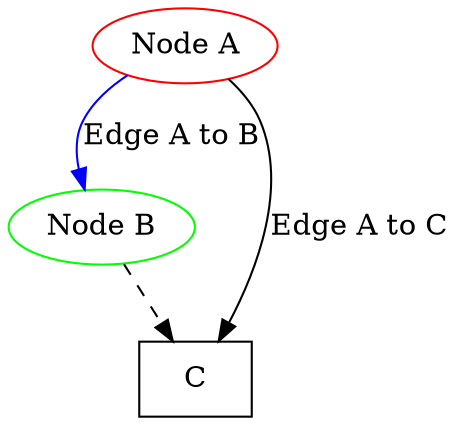

## Dot 语言

### 图

- 有向图 (Digraph)：它的边有一个明确的起点和终点。
- 无向图 (Graph)：它的边没有明确的起点和终点。

```
digraph G { ... }  // 有向图
graph G { ... }    // 无向图
```

### Node

节点代表图中的实体，有唯一标识，可以添加额外属性，比如形状、颜色、标签。

```
nodeA [label="This is node A", color=red];
```

### Edge

连接两个节点。边可以有属性，比如线型、颜色和标签。

- 有向图中，边有箭头，比如 nodeA -> nodeB [label="Edge from A to B", color=blue]
- 无向图则是线段，比如 nodeA -- nodeB

### Attributes

图、节点和边都可以有属性，决定元素的外观和行为。比如颜色、宽度、形状和样式。常见的有：
- color
- label，附到元素的文本标签
- fontsize，节点标签文字大小
- shape，节点形状
    - ellipse 默认的，椭圆形状的节点
    - circle 
    - box
    - diamond
- style，比如 dashed, bold, filled, dotted
- fillcolor，当 style 设置 filled 时，指定填充的颜色，比如 fillcolor="yellow"

边的属性还有：
- weight，在布局中，权重越大则越短。比如 A -> B [weight=2]
- arrowhead 和 arrowtail，箭头样式，比如 normal, inv, dot, odot, none 等。

全局属性：
- graph [bgcolor="gray"] 设置全局背景灰色
- node [color="red", shape="ellipse"] 设置全局的节点默认红色，椭圆形状
- edge [color="blue"]

比如：



## Ref and Tag