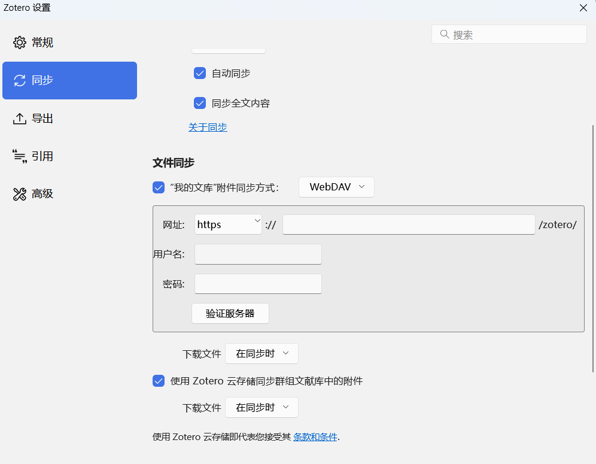

在 Windows 上，把需要分享的目录设置共享。操作如下：右键需要共享的文件夹 → 属性 → 共享 → 选择共享用户（如Everyone或指定用户），设置读写权限。

## 使用 Docker 启动 WebDAV 服务

参考 [hacdias/webdav](https://github.com/hacdias/webdav)。

在 wsl2 下，拉取镜像：

```bash
docker pull ghcr.io/hacdias/webdav:latest
```

在当前目录下，编辑配置：

```bash
cd ~/packages/webdav
vim config.yml
```

内容如下：

```
port: 6060
directory: /data

users:
  - username: wj-24
    password: sciencerobotics
    - rules:
      - path: /
        # CRUD: Create, Read, Update, Delete
        # RU: Read, Update
        # none: No permissions, even access
        permissions: CRUD
```

登录需要上述用户名和密码，为了安全。

紧接着，启动镜像：

```bash
export SHARED_DIR=/mnt/d/Dendron/notes
docker run --rm \
  -p 6060:6060 \
  -v $(pwd)/config.yml:/config.yml:ro \
  -v $SHARED_DIR:/data \
  ghcr.io/hacdias/webdav -c /config.yml
```

## 使用 nginx 的 Docker 镜像

拉取 nginx 镜像后，查看是否支持包含 http_dav_module。

```bash
docker run --rm nginx:latest nginx -V 2>&1 | grep -E 'http_dav_module|dav_ext'
```

输出若有 http_dav_module 但无 dav_ext，则需要扩展功能。

### 配置 WebDAV 服务

**创建本地配置文件目录**

```bash
mkdir -p ~/packages/nginx-webdav/{conf,data,certs}
```

**配置** ~/packages/nginx-webdav/conf/webdav.conf 如下

```nginx
server {
    listen 80;
    server_name localhost;

    location /webdav {
        alias /var/webdav;
        autoindex on;

        # WebDAV 核心方法
        dav_methods PUT DELETE MKCOL COPY MOVE;
        dav_ext_methods PROPFIND OPTIONS LOCK UNLOCK;
        # 控制用户权限
        dav_access user:rw group:rw all:r;
        create_full_put_path on;

        # 认证配置
        auth_basic "WebDAV Restricted";
        auth_basic_user_file /etc/nginx/conf.d/.htpasswd;

        # 大文件支持
        client_max_body_size 10G;
        client_body_temp_path /tmp;
    }
}
```

**生成认证文件**

```bash
# 安装工具
sudo apt -y install apache2-utils
# 创建密码文件（用户：wj-24）
# -B 使用 bcrypt 加密，更安全
htpasswd -Bbc ~/packages/nginx-webdav/conf/.htpasswd wj-24
```

htpasswd 用法：

```bash
# c 创建新文件
htpasswd -bc ./conf/.htpasswd username password
```

最后，使用 conf/.htpasswd 文件来验证用户。

### 启动容器

```bash
docker run -d \
  --name nginx-webdav \
  -p 8080:80 \
  -v ~/packages/nginx-webdav/conf/webdav.conf:/etc/nginx/conf.d/webdav.conf:ro \
  -v ~/packages/nginx-webdav/conf/.htpasswd:/etc/nginx/conf.d/.htpasswd:ro \
  -v ~/nginx-webdav/data:/var/webdav \
  nginx:latest
```

参数说明：
- -v ~/nginx-webdav/data:/var/webdav：将宿主机的 ~/nginx-webdav/data 映射为 WebDAV 存储目录
- -v .../webdav.conf：挂载自定义配置文件到容器内
- client_max_body_size 10G：支持最大 10GB 文件上传

在 nginx-webdav 目录下，临时运行：

```bash
docker run --rm \
  --name nginx-webdav \
  -p 6062:80 \
  -v $(pwd)/conf/webdav.conf:/etc/nginx/conf.d/webdav.conf:ro \
  -v $(pwd)/conf/.htpasswd:/etc/nginx/conf.d/.htpasswd:ro \
  -v $(pwd)/data:/var/webdav \
  nginx:latest
```

```bash
docker run -it --rm \
  -p 6062:80 \
  -v $(pwd)/conf/.htpasswd:/etc/nginx/webdav_passwd:ro \
  -v $(pwd)/data:/var/webdav \
  webdav_nginx
```


## 使用 Ubuntu Docker 镜像制作

```Dockerfile
FROM ubuntu:22.04
RUN sed -i "s@http://.*archive.ubuntu.com@http://mirrors.tuna.tsinghua.edu.cn@g" /etc/apt/sources.list \
  && sed -i "s@http://.*security.ubuntu.com@http://mirrors.tuna.tsinghua.edu.cn@g" /etc/apt/sources.list \
  && apt update && apt install -y nginx-full apache2-utils vim \
  && mkdir -p /var/www/webdav && chmod 777 /var/www/webdav \
  && chown -R www-data:www-data /var/www/webdav \
  && rm -rf /etc/nginx/sites-enabled/* \
  && htpasswd -bc /etc/nginx/webdav.passwd wj-24 sciencerobotics

RUN cat > /etc/nginx/sites-available/webdav.conf <<EOF
server {
    listen 80; # 或者其他端口，例如 8080
    server_name localhost; # 替换成你的服务器 IP 或域名

    root /var/www/webdav; # WebDAV 根目录

    location / {
        # 允许客户端浏览目录 (可选)
        autoindex on;

        # 基本认证设置
        auth_basic "Restricted WebDAV Area"; # 登录提示信息
        auth_basic_user_file /etc/nginx/webdav.passwd; # 指向密码文件

        # WebDAV 设置
        dav_methods PUT DELETE MKCOL COPY MOVE; # 允许的 HTTP 方法
        dav_ext_methods PROPFIND OPTIONS LOCK UNLOCK;      # 允许的扩展方法 (PROPFIND 很重要)

        # Nginx 需要写入权限。这个指令设置新创建文件和目录的权限。
        # user:rw 表示所有者有读写权限
        # group:rw 表示同组用户有读写权限 (可选，根据需要调整)
        # all:r 表示其他用户只有读权限 (可选，根据需要调整)
        # 对于目录，执行权限会自动添加
        dav_access user:rw group:rw all:rw;

        # 允许客户端使用 PUT 方法创建所有必需的中间目录
        create_full_put_path on;

        client_max_body_size 0; # 允许上传的最大文件大小
        #client_body_timeout 120s;   # 客户端请求体超时时间
    }

    # Nginx 日志 (可选，但推荐)
    access_log /var/log/nginx/webdav.access.log;
    error_log /var/log/nginx/webdav.error.log;
}
EOF

# 如果 /etc/nginx/sites-enabled/default 文件存在且监听同一个端口（如 80），
# 可能需要先移除默认站点的链接 sudo rm /etc/nginx/sites-enabled/default
RUN ln -s /etc/nginx/sites-available/webdav.conf /etc/nginx/sites-enabled/
RUN service nginx reload

CMD ["nginx", "-g", "daemon off;"]
```

```bash
docker build . -t webdav_nginx
htpasswd -bc conf/webdav.passwd wj-24 sciencerobotics
```

```bash
docker run -it --rm \
  -p 6062:80 \
  # -v $(pwd)/conf/webdav.passwd:/etc/nginx/webdav.passwd \
  -v $(pwd)/data:/var/www/webdav \
  webdav_nginx
```

但是，在 Windows 下，映射网络驱动后，修改文件总是提示另存为新的文件，没有 Linux 的方便。

## 最简单的方式：使用 bytemark/webdav 镜像（推荐）

pull 之后：

```bash
docker run --rm \
  -p 6062:80 \
  -e AUTH_TYPE=Digest \
  -e USERNAME=wj-24 \
  -e PASSWORD=sciencerobotics \
  -v /home/wujing/share:/var/lib/dav \
   bytemark/webdav:latest
```

会在 share 目录下创建 data 目录，保存共享的文件。在 share 目录下有源文件。或者仅仅映射 data 目录：

```bash
  ...
  -v <本机的webdav共享文件夹目录>:/var/lib/dav/data \
  ...
```

直接映射到 data 这种做法更方便。

### 注意

如果 nginx 没有 nginx-dav-ext-module 模块，可能报错如下：

```
unknown directive "dav_ext_methods" in /etc/nginx/conf.d/webdav.conf
```

dav_ext_methods 是第三方模块 ​​nginx-dav-ext-module​​ 提供的指令，用于扩展 WebDAV 的 PROPFIND、OPTIONS、LOCK、UNLOCK 方法支持。​​标准 Nginx 的 http_dav_module 不包含此指令​​，仅支持基础方法（PUT/DELETE/MKCOL/COPY/MOVE）

解决方案，可以不用这些方法。在 webdav.conf 中注释此句。

也可以扩展方法，重新配置镜像：

```Dockerfile
FROM nginx:latest
RUN apt update && apt install -y nginx-extras
# 开放端口
EXPOSE 80
# 启动命令
CMD ["nginx", "-g", "daemon off;"]
```

## 配置内网穿透

公网服务器启动了 frps，需要把此端口的内容转发过去。使用 `ss -l src :6060` 可以看到端口 6060 是 TCP 协议的。所以使用 tcp 转发。编辑 ./webdav.toml 如下：

```toml
serverAddr = "117.72.39.249"
serverPort = 7000
auth.token = "xxx"

[[proxies]]
name = "webdav"
type = "tcp"
localIP = "127.0.0.1"
localPort = 6060
remotePort = 6060
```

启动转发：

```bash
./frpc -c webdav.toml
```

接下来，可以在公网上看到此服务。

## Linux 下挂载 WebDAV

使用 davfs2 实现挂载。首先安装：

```bash
sudo apt -y install davfs2
```

挂载如下：

```bash
mkdir -p ~/webdav/win_notes
# 可选，自动挂在
echo "/your/local/path /mnt/webdav davfs user,noauto 0 0" | sudo tee -a /etc/fstab
sudo mount -t davfs wujingdp.xyz:6060 ~/webdav/win_notes
```

会提示输入用户名密码，根据设置输入即可。如果没有，则回车即可。

### 读写权限

如果需要写权限，记得更换。首先在需要分享的目录下，设置 777 权限：

```bash
sudo chmod 777 ~/webdav/win_notes
sudo chmod 777 ~/webdav/win_notes/*
```

上面都是临时挂载，重启电脑后都会丢失。可以设置自动挂仔，​​编辑 /etc/fstab 添加：

```bash
wujingdp.xyz:6060 ~/webdav/win_notes davfs _netdev,noauto,user 0 0
```

fstab 的格式是：

```
挂载分区  挂载点  文件系统类型  选项  是否备份  是否检测
```

WebDAV 可以看做是一个特殊的分区。

取消挂载：

```bash
sudo umount /mnt/webdav
```

## Windows 下挂载 WebDAV

### 启用 WebClient 服务​​

按下 Win + R → 输入 services.msc → 找到 ​​WebClient​​ 服务 → 设置启动类型为「自动」并启动。通常启动方式默认为手动。设置后暂时不要关闭窗口，设置注册表后需要重新启动 WebClient 服务。

运行注册表编辑器 (regedit)，导航至路径 HKEY_LOCAL_MACHINE\SYSTEM\CurrentControlSet\Services\WebClient\Parameters，然后设置如下键值：
- BasicAuthLevel → 设置为 ​​2​​（允许 HTTP 基本认证）
- FileSizeLimitInBytes → 设置为 ​​0xFFFFFFFF​​（解除 50MB 传输限制）

在服务页面，重新启动 WebClient 服务。

### 配置 WebDAV 挂载

右击此电脑 → 选择「映射网络驱动器」 → 输入地址：`http://域名或ip:端口` → 选择「使用其他凭据连接」 → 输入用户名和密码（记得勾选记住凭证）。

现在，私有云盘已经挂载。

## iOS 挂载 WebDAV

找到并打开“文件”应用。这是一个蓝色的文件夹图标。

点击左上角的“浏览”：
在“文件”应用中，点击左上角的“浏览”按钮，选择“连接服务器”。填写WebDAV服务器信息。在弹出的窗口中，填写以下信息：
- 服务器： 输入你的WebDAV服务器地址，格式为 http://your-webdav-url 或 https://your-webdav-url，取决于你的服务器配置。
- 帐户： 输入你的WebDAV用户名。
- 密码： 输入你的WebDAV密码。
- 描述： 可以为你的WebDAV帐户添加一个描述，以便更容易区分。

点击“下一步”后，保存设置。返回到主屏幕，打开“文件”应用。你应该能够在“共享”部分看到新添加的WebDAV帐户。

## Zotero 使用 WebDAV

编辑->设置->同步->文件同步->"我的文库"附件同步方式：选择 WebDAV，在下面界面输入相关内容即可：



## Windows 睡眠计划调整

如果使用 wsl2 作为 WebDAV 的服务器，可能会出现断开连接的情况。这是因为进入了睡眠。设置笔记本接通电源后，不进入睡眠，仅仅关闭显示器即可：

控制面板->硬件和声音->电源选项->编辑计划设置->使计算机进入睡眠状态，设置接通电源一栏的睡眠为从不，显示器可以关闭。如果是笔记本，合上盖子设置不采取任何操作。

关键点在于设置电源和睡眠，可以关闭显示器，但是不能进入睡眠。若有睡眠需求，手动睡眠即可。这样，即使 Win+L 锁屏，或是屏幕自动关闭，也不会进入睡眠状态，导致 WebDAV 服务关闭。

## Ref and Tag

怎么把Windows的共享文件夹映射为Linux本地的一个磁盘分区？ - youjia的回答 - 知乎
https://www.zhihu.com/question/451313514/answer/1806390822