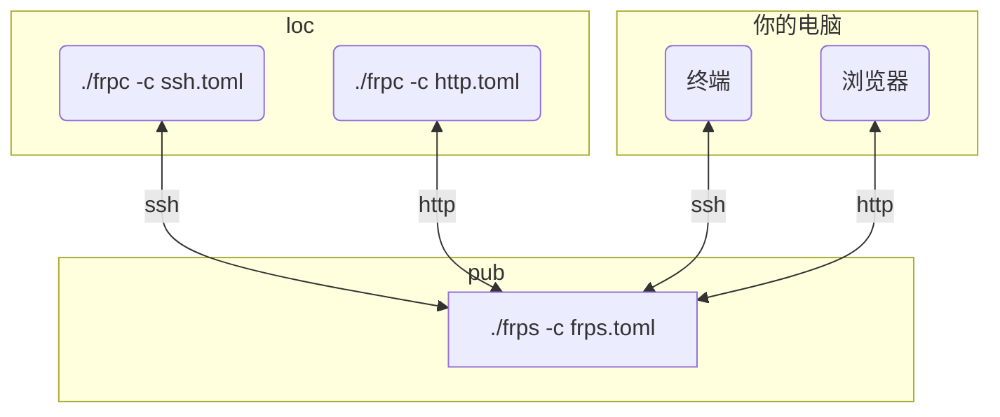

下载：

```bash
wget -c https://github.com/fatedier/frp/releases/download/v0.55.1/frp_0.55.1_linux_amd64.tar.gz
tar -xvf frp_0.55.1_linux_amd64.tar.gz
```

进入后，可以看到有：
- frpc： frp 客户端执行程序
- frpc.toml：frp 客户端配置文件
- frps：frp 服务端执行程序
- frps.toml：frp 服务端配置文件
- LICENSE：frp 软件开源协议，不用管

pub 用于转发网络请求实现内网穿透，所以它是服务端，使用 frps。loc 是被转发的对象，所以是客户端，使用 frpc. 本文所有技术的整体访问模型如下：



## SSH 内网穿透

在 pub 上，修改 frps.toml：

```toml
bindPort = 7000
```

执行：

```bash
# 开启防火墙，一个绑定端口，一个转发端口
sudo ufw allow 7000
sudo ufw allow 7001
./frps -c frps.toml
```

在 loc (需要被穿透的设备，比如 NAS 服务器) 上，创建 ssh.toml：

```toml
serverAddr = "x.x.x.x"
serverPort = 7000

[[proxies]]
name = "ssh"
type = "tcp"
localIP = "127.0.0.1"
localPort = 22
remotePort = 7001
```

- 其中 serverAddr 是 pub 的公网 IP，serverPort 和 刚刚 pub 上的 bindPort 保持一致。
- 请保证 localPort 是 loc 上的 ssh 服务端端口号，此处填写 22 是因为 sshd 默认开放的端口就是 22。
- remotePort 是我们后面访问 pub 时需要使用的转发端口。

然后，在后台启动 frpc ：

```bash
./frpc -c ./ssh.toml
```

接下来，可以在电脑上访问 pub 上转发的 ssh 服务了：

```bash
ssh loc的用户名@pub的公网IP -p 7001
```

## HTTP 内网穿透

在 pub 上，修改 frps.toml：

```toml
bindPort = 7000
vhostHttpPort = 7002
```

```bash
sudo ufw allow 7002
./frps -c frps.toml
```

在 loc 一侧，创建 http.toml:

```toml
serverAddr = "x.x.x.x"
serverPort = 7000

[[proxies]]
name = "web"
type = "http"
localPort = 8001
customDomains = ["kirigaya.cn"]
```

然后，在后台启动 frpc ：

```bash
./frpc -c ./http.toml
```

localPort 是具体本地服务器需要的端口号。customDomains 可以绑定公网域名。

这样就可以通过 http://pub的公网IP:7002 来访问 loc 上的 http 服务了。在浏览器输入 `http://<customDomains[0]>:<vhostHTTPPort>` 即可。

## Ref and Tag

https://github.com/fatedier/frp