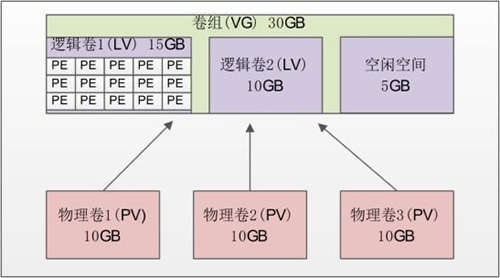

挂载和操作磁盘，需要在 root 用户环境下才能操作。以下操作都默认为 root 权限，或是 sudo 执行。parted 命令中，-l 显示磁盘信息，-h 帮助。注意，操作设备都会需要 root 环境。

## 逻辑卷管理（LVM）：物理卷，卷组和逻辑卷



- 物理卷（Physical Volume，PV）：就是真正的物理硬盘或分区。
- 卷组（Volume Group，VG）：将多个物理卷合起来就组成了卷组。组成同一个卷组的物理卷可以是同一块硬盘的不同分区，也可以是不同硬盘上的不同分区。我们可以把卷组想象为一块逻辑硬盘。
- 逻辑卷（Logical Volume，LV）：卷组是一块逻辑硬盘，硬盘必须分区之后才能使用，我们把这个分区称作逻辑卷。逻辑卷可以被格式化和写入数据。我们可以把逻辑卷想象为分区。
- 物理扩展（Physical Extend，PE）：PE 是用来保存数据的最小单元，我们的数据实际上都是写入 PE 当中的。PE 的大小是可以配置的，默认是 4MB。

建立 LVM 的时候，需要按照以下步骤来进行：
- 把物理硬盘分成分区，当然也可以是整块物理硬盘；
- 把物理分区建立为物理卷（PV），也可以直接把整块硬盘都建立为物理卷。
- 把物理卷整合为卷组（VG）。卷组就已经可以动态地调整大小了，可以把物理分区加入卷组，也可以把物理分区从卷组中删除。
- 把卷组再划分为逻辑卷（LV），当然逻辑卷也是可以直接调整大小的。我们说逻辑卷可以想象为分区，所以也需要格式化和挂载。


有了物理分区，可以建立逻辑卷。卷组（Volume Group）由一个或多个物理卷组成的存储池。通常使用 vgcreate, vgchange, vgscan, vgextend 等命令来操作。

[参考 VG 卷组](https://c.biancheng.net/view/918.html)。[PV 物理卷](https://c.biancheng.net/view/914.html)。[LV 逻辑卷](https://c.biancheng.net/view/920.html)。

### 物理卷管理

使用 parted 或 fdisk 交互命令来创建物理分区。注意，操作分区后，使用命令 `partprobe` 重新读取分区表，或重启 OS。

可以把整块硬盘建立为物理卷，也可以仅用某个分区建立物理卷。建立物理卷命令如下：

```bash
pvcreate /dev/sdb
pvcreate /dev/sdb5 # 仅分区 sdb5
```

查询使用 `pvscan` 或者 `pvdisplay`。后者列出更详细的状态。

删除：

```bash
pvremove /dev/sdb7
```

### 卷组管理

```bash
vgcreate [-s PE 大小] 卷组名 物理卷名
vgcreate -s 8MB scvg /dev/sdb5 /dev/sdb6 # 加入两个物理卷
```

单位可以使 MB, GB, TB，不写则默认 4MB。

激活：

```bash
vgchange -a y 卷组名 # 激活
vgchange -a n 卷组名 # 停用
```

查看卷组使用 `vgscan` 或 `vgdisplay`。

扩充/减少卷组容量：

```bash
vgextend 卷组名 物理卷
vgextend scvg /dev/sdb7
vgreduce 卷组名 物理卷
vgreduce scvg /dev/sdb7
```

删除：

```bash
vgremove scvg
```

## 分区扩容例子

查看磁盘使用情况：

```bash
df -hl
```


### 创建物理卷

查看物理磁盘情况，使用命令 `lsblk -a`，找到没有挂载点的设备。比如：

    ...
    sdd                         8:48   0 931.5G  0 disk
    ├─sdd1                      8:49   0     1G  0 part /boot/efi
    ├─sdd2                      8:50   0     2G  0 part /boot
    └─sdd3                      8:51   0 928.5G  0 part
    └─ubuntu--vg-ubuntu--lv 253:0    0 928.5G  0 lvm  /
    sde                         8:64   0 476.9G  0 disk

注意，只有满足两个条件的设备，才能合并到卷组 `ubuntu-vg`:
- 没有挂载点，也就是 MOUNTPOINTS 为空
- 没有被进行分区，也就它没有子节点

以新插入的硬盘 sde 为例，首先创建物理卷：

```bash
sudo pvcreate /dev/sde
```

扩充卷组 ubuntu-vg:

```bash
sudo vgextend ubuntu-vg /dev/sde
```

ubuntu-vg 得到扩充后，我们把 ubuntu-vg 内的 ubuntu-lv 逻辑卷直接 100% 扩充即可。把 ubuntu-vg 所有空间划分给 ubuntu-lv，扩展逻辑卷命令如下：

```bash
sudo lvextend -l +100%FREE /dev/ubuntu-vg/ubuntu-lv
```

调整逻辑卷。为了让根目录更大，需要调整逻辑卷：

```bash
sudo resize2fs /dev/mapper/ubuntu--vg-ubuntu--lv
```

## 分区工具 parted

使用 parted <设备或分区> 进入磁盘分区交互界面。不指定则进入交互界面再选址。例如：

```bash
parted /dev/nvme0n1
```

一般设备名的最后为 p<分区号>，比如 `/dev/nvme0n1p1`。

以 /dev/sdb 设备为例。进入交互界面：

```bash
parted /dev/sdb
```

在交互界面，可以使用 print 命令查看选中设备的分区情况。

### 使用 select 命令选择编辑的设备

如果在进入交互界面时，没有指定设备，可以使用 select <设备> 来选择。比如：

```bash
(parted) select /dev/sdb
```

### 设置分区

使用 mklabel gpt 设置设备分区表，格式为 gpt。使用 help mklabel 查看如何使用。

紧接着，开始对设备对应区域新建分区，比如：

```bash
 (parted) mkpart /dev/sdb1 xfs  0%  100%
```

用法为 mkpart PART-TYPE [FS-TYPE] START END。
- START END 选择可以是百分比，避免出现对齐块问题。也可以是 数字<单位>。单位为 MiB/GiB/TiB，比如 1G。END 可以为 -1，代表最后一个扇区。

### 例子

```bash
(parted) select /dev/nvme0n1
使用 /dev/nvme0n1
(parted) print
型号：ZHITAI TiPlus7100 1TB (nvme)
磁盘 /dev/nvme0n1: 1024GB
扇区大小 (逻辑/物理)：512B/512B
分区表：msdos
磁盘标志：

编号  起始点  结束点  大小    类型      文件系统  标志
 1    1049kB  524MB   523MB   primary   fat32     启动, esp
 2    525MB   1024GB  1024GB  extended
 6    525MB   512GB   512GB   logical   ext4
 5    512GB   1024GB  512GB   logical   ext4
```

在另一个终端，使用 lsblk 查看已经挂载的分区，找出未挂载的，进一步初始化。

```bash
lsblk
```

输出：

```
...
nvme0n1     259:0    0 953.9G  0 disk
├─nvme0n1p1 259:1    0   499M  0 part /boot/efi
├─nvme0n1p2 259:2    0     1K  0 part
├─nvme0n1p5 259:3    0 476.7G  0 part
└─nvme0n1p6 259:4    0 476.7G  0 part /
```

可以看到，需要初始化并挂在 /dev/nvme0n1p5，并挂载到根目录。可以看出，目录已经分区，但是没有初始化文件系统，没有挂载。不再需要重新分区，初始化文件系统和挂载即可。

## 初始化文件系统

```bash
sudo mkfs -t ext4 /dev/nvme0n1p5
```

## 挂载文件系统

磁盘分区，初始化文件系统后，需要挂载到目录下。注意，需要 root 用户。

```bash
mkdir /path/to/mountpoint
mount /dev/nvme0n1p5 /path/to/mountpoint
chmod a+x /path/to/mountpoint
```

卸载文件系统，从挂载点移除。

```bash
umount -f /path/to/mountpoint # 卸载 FS，-f 代表 force
```

## 持久化挂载

实现开机自动挂在，比如：

```bash
echo "/dev/sdb1   /home/wujing/sdb1  xfs   defaults  0 0 " >> /etc/fstab 
```

可以使用 UUID 替换设备名，避免设备位置更换后，名字修改。使用如下命令查看 sdb1 UUID：

```bash
$ sudo blkid | grep sdb1
/dev/sdb1: UUID="d9ae7fb6-ca5a-4e94-b5dc-41f7a6021e8f" TYPE="ext2" PARTLABEL="sdb1" PARTUUID="9594e121-ba23-4f8d-a6ad-984056502559"
```

## 调整分区大小：合并同一设备两个分区

### 直接删除并扩展分区（高风险，数据丢失）
操作方式：删除第二个分区，将其空间合并到第一个分区。

风险：直接删除分区会立即清除分区内的所有数据，包括系统盘内容。

适用场景：无需保留数据，且已做好完整备份。

### 使用 LVM（逻辑卷管理）合并（低风险，需初始化）
操作方式：将两个分区初始化为 LVM 物理卷，合并为逻辑卷。

风险：初始化分区为物理卷（pvcreate）会擦除分区数据。

适用场景：愿意重新格式化分区并重建系统环境。

### 调整分区大小（中风险，依赖工具）
工具：使用 gparted（图形化）或 parted（命令行）调整分区边界。

风险：若第二个分区物理**紧邻**第一个分区后方，且文件系统支持在线调整（如 ext4），可能无需丢失数据。但操作中意外断电或中断可能导致数据损坏。

适用场景：两个分区物理位置连续，且文件系统支持动态调整。

比如 lsblk 之后看到 /dev/nvme0n1p6 挂载了根目录 /，而相邻的 /dev/nvme0n1p5 没有挂载，我们想要把 nvme0n1p5 合并到 nvme0n1p6，扩充空间，并且不格式化 nvme0n1p6。

parted 命令进入交互界面后，选择设备，可以看到：

```bash
(parted) select /dev/nvme0n1
(parted) p
编号  起始点  结束点  大小    类型      文件系统  标志
 1    1049kB  524MB   523MB   primary   fat32     启动, esp
 2    525MB   1024GB  1024GB  extended
 6    525MB   512GB   512GB   logical   ext4
 5    512GB   1024GB  512GB   logical   ext4
```

/dev/nvme0n1p6 在 /dev/nvme0n1p5 之后，所以可以调整其结束点位置，以扩充空间。关于查看具体起始点，可以使用 `❯ cat /sys/block/nvme0n1/nvme0n1p5/start` 命令查看。

使用 help 命令，可以看到操作的命令：
- `resizepart NUMBER END` 改变 NUMBER 的大小
- `rm NUMBER` 删除编号为 NUMBER 的分区。
- `rescue START END` 挽救删除的分区

使用 resizepart 命令时，不指定参数，会进入交互界面。先选择分区号，再选择分区大小（默认单位是 MB）。比如，增加为 15GB，应当如下：

```bash
（parted）resizepart 
分区号？1 
结束？[10.0GB]？15000
```

注意，ext4 支持在线拓展，但是 xfs 不支持。所以需要关注文件系统。

resizepart 之后，并不能直接看到扩充的空间，df -h 命令还没显示增加的空间。需要使用命令扩展文件系统，具体如下：

```bash
# ext<2-4> 系列的文件系统适用
sudo resize2fs /dev/nvme0n1p5
```

#### 例子

U 盘中，/dev/sda1 与 /sev/sda2 物理相邻。sda2 有数据，要避免丢失。sda1 内容可以删除。现在需要合并 sda1 和 sda2，并且合并后的分区中，保留 sda2 原有数据。

首先确保 sda2 

## sd

160 230400 /[]

4x8x16，

## Ref and Tag