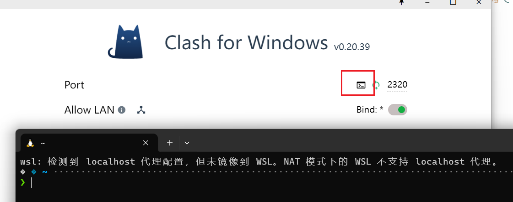
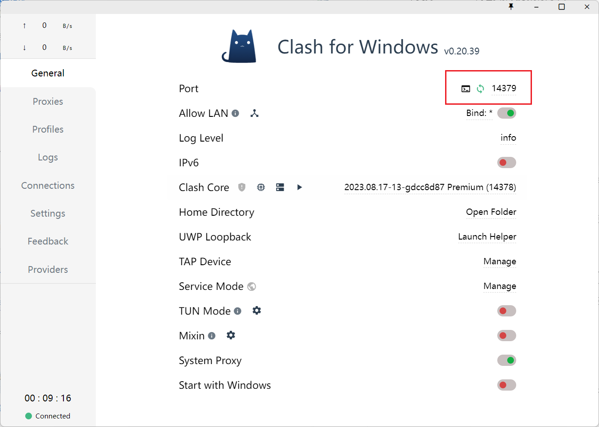

## WSL2 有自己独立的网络栈

WSL2 确实使用了自己的独立网络栈。但与虚拟机不同，它通过 Hyper-V 虚拟交换机与宿主机通信，默认采用 NAT 网络模式，拥有独立的 IP 地址段（如 172.xx.xx.xx）。这种设计导致 WSL2 无法直接继承宿主机的代理设置，但可以通过以下方式实现代理使用：镜像网络模式（最新推荐），传统环境变量设置。

1. WSL2 通过虚拟网卡与宿主机通信，默认使用 NAT 模式，导致 WSL2 的网络流量需要通过宿主机的网络接口转发。这种模式下，WSL2 的 IP 地址与宿主机不在同一局域网段（例如宿主机 IP 为 192.168.1.10，而 WSL2 可能为 172.25.46.6）。
2. ​​镜像网络模式（推荐方案）​​
在 WSL2 2.0 及以上版本中，可通过配置 .wslconfig 启用 networkingMode=mirrored，使 WSL2 与宿主机共享同一网络栈。此模式下：
- WSL2 可直接通过 localhost 访问宿主机服务
- 宿主机的代理设置（如 Clash）会自动同步到 WSL2
- 支持 IPv6 和局域网直接访问



提示如：“wsl: 检测到 localhost 代理配置，但未镜像到 WSL。NAT 模式下的 WSL 不支持 localhost 代理。”解决方案有两个，

## 镜像网络模式（最新推荐）

在 `%UserProfile%/.wslconfig` 中添加如下内容：

```ini
[wsl2]
networkingMode=mirrored
[experimental]
autoProxy=true
dnsTunneling=true
firewall=true
```

重启 WSL2，首先查看名字，`wsl -l -v`；`wsl --shutdown` 后，重新启动。可以使用命令 `ip a` 查看地址是否与宿主机一致。

在 Clash 一端，打开 "Allow LAN" 选项，于是 WSL2 所有流量会经过代理。

### 变量 %UserProfile%

访问 %UserProfile% 目录，在 PowerShell 中使用 cd ~ 即可访问主目录（通常是用户配置文件 `C:\Users\<UserName>`），或者可以打开 Windows 文件资源管理器并在地址栏中输入 %UserProfile%。 该目录路径应类似于：`C:\Users\<UserName>\.wslconfig`

默认情况下，.wslconfig 文件不存在。

### 设置代理相关环境变量

查看 Clash 客户端开放的端口，大多数情况是 7890，有时候可能会被修改为其他值，比如开启随机设置端口。如图，应该用 14379。



设置为 7890，兼容大多数情况。

```bash
# 开启系统代理
function proxy_on() {
        local port=7890
        if [[ $# -eq 1 && $1 =~ ^[0-9]+$ ]]; then
                port=$1
        fi
        export http_proxy=http://127.0.0.1:$port
        export https_proxy=http://127.0.0.1:$port
        export no_proxy=127.0.0.1,localhost
        export HTTP_PROXY=http://127.0.0.1:$port
        export HTTPS_PROXY=http://127.0.0.1:$port
        export NO_PROXY=127.0.0.1,localhost
        echo -e "\033[32m[√] 已开启代理，端口 $port\033[0m"
}

# 关闭系统代理
function proxy_off(){
        unset http_proxy
        unset https_proxy
        unset no_proxy
        unset HTTP_PROXY
        unset HTTPS_PROXY
        unset NO_PROXY
        echo -e "\033[31m[×] 已关闭代理\033[0m"
}
```

随后执行 proxy_on {{port_num}} 即可。如果 Clash 客户端需要使用随机端口，修改 7890 为对应的即可。

## 方案 2：传统环境变量配置（不推荐）

暂不需要。

## Ref and Tag

[WSL 中的高级设置配置 | Microsoft Learn](https://learn.microsoft.com/zh-cn/windows/wsl/wsl-config#experimental-settings)