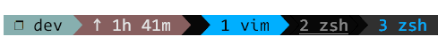

参考 [.tmux.conf.local](./assets/tmux_config/.tmux.conf.local)。

在文件前部分，设置了一系列颜色，比如：

```
...
tmux_conf_theme_colour_6="#080808"    # dark gray
tmux_conf_theme_colour_7="#e4e4e4"    # white
tmux_conf_theme_colour_8="#080808"    # dark gray
tmux_conf_theme_colour_9="#ffff00"    # yellow
tmux_conf_theme_colour_10="#ff00af"   # pink
tmux_conf_theme_colour_11="#5fff00"   # green
...
```

## 底部状态栏

### 左侧状态栏

部分背景配置如下：

```
tmux_conf_theme_status_left_fg="$tmux_conf_theme_colour_6,$tmux_conf_theme_colour_7,$tmux_conf_theme_colour_8"
tmux_conf_theme_status_left_bg="$tmux_conf_theme_colour_9,$tmux_conf_theme_colour_10,$tmux_conf_theme_colour_11"
tmux_conf_theme_status_left_attr="bold,none,none"
```


tmux_conf_theme_status_left_fg 决定状态栏文字颜色，比如灰色的 dev 和 zsh，还有白色的 59m。

tmux_conf_theme_status_left_bg 决定了状态栏的背景，比如黄色、粉色和蓝色部分，具体如下。

修改其他颜色，比如青色，红色和紫色。得到如下：

```
tmux_conf_theme_status_left_bg="#8fbcbb,#8f616a,#b48ead"
```



## Ref and Tag