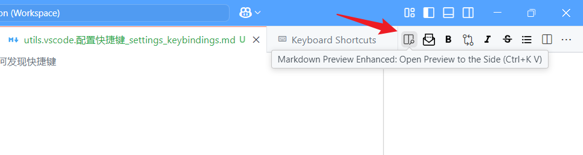
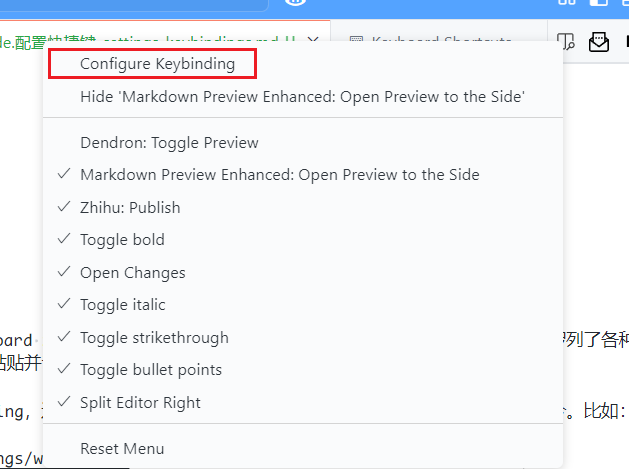
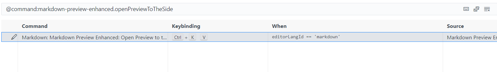

## 如何发现快捷键

通过 ctrl+shift+p，输入 shortcut，看到提示的 Preference: Open Keyboard Shortcuts，选择进入后，可以看到 Keyboard Shortcuts 窗口罗列了各种命令。可以根据 Vs Code 各个组件的名字来搜索，通常有想要的命令，比如 source control 的 graph 中，右击可以看到有 Checkout (Detached)，以此为关键词，可以搜索 Checkout，看到对应内容。右击对应条目，选择 copy 之后，可以拷贝命令，在 settings.json 或 keybindings.json 等中粘贴并设置快捷键。

在 Vs Code 中的各个小组件 widget 上右击（几乎所有组件都可以右键点击），可以看到 Configure Keybinding，选择后会跳到 Keyboard Shortcuts 界面，并筛选出它对应的命令。例如查看展示 markdown 预览界面的按钮功能：

## Ref and Tag