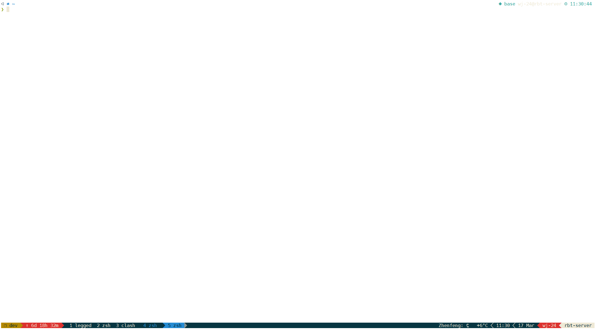
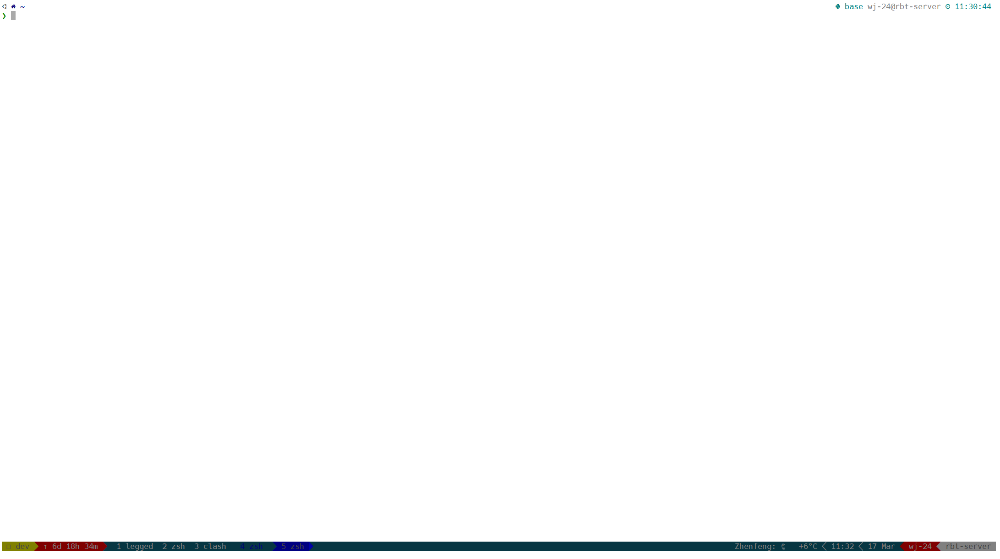
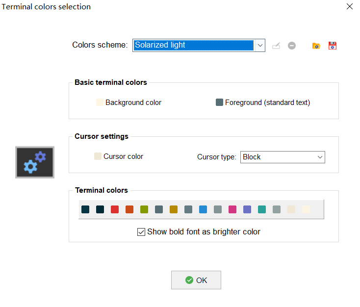

使用 MobaXterm 时，连接服务器的终端配色调为白色，避免看浏览器时黑白调换，眼睛疲劳。

在 MobaXterm->Settings->Terminal->Default color settings->Colors scheme 中，选择 Solarized light。但是背景是米色的，所以选择 Basic terminal colors->Background color 中，设置为 `#ffffff`，便可得到白色背景。

如果仅仅简单选择 Colors scheme 为 Light background，那么 tmux 的状态栏会十分模糊，难以分辨。比如：

原因是 Terminal colors selection 的颜色组合。

