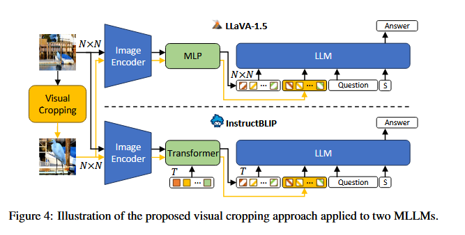
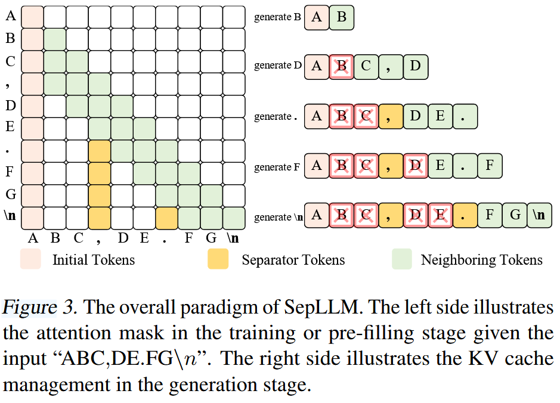
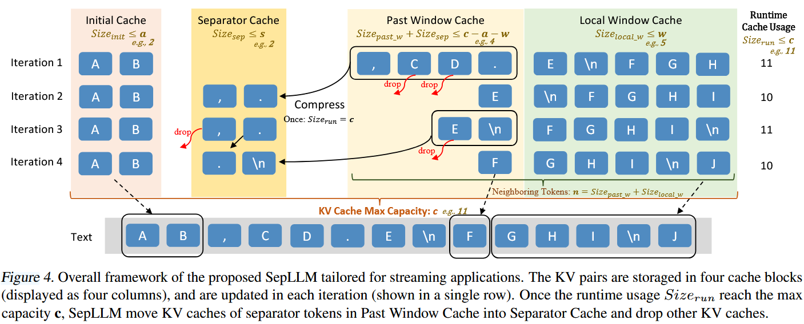
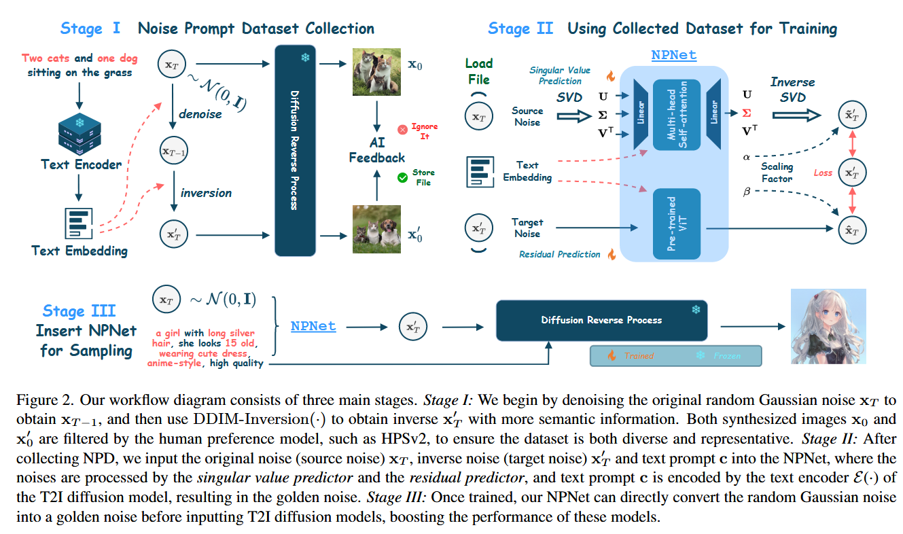
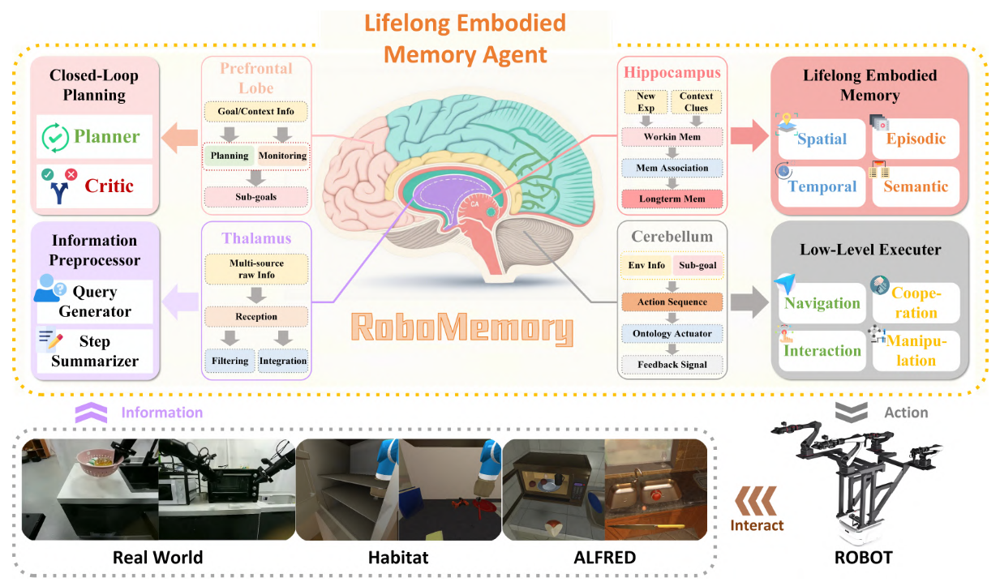
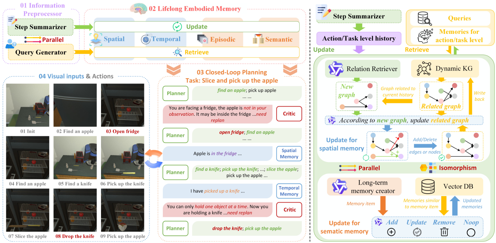

画图需要关注配色和逻辑。

## ICLR

### MLLMs Know Where to Look

## ICML

### SepLLM

学习配色。

## ICCV

借鉴箭头的使用：

## Arxiv

### RoboMemory

Figure 2: RoboMemory architecture with working pipeline and memory mechanisms. (a) Left: The agent’s pipeline. Parallel Step Summarizer and Query Generator in Information Processor (1) generate updates/queries for Lifelong Embodied Memory (2). These memories enable Closed-Loop Planning (3) for tasks like “slice and pick up the apple”—the Planner generates plans, while the Critic and memories adjust decisions via feedback from visual inputs/results (4). (b) Right: Spatial and Semantic memories operate in parallel with isomorphic updates. Internally, Spatial memory maintains a relevance/similarity-updated KG, and Semantic memory manages a Vector DB with analogous logic.

## Ref and Tag